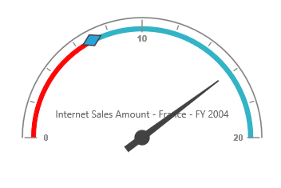

# Frame Type

## Full Circle

Full Circle frame lets the OlapGauge display in circular shape. Frame type can be set using the `FrameType` property.  By default, the frame type is "FullCircle".



@Html.EJ().Olap().OlapGauge("OlapGauge1").Url(Url.Content("~/OlapGauge")).Frame(Frame.FullCircle)



 

## Half Circle
Half Circle frame lets the OlapGauge display in semi-circular shape. For this, frame type needs to be set as "HalfCircle" within the `FrameType` property.



@Html.EJ().Olap().OlapGauge("OlapGauge1").Url(Url.Content("~/OlapGauge")).Frame(Frame.HalfCircle)



 
