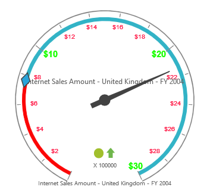

# Labels

## Adding Label Collection

Label collection can be directly added to the scales option within the PivotGauge control.



    @Html.EJ().Pivot().PivotGauge("PivotGauge1").Scales(scales => {
        scales.Labels(labels => { labels.Angle(20).Add(); }).Add();
    })



## Appearance Customization

The appearance of the Label can be customized through the following properties.

* **Angle** – used to display labels in a rotated manner.  By default, the value is 0.
* **Color** – displays the label in specified color
* **Opacity** – sets the opacity of the label. By default, the value is 1.
* **Type** – indicates the label for major intervals or minor intervals.  By default, it takes major intervals.
* **IncludeFirstValue** – includes the initial value based on user requirement.  By default, the value is “true”.
* **Font** – sets the font size, font style and font family of the label.



    @Html.EJ().Pivot().PivotGauge("PivotGauge1").Scales(scales => {
        scales.Labels(labels =>
        {
            //for Major labels        
            labels.Type(GaugeTypes.Major).Color("#1AFF01").Opacity(80).IncludeFirstValue(false).Font(font => font.Size("15px").FontFamily("Arial").FontStyle("Bold")).Add();
            //for Minor labels   
            labels.Type(GaugeTypes.Minor).Color("#FF103F").Opacity(80).IncludeFirstValue(true).Font(font => font.Size("10px").FontFamily("Arial").FontStyle("Normal")).Add();
        }).Add();
    })



 

## Unit Text

The `UnitText` property is used to add some text along with the labels. Normally, we indicate the unit/measurement of the numeric value through unit text. Using the `UnitTextPosition` property, the text can be positioned either in front or back.

N> By default, text appears at the back.



    @Html.EJ().Pivot().PivotGauge("PivotGauge1").Scales(scales => {
        scales.Labels(labels => { 
            //for Major labels 
            labels.Type(GaugeTypes.Minor).UnitText("$").UnitTextPosition(UnitTextPlacement.Front).Add();
            //for Minor labels
            labels.Type(GaugeTypes.Minor).UnitText("$").UnitTextPosition(UnitTextPlacement.Front).Add(); 
        }).Add();
    })



 

