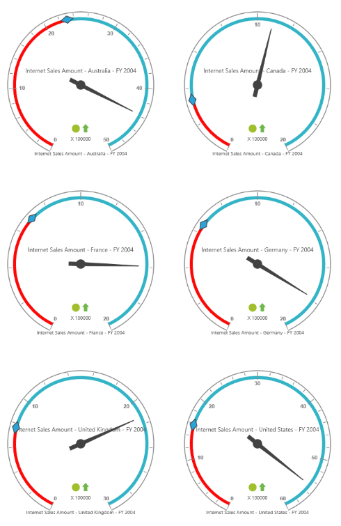

# Layout 

## Row-wise Layout

Gauges can be arranged in specified number of rows by using the `RowsCount` property.



    @Html.EJ().Pivot().PivotGauge("PivotGauge1").RowsCount(2)



 

## Column-wise Layout

Gauges can be arranged in specified number of columns by using the `ColumnsCount` property.



    @Html.EJ().Pivot().PivotGauge("PivotGauge1").ColumnsCount(2)



