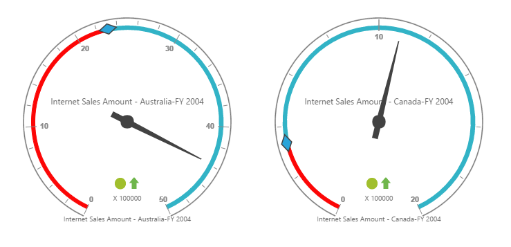

# Getting Started

## Creating a simple application with PivotGauge and OLAP datasource (Client Mode)

This section covers the information required to populate a simple PivotGauge with OLAP data completely on the client-side.

## Project Initialization

Create a new **ASP.NET MVC Web Application** using Visual Studio IDE and name the project as **“PivotGaugeDemo”**.

Select the View engine as **‘Razor’** and Project template as **‘Internet Application’** and finally click **OK** button to create an application.

Now add the following dependency libraries as references into your MVC Web Application. In order to add them to your application, right-click on **References** in Solution Explorer and select Add Reference. Now in the **Reference Manager** dialog, under **Assemblies > Extension**, the following Syncfusion libraries will be found.

* Syncfusion.EJ
* Syncfusion.EJ.Olap
* Syncfusion.EJ.MVC

The version of Syncfusion libraries based on .NET Framework and MVC version are classified below. For example, 14.2 version is illustrated as,

<table>
<tr>
<th>MVC Version</th>
<th>MVC Version of Syncfusion assembly</th>
<th>Base Version of Syncfusion assembly</th>
<th>System.Web.Mvc</th>
<th>System.Web.WebPages</th>
</tr>
<tr>
<td>MVC3</td>
<td>{{ site.mvc3releaseversion }}</td>
<td>{{ site.35esreleaseversion }}</td>
<td>3.0</td>
<td>1.0</td>
</tr>
<tr>
<td>MVC4</td>
<td>{{ site.mvc4releaseversion }}</td>
<td>{{ site.40esreleaseversion }}</td>
<td>4.0</td>
<td>2.0</td>
</tr>
<tr>
<td>MVC5</td>
<td>{{ site.mvc5releaseversion }}</td>
<td>{{ site.45esreleaseversion }}</td>
<td>5.0</td>
<td>3.0</td>
</tr>
</table>

Register the referred assemblies in Web.config files available inside Views folder and also at the root of the application.



    <compilation debug="true" targetFramework={Framework version}>
        <assemblies> 
            ……
            ……
            <add assembly="Syncfusion.EJ, Version= {{ site.40esreleaseversion }}, Culture=neutral, PublicKeyToken=3d67ed1f87d44c89" />
            <add assembly="Syncfusion.EJ.Olap, Version= {{ site.40esreleaseversion }}, Culture=neutral, PublicKeyToken=3d67ed1f87d44c89" />
            <add assembly="Syncfusion.EJ.Mvc, Version= {{ site.40esreleaseversion }}, Culture=neutral, PublicKeyToken=3d67ed1f87d44c89" />
        </assemblies>
    </compilation>


Register the required namespaces in Web.config files available inside Views folder and also at the root of the application



    <namespaces> 
  	    ……
  	    ……
        <add namespace="Syncfusion.MVC.EJ" />
        <add namespace="Syncfusion.JavaScript" /> 
    </namespaces>


N> Registering assemblies and namespaces earlier helps to include the control in view page with the help of intellisense.

Set the **UnobtrusiveJavaScriptEnabled** property to false under **appSettings** tag in Web.config file at the root folder.
    


    <configuration> 
  	    …… 
  	    ……
        <appSettings> 
      	    …… 
      	    ……
            <add key="UnobtrusiveJavaScriptEnabled" value="false" /> 
        </appSettings>        
    </configuration>


### Scripts and CSS Initialization

The scripts and style sheets that are mandatorily required to render PivotGauge widget in a MVC Web Application are mentioned in an appropriate order below:

1.  ej.widgets.all.min.css
2.	jquery-1.10.2.min.js
3.	jquery.easing.1.3.min.js
4.	ej.web.all.min.js 

[Click here](http://help.syncfusion.com/js/cdn) here to know more about scripts and style sheets available online (CDN Link).

Scripts and style sheets are referred under the <head> tag in **_Layout.cshtml** file which is found inside **Views > Shared folder.**
    


    <head>
        <link href="http://cdn.syncfusion.com/{{ site.releaseversion }}/js/web/flat-azure/ej.web.all.min.css" rel="stylesheet" />
        
        
        
    </head>


The script manager is initialized immediately after the `RenderBody()` function call in **_Layout.cshtml** file in-order to generate widget related scripts.



    <body> 
        …… 
        …… 
        @RenderBody() 
        @(Html.EJ().ScriptManager())   
    </body>


### Initialize PivotGauge

Before initializing, empty the contents of Index.cshtml file under Views > Home folder and add the following codes.



    @using Syncfusion.JavaScript;

    @Html.EJ().Pivot().PivotGauge("PivotGauge1")


### Populate PivotGauge With DataSource

Initializes the OLAP datasource for PivotGauge widget as shown below.



    @Html.EJ().Pivot().PivotGauge("PivotGauge1").DataSource(dataSource => dataSource.Rows(rows => { rows.FieldName("[Date].[Fiscal]").Add(); }).Columns(columns => { columns.FieldName("[Customer].[Customer Geography]").Add(); }).Values(values => { values.Measures(measures => { measures.FieldName("[Measures].[Internet Sales Amount]").Add(); measures.FieldName("[Measures].[Internet Revenue Status]").Add(); measures.FieldName("[Measures].[Internet Revenue Trend]").Add(); measures.FieldName("[Measures].[Internet Revenue Goal]").Add(); }).Axis(AxisName.Column).Add(); })
    .Data("http://bi.syncfusion.com/olap/msmdpump.dll").Catalog("Adventure Works DW 2008 SE").Cube("Adventure Works")).Scales(scale =>
    {
        scale.ShowRanges(true).Radius(150).ShowScaleBar(true).Size(1).Border(bor => bor.Width(0.5)).ShowIndicators(true).ShowLabels(true).
            Pointers(pointer =>
            {
                pointer.ShowBackNeedle(true).BackNeedleLength(20).Length(120).Width(7).Add();
                pointer.Type(PointerType.Marker).DistanceFromScale(5).Placement(PointerPlacement.Center).BackgroundColor("#29A4D9").Length(25).Width(15).MarkerType(MarkerType.Diamond).Add();
            }).
        Ticks(ticks =>
        {
            ticks.Type(CircularTickTypes.Major).DistanceFromScale(2).Height(16).Width(1).Color("#8c8c8c").Add();
            ticks.Type(CircularTickTypes.Minor).Height(6).Width(1).DistanceFromScale(2).Color("#8c8c8c").Add();
        })
        .Labels(labels => { labels.Color("#8c8c8c").Add(); })
        .Ranges(ranges =>
        {
            ranges.DistanceFromScale(-5).BackgroundColor("#fc0606").Border(bor => bor.Color("#fc0606")).Add();
            ranges.DistanceFromScale(-5).Add();
        })
        .CustomLabels(customLabel =>
        {
            customLabel.Position(location => location.X(180).Y(290)).Font(font => font.Size("10px").FontFamily("Segoe UI").FontStyle("Normal")).Color("#666666").Add();
            customLabel.Position(location => location.X(180).Y(320)).Font(font => font.Size("10px").FontFamily("Segoe UI").FontStyle("Normal")).Color("#666666").Add();
            customLabel.Position(location => location.X(180).Y(150)).Font(font => font.Size("12px").FontFamily("Segoe UI").FontStyle("Normal")).Color("#666666").Add();
        }).Add();
    })


The above code will generate a simple PivotGauge as shown in below figure.

 

## Creating a simple application with PivotGauge and OLAP datasource (Server Mode)
 
This section covers the information required to create a simple PivotGauge bound to OLAP datasource.

N> ASP.NET MVC Web Application will contain a service that transfers data to server-side, processes and returns back to client-side for control rendering and re-rendering. The service utilized for communication could be either WCF or WebAPI based on user requirement.

### Project Initialization

Create a new **ASP.NET MVC Web Application** using Visual Studio IDE and name the project as **"PivotGaugeDemo"**. 

Select the View engine as **‘Razor’** and Project template as **‘Internet Application’** and finally click **OK** button to create an application.

Now add the following dependency libraries as references into your MVC Web Application. In order to add them to your application, right-click on **References** in Solution Explorer and select **Add Reference**. Now in the **Reference Manager** dialog, under **Assemblies > Extension**, the following Syncfusion libraries will be found.

N> When you have installed any version of SQL Server Analysis Service (SSAS) or Microsoft ADOMD.NET utility, then the location of Microsoft.AnalysisServices.AdomdClient library is [system drive:\Program Files (x86)\Microsoft.NET\ADOMD.NET]

* Microsoft.AnalysisServices.AdomdClient
* Syncfusion.Compression.Base
* Syncfusion.Linq.Base
* Syncfusion.Olap.Base
* Syncfusion.PivotAnalysis.Base
* Syncfusion.XlsIO.Base
* Syncfusion.Pdf.Base
* Syncfusion.DocIO.Base
* Syncfusion.EJ
* Syncfusion.EJ.Olap
* Syncfusion.EJ.MVC

N> If any version of SQL Server Analysis Service (SSAS) or Microsoft ADOMD.NET utility is installed, then the location of Microsoft.AnalysisServices.AdomdClient library is [system drive:\Program Files (x86)\Microsoft.NET\ADOMD.NET].

The version of Syncfusion libraries based on .NET Framework and MVC version are classified below. For example, 14.2 version is illustrated as,

<table>
<tr>
<th>MVC Version</th>
<th>MVC Version of Syncfusion assembly</th>
<th>Base Version of Syncfusion assembly</th>
<th>System.Web.Mvc</th>
<th>System.Web.WebPages</th>
</tr>
<tr>
<td>MVC3</td>
<td>{{ site.mvc3releaseversion }}</td>
<td>{{ site.35esreleaseversion }}</td>
<td>3.0</td>
<td>1.0</td>
</tr>
<tr>
<td>MVC4</td>
<td>{{ site.mvc4releaseversion }}</td>
<td>{{ site.40esreleaseversion }}</td>
<td>4.0</td>
<td>2.0</td>
</tr>
<tr>
<td>MVC5</td>
<td>{{ site.mvc5releaseversion }}</td>
<td>{{ site.45esreleaseversion }}</td>
<td>5.0</td>
<td>3.0</td>
</tr>
</table>

Register the referred assemblies in Web.config files available inside Views folder and also at the root of the application.



    <compilation debug="true" targetFramework={Framework version}>
        <assemblies> 
            …… 
            ……
            <add assembly="Syncfusion.EJ, Version= {{ site.40esreleaseversion }}, Culture=neutral, PublicKeyToken=3d67ed1f87d44c89" />
            <add assembly="Syncfusion.EJ.Olap, Version= {{ site.40esreleaseversion }}, Culture=neutral, PublicKeyToken=3d67ed1f87d44c89" />
            <add assembly="Syncfusion.EJ.Mvc, Version= {{ site.40esreleaseversion }}, Culture=neutral, PublicKeyToken=3d67ed1f87d44c89" />
        </assemblies>
    </compilation>
    


Register the required namespaces in Web.config files available inside Views folder and also at the root of the application



    <namespaces> 
        ……
        ……
        <add namespace="Syncfusion.MVC.EJ" />
        <add namespace="Syncfusion.JavaScript" /> 
    </namespaces>



N> Registering assemblies and namespaces earlier helps to include the control in view page with the help of intellisense.

Set the **UnobtrusiveJavaScriptEnabled** property to false under **appSettings** tag in Web.config file at the root folder.
    


    <configuration> 
  	    …… 
  	    ……
        <appSettings> 
      	    …… 
      	    ……
            <add key="UnobtrusiveJavaScriptEnabled" value="false" /> 
        </appSettings>        
    </configuration>


### Scripts and CSS Initialization

The scripts and style sheets that are mandatorily required to render PivotGauge widget in a MVC Web Application are mentioned in an appropriate order below:

1.  ej.widgets.all.min.css
2.	jquery-1.10.2.min.js
3.	jquery.easing.1.3.min.js
4.	ej.web.all.min.js 

[Click here](http://help.syncfusion.com/js/cdn) here to know more about scripts and style sheets available online (CDN Link).

Scripts and style sheets are referred under the **head** tag in **_Layout.cshtml** file which is found inside **Views > Shared folder.**
    


    <head>
        <link href="http://cdn.syncfusion.com/{{ site.releaseversion }}/js/web/flat-azure/ej.web.all.min.css" rel="stylesheet" />
        
        
        
    </head>


The script manager is initialized immediately after the `RenderBody()` function call in **_Layout.cshtml** file in-order to generate widget related scripts.



    <body> 
        …… 
        …… 
        @RenderBody() 
        @(Html.EJ().ScriptManager())  
    </body>


### Control Initialization

Before initializing, empty the contents of **Index.cshtml** file under **Views > Home** folder and add the following codes. Register the namespaces at the top of the page and then add the control.


    
    @using Syncfusion.JavaScript;

    @Html.EJ().Pivot().PivotGauge("PivotGauge1").Url(Url.Content("/OlapGauge"))


The **“Url”** property in PivotGauge widget points the service endpoint, where data are processed and fetched in the form of JSON. The services used in PivotGauge widget as endpoint are WCF and WebAPI.

N> The above "Index.cshtml" contains WebAPI URL, which is "/OlapGauge". If WCF service is used as endpoint, the URL would look like "/OlapGaugeService.svc".

### WebAPI

**Adding a WebAPI Controller**

To add a WebAPI controller in your existing Web Application, right-click on the project in Solution Explorer and select **Add > New Item.** In the **Add New Item** window, select **WebAPI Controller Class** and name it as “OlapGaugeController.cs”, click **Add.**

Now WebAPI controller is added into your application successfully which in-turn comprise of the following file. The utilization of this file will be explained in the following sections.
 
* OlapGaugeController.cs

N> While adding WebAPI Controller Class, name it with the suffix “Controller” that is mandatory. For example, in demo the controller is named as “OlapGaugeController”.

Next, remove all the existing methods such as “Get”, “Post”, “Put” and “Delete” present inside `OlapGaugeController.cs` file. 



    namespace PivotGaugeDemo
    {
        public class OlapGaugeController : ApiController
        {
        
        }
    }



**List of Namespaces**

Following are the list of namespaces to be added on top of the main class inside `OlapGaugeController.cs` file.



    using Syncfusion.Olap.Manager;
    using Syncfusion.Olap.Reports;
    using Syncfusion.JavaScript;

    namespace PivotGaugeDemo
    {
        public class OlapGaugeController : ApiController
        {

        }
    }



**Datasource Initialization**

Now, the connection string to connect OLAP Cube and PivotGauge instances are created immediately inside the main class in `OlapGaugeController.cs` file.



    namespace PivotGaugeDemo
    {
        public class OlapGaugeController : ApiController
        {
            string connectionString = "Data Source=http://bi.syncfusion.com/olap/msmdpump.dll; Initial Catalog=Adventure Works DW 2008 SE;";
            PivotGauge pivotGauge = new PivotGauge();
            //Other codes
        }
    }



**Service methods in WebAPI Controller**

Now you need to define the service methods inside OlapGaugeController class, found inside `OlapGaugeController.cs` file, created while adding WebAPI Controller Class to your Web Application.
 


    namespace PivotGaugeDemo
    {
        public class OlapGaugeController : ApiController
        {
            string connectionString = "Data Source=http://bi.syncfusion.com/olap/msmdpump.dll; Initial Catalog=Adventure Works DW 2008 SE;";
            PivotGauge pivotGauge = new PivotGauge();

            [System.Web.Http.ActionName("InitializeGauge")]
            [System.Web.Http.HttpPost]
            public Dictionary<string, object> InitializeGauge(Dictionary<string, object> jsonResult)
            {
                OlapDataManager DataManager = new OlapDataManager(connectionString);
                DataManager.SetCurrentReport(CreateOlapReport());
                return pivotGauge.GetJsonData(jsonResult["action"].ToString(), DataManager);
            }

            private OlapReport CreateOlapReport()
            {
                OlapReport olapReport = new OlapReport();
                olapReport.Name = "Default Report";
                olapReport.CurrentCubeName = "Adventure Works";

                DimensionElement dimensionElementColumn = new DimensionElement();
                //Specifying the Name for the Dimension Element
                dimensionElementColumn.Name = "Customer";
                dimensionElementColumn.AddLevel("Customer Geography", "Country");

                MeasureElements measureElementColumn = new MeasureElements();
                //Specifying the Name for the Measure Element
                measureElementColumn.Elements.Add(new MeasureElement { Name = "Customer Count" });

                DimensionElement dimensionElementRow = new DimensionElement();
                //Specifying the Dimension Name
                dimensionElementRow.Name = "Date";
                dimensionElementRow.AddLevel("Fiscal", "Fiscal Year");

                ///Adding Row Members
                olapReport.SeriesElements.Add(dimensionElementRow);
                ///Adding Column Members
                olapReport.CategoricalElements.Add(dimensionElementColumn);
                ///Adding Measure Element
                olapReport.CategoricalElements.Add(measureElementColumn);
                return olapReport;
            }
        }
    }



**Configure routing in WebAPIConfig Class**

Open the WebAPIConfig.cs file found in **App_Start** folder. Then routing could be configured as shown in the following code example.



    public static class WebApiConfig
    {
        public static void Register(HttpConfiguration config)
        {
            config.Routes.MapHttpRoute(
                name: "DefaultApi",
                routeTemplate: "{controller}/{action}/{id}",
                defaults: new { id = RouteParameter.Optional }
            );
        }
    }


Now, PivotGauge will be rendered with the provided data as shown below.

 

### WCF

This section demonstrates the utilization of WCF service as endpoint binding OLAP datasource to a simple PivotGauge. For more details on this topic, [click here](http://help.syncfusion.com/aspnetmvc/PivotGauge/olap-connectivity#wcf).

