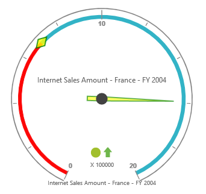

# Pointers

## Pointer Types

PivotGauge pointers has two types such as,

* Needle
* Marker

Needle type pointers are the default pointers which is always located at the center of the Gauge. Following shapes that are supported for the needle pointers are:

* Rectangle
* Triangle
* Trapezoid
* Arrow
* Image.



    @Html.EJ().Pivot().PivotGauge("PivotGauge1").Scales(scales => { scales.Pointers(pointers => { pointers.Type(PointerType.Needle).NeedleType(NeedleType.Trapezoid).Add(); }).Add(); })



 

For marker pointer, the available shapes are Rectangle, Triangle, Ellipse, Diamond, Pentagon, Circle, Slider, Pointer, Wedge, Trapezoid, RoundedRectangle and Image.



    @Html.EJ().Pivot().PivotGauge("PivotGauge1").Scales(scales => { scales.Pointers(pointers => { pointers.Type(PointerType.Marker).MarkerType(MarkerType.Diamond).Add(); }).Add(); })



 

## Adding Pointer Collection

Pointer collection can be directly added to the scales option within the PivotGauge control. 



    @Html.EJ().Pivot().PivotGauge("PivotGauge1").Scales(scales => { scales.Pointers(pointers => { pointers.Type(PointerType.Needle).NeedleType(NeedleType.Triangle).Add(); pointers.Type(PointerType.Marker).MarkerType(MarkerType.Diamond).Add(); }).Add(); })



 

## Appearance Customization

The appearance of the pointer can be customized through the following properties.

* **Border** – sets the "Color" and "Width" of the pointer border.
* **BackgroundColor** – sets the background color of the pointer.
* **Length** – sets the length of the pointer.
* **Width** – sets the width of the pointer.
* **Opacity** – sets the opacity of the pointer.  By default, the value is 1.
* **Type** – sets the type of the pointer.  By default, the type is "Needle".



    @Html.EJ().Pivot().PivotGauge("PivotGauge1").Scales(scales => {
        scales.Pointers(pointers => { 
            //For customizing needle pointer
            pointers.Border(border => border.Color("green").Width(2)).BackgroundColor("yellow").Length(120).Width(7).Opacity(0.6).Type(PointerType.Needle).NeedleType(NeedleType.Triangle).Add();
            //For customizing marker pointer 
            pointers.Border(border => border.Color("green").Width(2)).BackgroundColor("yellow").Length(25).Width(15).Opacity(0.8).Type(PointerType.Marker).MarkerType(MarkerType.Diamond).Add();
        }).Add();
    })



 

## Pointer Position

Pointer can be positioned with the help of below two properties.

* **DistanceFromScale** -  defines the distance between scale and pointer. By default, the value is 0.
* **Placement** -  defines the location of the pointer. By default, the value is "Center".

N> Both the properties can be applied only if the pointer type is set to “Marker”. Needle pointer type appears only at the center of the control, which is its default position.



    @Html.EJ().Pivot().PivotGauge("PivotGauge1").Scales(scales => {
        scales.Pointers(pointers => { pointers.Type(PointerType.Marker).DistanceFromScale(2).Placement(PointerPlacement.Far).Add(); }).Add();
    })



 

## Pointer Image

It is possible to replace the pointers with image. To view the pointers as image, we need to set the appropriate location in the `ImageUrl` property.



    @Html.EJ().Pivot().PivotGauge("PivotGauge1").Scales(scales => {
        scales.Pointers(pointers => {
            //For replacing needle pointer with image        
            pointers.Type(PointerType.Needle).NeedleType(NeedleType.Image).ImageUrl("../image.png").Add();
            //For replacing marker pointer with image        
            pointers.Type(PointerType.Marker).MarkerType(MarkerType.Image).ImageUrl("../image.png").Add();
        }).Add();
    })



## Pointer Value Text

To display the current value of the pointers in PivotGauge control, **"PointerValueText"** option inside pointers is used.  Following are the properties used to enable and customize the pointer value text.
 
* **ShowValue** – enables the pointer value text by setting the property to "true". By default, its value is "true".
* **Distance** – sets the distance between pointer and text.
* **Color** – sets the color of the text.
* **Opacity** – sets the opacity of the text. By default, its value is 1.
* **Angle** – sets the rotation angle of the text. By default, its value is 0.
* **Font** – sets the font size, font style and font family of the text.



    @Html.EJ().Pivot().PivotGauge("PivotGauge1").Scales(scales => {
        scales.Pointers(pointers => {
            //For needle type
            pointers.Type(PointerType.Needle).PointerValueText(pointerValueText => pointerValueText.ShowValue(true).Distance(10).Color("red").Opacity(70).Angle(20).Font(font => font.FontFamily("Arial").FontStyle("Normal").Size("15px"))).Add();
            //For marker type
            pointers.Type(PointerType.Marker).PointerValueText(pointerValueText => pointerValueText.ShowValue(true).Distance(40).Color("red").Opacity(70).Angle(-40).Font(font => font.FontFamily("Arial").FontStyle("Normal").Size("15px"))).Add(); 
        }).Add();
    })



 
