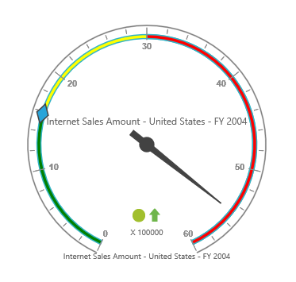

# Ranges

## Adding Range Collection

Range collection can be directly added to the scales option within the PivotGauge control.



    @Html.EJ().Pivot().PivotGauge("PivotGauge1").Scales(scales => {
        scales.ShowRanges(true).Ranges(ranges => { ranges.DistanceFromScale(10).Add(); }).Add();
    })



## Appearance Customization

The appearance of the range can be customized through the following properties.

* StartValue – defines the start position of the range.
* EndValue – defines the end position of the range.
* StartWidth – sets the width at starting position of the range.
* EndWidth – sets the width at ending position of the range.
* BackgroundColor – sets the background color of the range.
* Border – sets the height and width of the border of the range.
* Placement – sets the position of the range.
* DistanceFromScale – sets the distance between the range and scale.

Positioning the range could be set either through `Placement` or `DistanceFromScale` property. 

N> By default, placement takes the value “Near”, whereas other enumeration values available are “Far” and “Center”.



    @Html.EJ().Pivot().PivotGauge("PivotGauge1").Scales(scales => {
        scales.ShowRanges(true).Ranges(ranges => {
            ranges.StartValue(20).EndValue(50).StartWidth(2).EndWidth(6).Border(border => border.Color("red").Width(2)).BackgroundColor("yellow").DistanceFromScale(20).Add();
            ranges.StartValue(50).EndValue(100).StartWidth(2).EndWidth(7).Border(border => border.Color("green").Width(2)).BackgroundColor("blue").Placement(RangePlacement.Near).Add();
        }).Add();
    })



 

N> On setting both the position properties - "DistanceFromScale" and "Placement" for a range, the value set in "DistanceFromScale" is given preference. 

## Multiple Ranges

Multiple ranges can be added in `Ranges` to the scales option within the PivotGauge control.



    @Html.EJ().Pivot().PivotGauge("PivotGauge1").Scales(scales => {
        scales.ShowRanges(true).Ranges(ranges => {
            ranges.StartValue(0).EndValue(10).BackgroundColor("green").DistanceFromScale(-5).Add();
            ranges.StartValue(10).EndValue(30).BackgroundColor("yellow").DistanceFromScale(-5).Add();
            ranges.StartValue(30).EndValue(50).BackgroundColor("red").DistanceFromScale(-5).Add();
        }).Add();
    })



 
