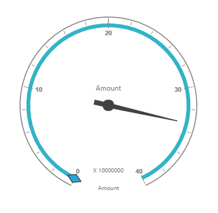

# Getting Started

>**Important**
Starting with v16.2.0.x, if you reference Syncfusion assemblies from trial setup or from the NuGet feed, you also have to include a license key in your projects. Please refer to this [link](https://help.syncfusion.com/common/essential-studio/licensing/license-key) to know about registering Syncfusion license key in your ASP.NET MVC application to use our components.

## Creating a simple application with PivotGauge and Relational datasource (Client Mode)

This section covers the information required to populate a simple PivotGauge with Relational data completely on the client-side.

## Project Initialization

Create a new **ASP.NET MVC Web Application** using Visual Studio IDE and name the project as **“PivotGaugeDemo”**.

Select the View engine as **‘Razor’** and Project template as **‘Internet Application’** and finally click **OK** button to create an application.

Now add the following dependency libraries as references into your MVC Web Application. In order to add them to your application, right-click on **References** in Solution Explorer and select Add Reference. Now in the **Reference Manager** dialog, under **Assemblies > Extension**, the following Syncfusion libraries will be found.

* Syncfusion.EJ
* Syncfusion.EJ.Export
* Syncfusion.EJ.Pivot
* Syncfusion.EJ.MVC

The version of Syncfusion libraries based on .NET Framework and MVC version are classified below. For example, version is illustrated as,

<table>
<tr>
<th>MVC Version</th>
<th>MVC Version of Syncfusion assembly</th>
<th>Base Version of Syncfusion assembly</th>
<th>System.Web.Mvc</th>
<th>System.Web.WebPages</th>
</tr>
<tr>
<td>MVC3</td>
<td>{{ site.mvc3releaseversion }}</td>
<td>{{ site.35esreleaseversion }}</td>
<td>3.0</td>
<td>1.0</td>
</tr>
<tr>
<td>MVC4</td>
<td>{{ site.mvc4releaseversion }}</td>
<td>{{ site.40esreleaseversion }}</td>
<td>4.0</td>
<td>2.0</td>
</tr>
<tr>
<td>MVC5</td>
<td>{{ site.mvc5releaseversion }}</td>
<td>{{ site.45esreleaseversion }}</td>
<td>5.0</td>
<td>3.0</td>
</tr>
</table>

Register the referred assemblies in "Web.config" files available inside Views folder and also at the root of the application.



<compilation debug="true" targetFramework="4.0">
    <assemblies> 
        ……
        ……
        <add assembly="Syncfusion.EJ, Version= {{ site.40esreleaseversion }}, Culture=neutral, PublicKeyToken=3d67ed1f87d44c89" />
        <add assembly="Syncfusion.EJ.Pivot, Version= {{ site.40esreleaseversion }}, Culture=neutral, PublicKeyToken=3d67ed1f87d44c89" />
        <add assembly="Syncfusion.EJ.Export, Version= {{ site.40esreleaseversion }}, Culture=neutral, PublicKeyToken=3d67ed1f87d44c89" />
        <add assembly="Syncfusion.EJ.Mvc, Version= {{ site.40esreleaseversion }}, Culture=neutral, PublicKeyToken=3d67ed1f87d44c89" />
    </assemblies>
</compilation>


Register the required namespaces in "Web.config" files available inside Views folder and also at the root of the application



<namespaces> 
    ……
    ……
    <add namespace="Syncfusion.MVC.EJ" />
    <add namespace="Syncfusion.JavaScript" /> 
</namespaces>


N> Registering assemblies and namespaces earlier helps to include the control in view page with the help of intellisense.

Set the **UnobtrusiveJavaScriptEnabled** property to false under **appSettings** tag in "Web.config" file at the root folder.
    


<configuration> 
    …… 
    ……
    <appSettings> 
        …… 
        ……
        <add key="UnobtrusiveJavaScriptEnabled" value="false" /> 
    </appSettings>        
</configuration>


### Scripts and CSS Initialization

The scripts and style sheets that are mandatorily required to render PivotGauge widget in a MVC Web Application are mentioned in an appropriate order below:

1. ej.web.all.min.css
2. jQuery-3.0.0.min.js
3. ej.web.all.min.js 

[Click here](http://help.syncfusion.com/js/cdn) here to know more about scripts and style sheets available online (CDN Link).

Scripts and style sheets are referred under the <head> tag in **_Layout.cshtml** file which is found inside **Views > Shared folder.**
    


<head>
    <link href="http://cdn.syncfusion.com/{{ site.releaseversion }}/js/web/flat-azure/ej.web.all.min.css" rel="stylesheet" type="text/css" />
    
    
</head>


The script manager is initialized immediately after the `RenderBody()` function call in **_Layout.cshtml** file in-order to generate widget related scripts.



<body> 
    …… 
    …… 
    @RenderBody() 
    @(Html.EJ().ScriptManager())   
</body>


### Initialize PivotGauge

Before initializing, empty the contents of "Index.cshtml" file under Views > Home folder and add the following codes.



@using Syncfusion.JavaScript;

@Html.EJ().Pivot().PivotGauge("PivotGauge1")


### Populate PivotGauge With Data

Let us now see how to populate the PivotGauge control using a sample JSON data as shown below. 



@Html.EJ().Pivot().PivotGauge("PivotGauge1").ClientSideEvents(clientSideEvents => clientSideEvents.Load("onLoad"))



The JSON data is set to the **"Data"** property present inside the **"DataSource"** object. The **"DataSource"** object allows us to set the raw data input and the fields in the rows, columns, values and filters.
  

  
@Html.EJ().Pivot().PivotGauge("PivotGauge1").ClientSideEvents(clientSideEvents => clientSideEvents.Load("onLoad")).DataSource(dataSource => dataSource.Rows(rows => { rows.FieldName("Country").FieldCaption("Country").Add();}).Columns(columns => { columns.FieldName("Product").FieldCaption("Product").Add(); }).Values(values => { values.FieldName("Amount").Add();})).Scales(scale =>
{
    scale.ShowRanges(true).Radius(150).ShowScaleBar(true).Size(1).Border(bor => bor.Width(0.5)).ShowIndicators(true).ShowLabels(true).
        Pointers(pointer =>
        {
            pointer.ShowBackNeedle(true).BackNeedleLength(20).Length(120).Width(7).Add();
            pointer.Type(PointerType.Marker).DistanceFromScale(5).Placement(PointerPlacement.Center).BackgroundColor("#29A4D9").Length(25).Width(15).MarkerType(MarkerType.Diamond).Add();
        }).
    Ticks(ticks =>
    {
        ticks.Type(CircularTickTypes.Major).DistanceFromScale(2).Height(16).Width(1).Color("#8c8c8c").Add();
        ticks.Type(CircularTickTypes.Minor).Height(6).Width(1).DistanceFromScale(2).Color("#8c8c8c").Add();
    })
    .Labels(labels => { labels.Color("#8c8c8c").Add(); })
    .Ranges(ranges =>
    {
        ranges.DistanceFromScale(-5).BackgroundColor("#fc0606").Border(bor => bor.Color("#fc0606")).Add();
        ranges.DistanceFromScale(-5).Add();
    })
    .CustomLabels(customLabel =>
    {
        customLabel.Position(location => location.X(180).Y(290)).Font(font => font.Size("10px").FontFamily("Segoe UI").FontStyle("Normal")).Color("#666666").Add();
        customLabel.Position(location => location.X(180).Y(320)).Font(font => font.Size("10px").FontFamily("Segoe UI").FontStyle("Normal")).Color("#666666").Add();
        customLabel.Position(location => location.X(180).Y(150)).Font(font => font.Size("12px").FontFamily("Segoe UI").FontStyle("Normal")).Color("#666666").Add();
    }).Add();
})


The above code will generate a simple PivotGauge as shown below.

 

## Creating a simple application with PivotGauge and Relational datasource (Server Mode)

This section covers the information required to create a simple PivotGauge bound to Relational datasource from server-side. 

N> ASP.NET MVC Web Application will contain a service that transfers data to server-side, processes and returns back to client-side for control rendering and re-rendering. The service utilized for communication could be either WCF or WebAPI based on user requirement.

### Project Initialization

Create a new **ASP.NET MVC Web Application** using Visual Studio IDE and name the project as **“PivotGaugeDemo”**.

Select the View engine as **‘Razor’** and Project template as **‘Internet Application’** and finally click **OK** button to create an application.

Now add the following dependency libraries as references into your MVC Web Application. In order to add them to your application, right-click on **References** in Solution Explorer and select Add Reference. Now in the **Reference Manager** dialog, under **Assemblies > Extension**, the following Syncfusion libraries will be found.

N> If you have installed any version of Essential Studio, then the location of Syncfusion libraries is [system drive:\Program Files (x86)\Syncfusion\Essential Studio\{{ site.releaseversion }}\Assemblies].

* Syncfusion.Compression.Base
* Syncfusion.Linq.Base
* Syncfusion.Olap.Base
* Syncfusion.PivotAnalysis.Base
* Syncfusion.EJ
* Syncfusion.EJ.Export
* Syncfusion.EJ.Pivot
* Syncfusion.EJ.MVC

The version of Syncfusion libraries based on .NET Framework and MVC version are classified below. For example, version is illustrated as,

<table>
<tr>
<th>MVC Version</th>
<th>MVC Version of Syncfusion assembly</th>
<th>Base Version of Syncfusion assembly</th>
<th>System.Web.Mvc</th>
<th>System.Web.WebPages</th>
</tr>
<tr>
<td>MVC3</td>
<td>{{ site.mvc3releaseversion }}</td>
<td>{{ site.35esreleaseversion }}</td>
<td>3.0</td>
<td>1.0</td>
</tr>
<tr>
<td>MVC4</td>
<td>{{ site.mvc4releaseversion }}</td>
<td>{{ site.40esreleaseversion }}</td>
<td>4.0</td>
<td>2.0</td>
</tr>
<tr>
<td>MVC5</td>
<td>{{ site.mvc5releaseversion }}</td>
<td>{{ site.45esreleaseversion }}</td>
<td>5.0</td>
<td>3.0</td>
</tr>
</table>

Register the referred assemblies in "Web.config" files available inside Views folder and also at the root of the application.



<compilation debug="true" targetFramework="4.0">
    <assemblies> 
        …… 
        ……
        <add assembly="Syncfusion.EJ, Version= {{ site.40esreleaseversion }}, Culture=neutral, PublicKeyToken=3d67ed1f87d44c89" />
        <add assembly="Syncfusion.EJ.Pivot, Version= {{ site.40esreleaseversion }}, Culture=neutral, PublicKeyToken=3d67ed1f87d44c89" />
        <add assembly="Syncfusion.EJ.Export, Version= {{ site.40esreleaseversion }}, Culture=neutral, PublicKeyToken=3d67ed1f87d44c89" />
        <add assembly="Syncfusion.EJ.Mvc, Version= {{ site.40esreleaseversion }}, Culture=neutral, PublicKeyToken=3d67ed1f87d44c89" />
    </assemblies>
</compilation>



Register the required namespaces in "Web.config" files available inside Views folder and also at the root of the application



<namespaces> 
    ……
    ……
    <add namespace="Syncfusion.MVC.EJ" />
    <add namespace="Syncfusion.JavaScript" /> 
</namespaces>


N> Registering assemblies and namespaces earlier helps to include the control in view page with the help of intellisense.

Set the **UnobtrusiveJavaScriptEnabled** property to false under **appSettings** tag in "Web.config" file at the root folder.
    


<configuration>
    …… 
    ……
    <appSettings> 
        …… 
        ……
        <add key="UnobtrusiveJavaScriptEnabled" value="false" /> 
    </appSettings>        
</configuration>



### Scripts and CSS Initialization

The scripts and style sheets that are mandatorily required to render PivotGauge widget in a MVC Web Application are mentioned in an appropriate order below:

1. ej.web.all.min.css
2. jQuery-3.0.0.min.js
3. ej.web.all.min.js

[Click here](http://help.syncfusion.com/js/cdn) here to know more about scripts and style sheets available online (CDN Link).

Scripts and style sheets are referred under the <head> tag in **_Layout.cshtml** file which is found inside **Views > Shared folder.**
    


<head>
    <link href="http://cdn.syncfusion.com/{{ site.releaseversion }}/js/web/flat-azure/ej.web.all.min.css" rel="stylesheet" type="text/css" />
    
    
</head>


The script manager is initialized immediately after the `RenderBody()` function call in **_Layout.cshtml** file in-order to generate widget related scripts.



<body> 
    //....
    //....
    @RenderBody() 
    @(Html.EJ().ScriptManager()) 
</body>


### Control Initialization

Before initializing, empty the contents of **Index.cshtml** file under **Views > Home** folder and add the following codes. Register the namespaces at the top of the page and then add the control.



@using Syncfusion.JavaScript;

@Html.EJ().Pivot().PivotGauge("PivotGauge1").Url(Url.Content("/Relational")).BackgroundColor("transparent").EnableTooltip(true).Scales(scale =>
{
    scale.ShowRanges(true).Radius(150).ShowScaleBar(true).Size(1).Border(bor => bor.Width(0.5)).ShowIndicators(true).ShowLabels(true).
        Pointers(pointer =>
        {
            pointer.ShowBackNeedle(true).BackNeedleLength(20).Length(120).Width(7).Add();
            pointer.Type(PointerType.Marker).DistanceFromScale(5).Placement(PointerPlacement.Center).BackgroundColor("#29A4D9").Length(25).Width(15).MarkerType(MarkerType.Diamond).Add();
        }).
    Ticks(ticks =>
    {
        ticks.Type(CircularTickTypes.Major).DistanceFromScale(2).Height(16).Width(1).Color("#8c8c8c").Add();
        ticks.Type(CircularTickTypes.Minor).Height(6).Width(1).DistanceFromScale(2).Color("#8c8c8c").Add();
    })
    .Labels(labels => { labels.Color("#8c8c8c").Add(); })
    .Ranges(ranges =>
    {
        ranges.DistanceFromScale(-5).BackgroundColor("#fc0606").Border(bor => bor.Color("#fc0606")).Add();
        ranges.DistanceFromScale(-5).Add();
    })
    .CustomLabels(customLabel =>
    {
        customLabel.Position(location => location.X(180).Y(290)).Font(font => font.Size("10px").FontFamily("Segoe UI").FontStyle("Normal")).Color("#666666").Add();
        customLabel.Position(location => location.X(180).Y(320)).Font(font => font.Size("10px").FontFamily("Segoe UI").FontStyle("Normal")).Color("#666666").Add();
        customLabel.Position(location => location.X(180).Y(150)).Font(font => font.Size("12px").FontFamily("Segoe UI").FontStyle("Normal")).Color("#666666").Add();
    }).Add();
}).ClientSideEvents(oCli => { oCli.RenderSuccess("loadPivotGaugeTheme"); }).IsResponsive(true).LabelFormatSettings(labelFormatSettings=> labelFormatSettings.DecimalPlaces(2))



The **“Url”** property in PivotGauge widget points the service endpoint, where data are processed and fetched in the form of JSON. The services used in PivotGauge widget as endpoint are WCF and WebAPI.

N> The above "Index.cshtml" contains WebAPI URL, which is "/Relational". If WCF service is used as endpoint, the URL would look like "/RelationalService.svc".

### WebAPI

**Adding a WebAPI Controller**

To add a WebAPI controller in an existing MVC Web Application, right-click on the project in Solution Explorer and select **Add > New Item**. In the **Add New Item** window, select **WebAPI Controller Class** and name it as **“RelationalController.cs”**, click **Add**.

Now, WebAPI controller is added to the application successfully with the file **“RelationalController.cs”**.

N> While adding WebAPI Controller Class, name it with the suffix “Controller” that is mandatory. For example, in demo the controller is named as “RelationalController”.

Next, remove all the existing methods such as “Get”, “Post”, “Put” and “Delete” present inside `RelationalController.cs` file.



namespace PivotGaugeDemo
{
    public class RelationalController: ApiController
    {
    
    }
}



**List of Namespaces**

Following are the list of namespaces to be added on top of the main class inside `RelationalController.cs` file.
 


using Syncfusion.JavaScript;
using Syncfusion.PivotAnalysis.Base; 

namespace PivotGaugeDemo
{
    public class RelationalController : ApiController
    {

    }
}


**Datasource Initialization**

A simple collection is provided as a datasource for the PivotGauge in this demo section. This datasource is placed inside a separate class “ProductSales” in `RelationalController.cs` file. Refer to the following code example.



namespace PivotGaugeDemo
{
    //....
    //....
    
    internal class ProductSales
    {
        public string Product { get; set; }

        public string Date { get; set; }

        public string Country { get; set; }

        public string State { get; set; }

        public int Quantity { get; set; }

        public double Amount { get; set; }

        public static ProductSalesCollection GetSalesData()
        {
            /// Geography
            string[] countries = new string[] { "Australia", "Canada", "France", "Germany", "United Kingdom", "United States" };
            string[] ausStates = new string[] { "New South Wales", "Queensland", "South Australia", "Tasmania", "Victoria" };
            string[] canadaStates = new string[] { "Alberta", "British Columbia", "Brunswick", "Manitoba", "Ontario", "Quebec" };
            string[] franceStates = new string[] { "Charente-Maritime", "Essonne", "Garonne (Haute)", "Gers", };
            string[] germanyStates = new string[] { "Bayern", "Brandenburg", "Hamburg", "Hessen", "Nordrhein-Westfalen", "Saarland" };
            string[] ukStates = new string[] { "England" };
            string[] ussStates = new string[] { "New York", "North Carolina", "Alabama", "California", "Colorado", "New Mexico", "South Carolina" };

            /// Time
            string[] dates = new string[] { "FY 2005", "FY 2006", "FY 2007", "FY 2008", "FY 2009" };

            /// Products
            string[] products = new string[] { "Bike", "Van", "Car" };
            Random r = new Random(123345345);

            int numberOfRecords = 2000;
            ProductSalesCollection listOfProductSales = new ProductSalesCollection();
            for (int i = 0; i < numberOfRecords; i++)
            {
                ProductSales sales = new ProductSales();
                sales.Country = countries[r.Next(1, countries.GetLength(0))];
                sales.Quantity = r.Next(1, 12);
                /// 1 percent discount for 1 quantity
                double discount = (30000 * sales.Quantity) * (double.Parse(sales.Quantity.ToString()) / 100);
                sales.Amount = (30000 * sales.Quantity) - discount;
                sales.Date = dates[r.Next(r.Next(dates.GetLength(0) + 1))];
                sales.Product = products[r.Next(r.Next(products.GetLength(0) + 1))];
                switch (sales.Product)
                {
                    case "Car":
                    {
                        sales.Date = "FY 2005";
                        break;
                    }
                }
                switch (sales.Country)
                {
                    case "Australia":
                    {
                        sales.State = ausStates[r.Next(ausStates.GetLength(0))];
                        break;
                    }
                    case "Canada":
                    {
                        sales.State = canadaStates[r.Next(canadaStates.GetLength(0))];
                        break;
                    }
                    case "France":
                    {
                        sales.State = franceStates[r.Next(franceStates.GetLength(0))];
                        break;
                    }
                    case "Germany":
                    {
                        sales.State = germanyStates[r.Next(germanyStates.GetLength(0))];
                        break;
                    }
                    case "United Kingdom":
                    {
                        sales.State = ukStates[r.Next(ukStates.GetLength(0))];
                        break;
                    }
                    case "United States":
                    {
                        sales.State = ussStates[r.Next(ussStates.GetLength(0))];
                        break;
                    }
                }
                listOfProductSales.Add(sales);
            }
            return listOfProductSales;
        }

        public override string ToString()
        {
            return string.Format("{0}-{1}-{2}", this.Country, this.State, this.Product);
        }

        public class ProductSalesCollection : List<ProductSales>
        {
        }
    }
}


**Service methods in WebAPI Controller**

Now you need to define the service methods inside RelationalController class, found inside `RelationalController.cs` file, created while adding WebAPI Controller Class to your Web Application.
 


namespace PivotGaugeDemo
{
    public class RelationalController : ApiController
    {
        PivotGauge pivotGauge = new PivotGauge();
        
        [HttpPost]
        [ActionName("InitializeGauge")]
        public Dictionary<string, object> InitializeGauge(Dictionary<string, object> jsonResult)
        {
            pivotGauge.PivotReport = BindDefaultData();
            return pivotGauge.GetJsonData(jsonResult["action"].ToString(), ProductSales.GetSalesData());
        }

        private PivotReport BindDefaultData()
        {
            PivotReport pivotSetting = new PivotReport();
            pivotSetting.PivotRows.Add(new PivotItem { FieldMappingName = "Date", FieldHeader = "Date", TotalHeader = "Total" });
            pivotSetting.PivotColumns.Add(new PivotItem { FieldMappingName = "Product", FieldHeader = "Product", TotalHeader = "Total" });
            pivotSetting.PivotCalculations.Add(new PivotComputationInfo { CalculationName = "Amount", Description = "Amount", FieldHeader = "Amount", FieldName = "Amount", Format = "C", SummaryType = Syncfusion.PivotAnalysis.Base.SummaryType.DoubleTotalSum });
            return pivotSetting;
        }
    }
}


**Configure routing in WebAPIConfig Class**

Open the "WebAPIConfig.cs" file found in **App_Start** folder. Then routing could be configured as shown in the following code example.



public static class WebApiConfig
{
    public static void Register(HttpConfiguration config)
    {
        config.Routes.MapHttpRoute(
            name: "DefaultApi",
            routeTemplate: "{controller}/{action}/{id}",
            defaults: new { id = RouteParameter.Optional }
        );
    }
}


Now, **PivotGauge** will be rendered as shown in the below figure.

 

### WCF

This section demonstrates the utilization of WCF service as endpoint binding Relational datasource to a simple PivotGauge. For more details on this topic, [click here](http://help.syncfusion.com/aspnetmvc/PivotGauge/relational-connectivity#wcf-1).