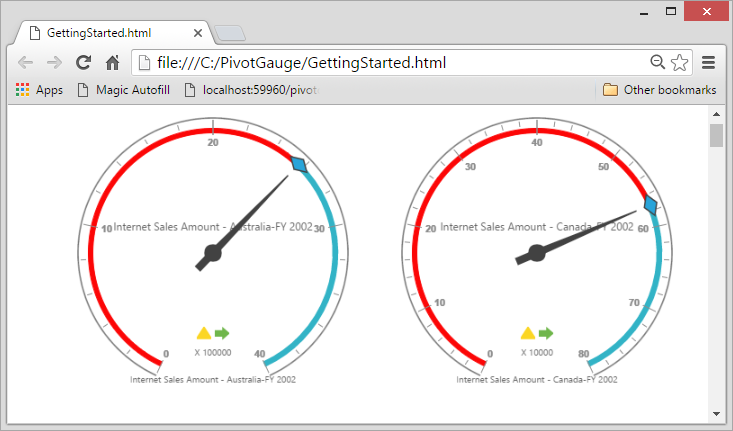

# Responsive Layout

PivotGauge control supports responsive rendering based on the target device (desktop & tablet) resolution. It supports resolution upto 1024x600. You can enable responsiveness in PivotGauge by setting `IsResponsive` property to true.



    @Html.EJ().Pivot().PivotGauge("PivotGauge1").IsResponsive(true)



_Normal View_

_Responsive View_

