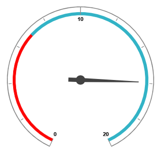

# Scale

## Adding Scale

Scale can be added within the PivotGauge control. 



    @Html.EJ().Pivot().PivotGauge("PivotGauge1").Scales(scales => { scales.ShowScaleBar(true).Radius(150).Add(); })



 

## Scale Customization

### Pointer Cap
Pointer Cap is a circular shape element which is located at the center of the PivotGauge. It can be customized with the property `PointerCap` inside the scales option. Following are the properties used to customize its appearance.

* **Radius** – sets the radius of the pointer cap.
* **BorderColor** – sets the color of the pointer cap border.
* **BorderWidth** – sets the width of the pointer cap border.
* **BackgroundColor** – sets the background color of the pointer cap.



    @Html.EJ().Pivot().PivotGauge("PivotGauge1").Scales(scales => {
        scales.ShowScaleBar(true).PointerCap(pointerCap => pointerCap.Radius(5).BorderWidth(2).BorderColor("green").BackgroundColor("yellow")).Add();
    })



 

### Appearance
The appearance of the scale can be customized through the following properties.

* **Radius** – sets the radius of the scale.
* **BackgroundColor** – sets the background color of the scale.
* **Border** – sets the border of the scale with color and width properties.
* **Size** – sets the size of the scale.
* **Minimum** – sets the least value of the scale.
* **Maximum** – sets the highest value of the scale.
* **MajorIntervalValue** – sets the interval between minor ticks in the scale.
* **MinorIntervalValue** – sets the interval between major ticks in the scale.
* **Direction** – sets the direction of the scale.  By default it takes “Clockwise” direction.

The `ShowIndicators`, `ShowTicks`, `ShowRanges`, `ShowPointers`, and `ShowScaleBar` properties are used to enable/disable the indicators, ticks, ranges, pointers and scale bar respectively.  By default, `ShowTicks` and `ShowPointers` are set to true, and other properties are set as false.



    @Html.EJ().Pivot().PivotGauge("PivotGauge1").Scales(scales => {
        scales.ShowScaleBar(true).Radius(120).BackgroundColor("yellow").Border(border => border.Color("blue").Width(3)).Size(10).Minimum(20).Maximum(120).MajorIntervalValue(20).MinorIntervalValue(5).Direction(Directions.CounterClockwise).Add();
    })



 