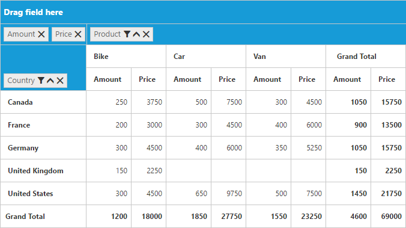

# Calculated Field

N> This feature is applicable only for Relational data source.

PivotGrid provides support to insert a new calculated field based on the existing Pivot Fields either through Calculated Field dialog or code behind.

### Through UI
To insert a new calculated Field, open the Calculated Field dialog using the Grouping Bar context menu. 

We can define **Name** for the new Calculated Field and **Formula** can be entered by inserting required fields through **Fields** section. For inserting numbers and operators, you can use formula pop-up as shown in the below screen-shot.

Click **Add** for adding that Calculated Field and **OK** to populate the PivotGrid control.

#### Through Code-behind

Calculated Field can be created at code-behind by defining formula based on the existing Pivot Fields in the PivotGrid. To indicate a field as a calculated field we need to set **"IsCalculatedField"** property to true and **"Formula"** property to set the expression.



@Html.EJ().Pivot().PivotGrid("PivotGrid1").EnableGroupingBar(true).ClientSideEvents(clientSideEvents => clientSideEvents.Load("onLoad")).DataSource(dataSource => dataSource.Rows(rows => { rows.FieldName("Country").FieldCaption("Country").Add(); }).Columns(columns => { columns.FieldName("Product").FieldCaption("Product").Add(); }).Values(values => { values.FieldName("Amount").Add(); values.FieldName("Price").FieldCaption("Price").IsCalculatedField(true).Formula("Amount * 15").Add(); }))



