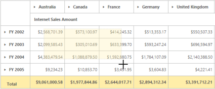
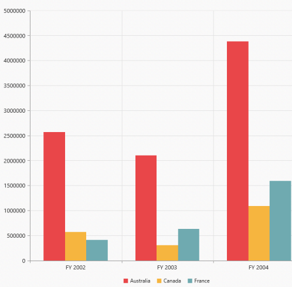

## Cell Selection

The PivotGrid control provides support to select specific ranges of value cells and display them in a format based on your requirement. The Selection can be done through simple mouse down and drag operation. This functionality is not available by default. To enable this, you need to set the “enableCellSelection” property to “true”.

The following code example explains on how to enable cell selection in the PivotGrid control.

@Html.EJ().Pivot().PivotGrid("PivotGrid1").Url(Url.Content("~/wcf/OLAPService.svc")).EnableCellSelection(true).ClientSideEvents(events => events.CellSelection("valueCellClick")).IsResponsive(true)

    @(Html.EJ().Chart("container").CommonSeriesOptions(cr => cr.Type(SeriesType.Column).EnableAnimation(true)).Load("loadTheme"))

valueCellClick = function (evt) {

    // The event lets the user to perform required operation with the selected set of cells. The details of the selected range would be obtained in the parameter of the event.

    cellvalue = evt.JSONRecords;

    rowheaders = evt.rowHeader;

    colheaders = evt.columnHeader;

}

{{ '' | markdownify }}
{:.image }

{{ '' | markdownify }}
{:.image }

