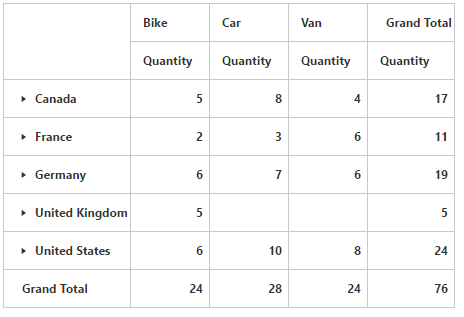

# Collapse by default

I> This feature is applicable only for Relational datasource.

Allows you to collapse all members displayed in the grid. You can enable collapsing all members by default in the PivotGrid by setting the [`EnableCollapseByDefault`](/api/js/ejpivotgrid#members: enablecollapsebydefault) property to true.



@Html.EJ().Pivot().PivotGrid("PivotGrid1").EnableCollapseByDefault(true)



