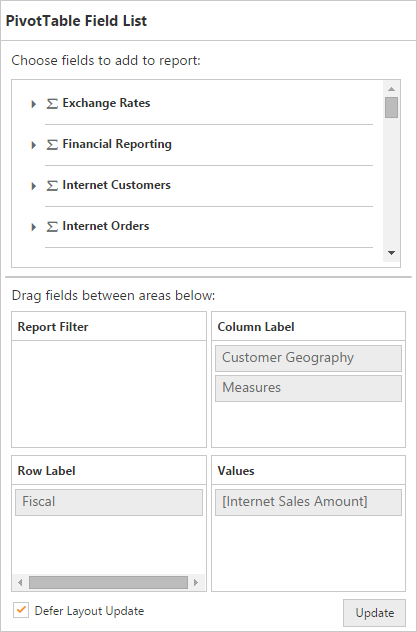

# Defer Update

Defer Update support allows you to refresh the control only on-demand and not during every UI interaction. To enable this functionality, set `enableDeferUpdate` property to "True".

The following code example explains how you can enable Defer Update in PivotGrid control.



@Html.EJ().Pivot().PivotGrid("PivotGrid1").Url(Url.Content("~/wcf/OLAPService.svc")).EnableDeferUpdate(true).ClientSideEvents(events => events.AfterServiceInvoke("OnAfterServiceInvoke"))

@Html.EJ().Pivot().PivotSchemaDesigner("PivotSchemaDesigner").Layout(PivotSchemaDesignerLayout.Excel)
    

OnAfterServiceInvoke = function(evt)
{
 if (evt.action == "initialize")
 {
	 var PivotSchemaDesigner = $("#PivotSchemaDesigner").data('ejPivotSchemaDesigner');
	 if (PivotSchemaDesigner.model.pivotControl == null)
	 {
		 PivotSchemaDesigner.model.pivotControl = this;
		 PivotSchemaDesigner.model.enableWrapper = true;
		 PivotSchemaDesigner.model.layout = "excel";
		 PivotSchemaDesigner._load();
	 }
 }
}


