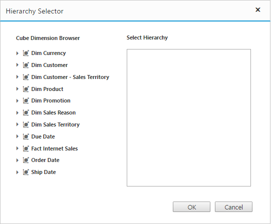
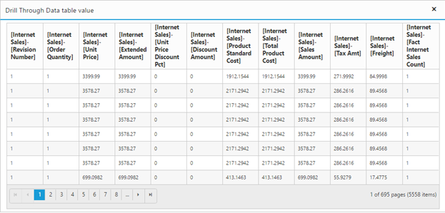

# Drill Through

Drill-through retrieves the raw items that are used to create a specified cell. To enable drill-through support, set “enableDrillThrough” property to “true”. Raw items are obtained through the “drillThrough” event, using which user can bind them to an external control for precise view. 

N> Drill-through is supported in PivotGrid only when we configure and enable drill-through action at the Cube. 

On clicking any value cell, the “Hierarchy Selector” dialog will be opened showing dimensions which are associated with the respective cells measure. In this example, the measure behind the respective cell is “Sales Amount” and the dimensions associated with this measure is alone displayed in the dialog.  

Drag and drop the respective hierarchies and finally click “OK” button. Drill through MDX query will be framed and executed internally provided back the raw items through “drillThrough” event. 
In this example, we have bound the raw items obtained into our Grid control. Please refer the code sample and scree shot below.



@Html.EJ().Pivot().PivotGrid("PivotGrid1").DataSource(dataSource => dataSource.Rows(rows=>{rows.FieldName("[Date].[Fiscal]").Add();}).Columns(columns=>{columns.FieldName("[Customer].[Customer Geography]").Add();}).Values(values => { values.Measures(measures => { measures.FieldName("[Measures].[Internet Sales Amount]").Add(); }).Axis(AxisName.Column).Add();})
.Data("http://bi.syncfusion.com/olap/msmdpump.dll").Catalog("Adventure Works DW 2008 SE").Cube("Adventure Works")).EnableDrillThrough(true).ClientSideEvents(clientSideEvents => clientSideEvents.DrillThrough("drilledData"))



