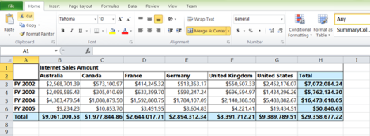

## Export

> _Note:__This feature is applicable only for OLAP datasource._

The PivotGrid is exported from cell mode to a worksheet of an Excel Workbook. The Excel Workbook is saved from the browser to the local disk drive.

The following code example illustrates how to save the document to Excel via service.

For PivotGrid

[C#]

public void ExportOptions(Stream stream)

{

PivotGrid pivotGridHelper = new PivotGrid();

OlapDataManager DataManager=new OlapDataManager(connectionString);

pivotGridHelper.ExportToExcel(DataManager, newStreamReader(stream).ReadToEnd(), "Sample.xls",HttpContext.Current.Response);

}

[MVC]

@section ScriptSection{

}

@section ControlsSection{

@Html.EJ().Button("Button1").Size(ButtonSize.Normal).Text("Export Grid").ShowRoundedCorner(true).ClientSideEvents(events=>events.Click("btnClick"))

@Html.EJ().Pivot().PivotGrid("PivotGrid1").Url("../wcf/PivotGridService.svc") 

}

{{ '' | markdownify }}
{:.image }

