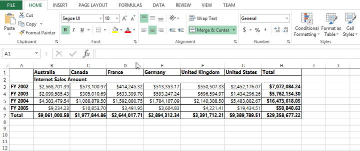
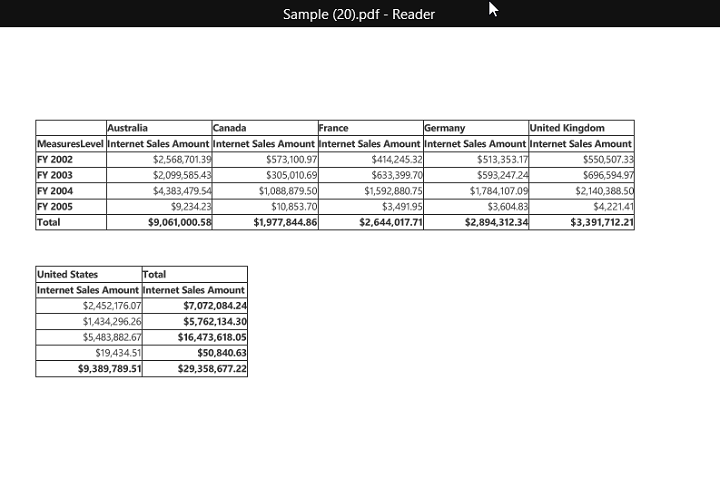

# Exporting

The PivotGrid control can be exported to the following file formats.

* Excel 
* CSV
* Word
* PDF

The PivotGrid control can be exported by invoking **"exportPivotGrid"** method, with an appropriate export option as parameter.



@Html.EJ().Pivot().PivotGrid("PivotGrid1").Layout(PivotGridLayout.Normal).Url(Url.Content("~/api/OLAP"))
@Html.EJ().Button("Button1").ClientSideEvents(clientSideEvents => { clientSideEvents.Click("exportBtnClick"); }).Text("Export")
<button id="ExportBtn">Export</button>

                                        



In-order to perform exporting in PivotGrid control, we need to add the following service method as well (either in WCF or WebAPI).



public void Export(System.IO.Stream stream) {
    System.IO.StreamReader sReader = new System.IO.StreamReader(stream);
    string args = System.Web.HttpContext.Current.Server.UrlDecode(sReader.ReadToEnd())
        .Remove(0, 5);
    OlapDataManager DataManager = new OlapDataManager(connectionString);
    string fileName = "Sample";
    htmlHelper.ExportPivotGrid(DataManager, args, fileName, System.Web.HttpContext.Current.Response);
}



## Excel Export

User can export contents of the PivotGrid to Excel document for future archival, references and analysis purposes. To achieve Excel export, we need to add the following dependency libraries into the application.

* Syncfusion.Compression.Base
* Syncfusion.XlsIO.Base

For Excel export, **"ej.PivotGrid.ExportOptions.Excel"** enumeration value is sent as the parameter.



function exportBtnClick(args) {
    var gridObj = $('#PivotGrid1').data("ejPivotGrid");
    gridObj.exportPivotGrid(ej.PivotGrid.ExportOptions.Excel);
}

  

## CSV Export
User can export contents of the PivotGrid to CSV document for future archival, references and analysis purposes.

For CSV export, **"ej.PivotGrid.ExportOptions.CSV"** enumeration value is sent as the parameter.



function exportBtnClick(args) {
    var gridObj = $('#PivotGrid1').data("ejPivotGrid");
    gridObj.exportPivotGrid(ej.PivotGrid.ExportOptions.CSV);
}

 

## Word Export
User can export contents of the PivotGrid to Word document for future archival, references and analysis purposes. To achieve Word export, we need to add the following dependency libraries into the application.

* Syncfusion.Compression.Base
* Syncfusion.DocIo.Base

For Word export, “ej.PivotGrid.ExportOptions.Word” enumeration value is sent as the parameter.  



function exportBtnClick(args) {
    var gridObj = $('#PivotGrid1').data("ejPivotGrid");
    gridObj.exportPivotGrid(ej.PivotGrid.ExportOptions.Word);
}

 

## PDF Export
User can export contents of the PivotGrid to PDF document for future archival, references and analysis purposes. To achieve PDF export, we need to add the following dependency libraries into the application.

* Syncfusion.Compression.Base
* Syncfusion.Pdf.Base

For PDF export, **"ej.PivotGrid.ExportOptions.PDF"** enumeration value is sent as the parameter. 



function exportBtnClick(args) {
    var gridObj = $('#PivotGrid1').data("ejPivotGrid");
    gridObj.exportPivotGrid(ej.PivotGrid.ExportOptions.PDF);
}

 

## Customize the export document name
The document name could be customized inside the service method. Following code sample illustrates the same.



public void Export(System.IO.Stream stream) {
    System.IO.StreamReader sReader = new System.IO.StreamReader(stream);
    string args = System.Web.HttpContext.Current.Server.UrlDecode(sReader.ReadToEnd())
        .Remove(0, 5);
    OlapDataManager DataManager = new OlapDataManager(connectionString);
    string fileName = "Customize the exported file name";
    htmlHelper.ExportPivotGrid(DataManager, args, fileName, System.Web.HttpContext.Current.Response);
}

 

