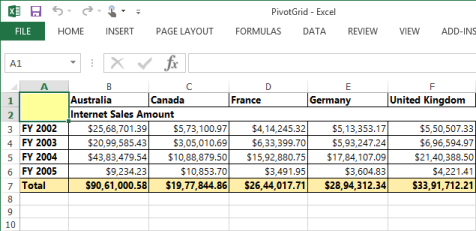
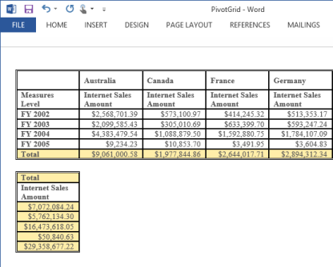
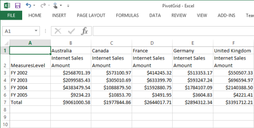

## Exporting

The PivotGrid control can be exported to the following formats:

* Excel (Cell Mode)
* Word
* PDF
* CSV

@Html.EJ().Pivot().PivotGrid("PivotGrid1")Url(Url.Content("~/wcf/OLAPService.svc"))

@Html.EJ().Button("Button1").ClientSideEvents(clientSideEvents => { clientSideEvents.Click("exportBtnClick"); }).Text("Export")

function exportBtnClick(args) {

    var gridObj = $('#PivotGrid1').data("ejPivotGrid");

    gridObj.exportPivotGrid(ej.PivotGrid.ExportOptions.Excel);

}

The Export type that is to be mentioned in the parameter takes any one of the following enumerated values such as Excel, Word, PDF and CSV.

The following code example of the service method needs to be added in-order to perform exporting in the PivotGrid.

public void Export(System.IO.Stream stream)

{

    System.IO.StreamReader sReader = new System.IO.StreamReader(stream);

    string args = System.Web.HttpContext.Current.Server.UrlDecode(sReader.ReadToEnd());

    OlapDataManager DataManager = new OlapDataManager(connectionString);

    string fileName = "PivotGrid";

    htmlHelper.ExportPivotGrid(DataManager, args, fileName,

    System.Web.HttpContext.Current.Response);

}

{{ '' | markdownify }}
{:.image }

{{ '' | markdownify }}
{:.image }

{{ '' | markdownify }}
{:.image }

{{ '' | markdownify }}
{:.image }

