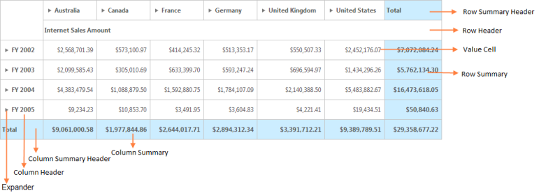
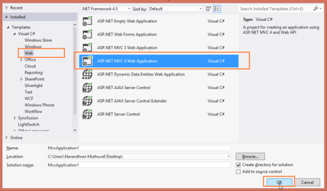
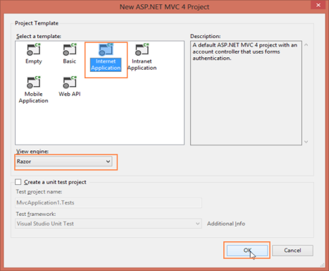
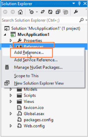
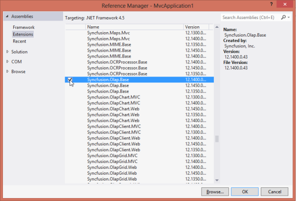
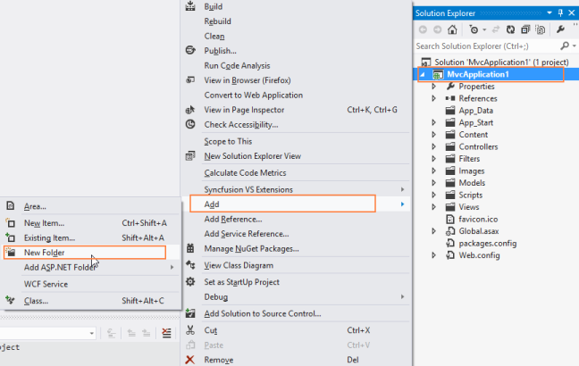
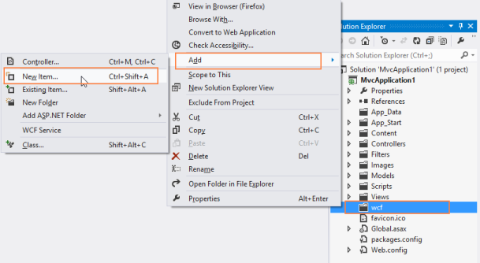
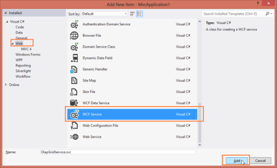
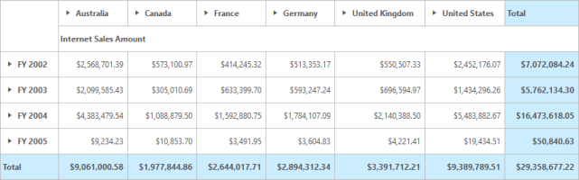
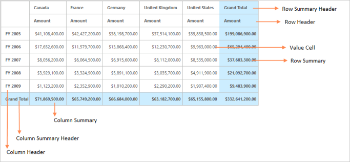

# Getting Started

This section explains briefly about how to create a PivotGrid in your application with ASP.NET MVC.

## Create your first PivotGrid in MVC

### OLAP

#### Control structure

The following screenshot displays the PivotGrid Control.

### Create an application

This section encompasses on how to configure the PivotGrid component in an application.

You can also pass the required data to PivotGrid and customize it according to your requirements.

In this example you can see how PivotGrid component tabulates the Internet Sales Amount over Fiscal year in different Customer Geographic locations 

You can open Visual Studio and create a new project by clicking New Project. You can select the Web category. Select the ASP.NET MVC4 Web Application template and then click OK.  

The following screenshot displays project creation wizard

Then select Internet application template with Razor view engine and click OK

## Add References, Scripts, Styles and Control

### Add References

1. In the Solution Explorer, right click the References folder and then click Add Reference.

2. Select the following assemblies: Microsoft.AnalysisServices.AdomdClient.dll, Syncfusion.Core.dll, Syncfusion.Compression.Base.dll, Syncfusion.Linq.Base.dll, Syncfusion.EJ.dll, Syncfusion.EJ.MVC.dll, Syncfusion.EJ.Olap.dll, Syncfusion.XlsIO.Base.dll, Syncfusion.PivotAnalysis.Base.dll and Syncfusion.Olap.Base.dll.
3. Click OK.

### Add Scripts and Styles

1. Add the script files and CSS files in the <head> tag of the _Layout.cshtml page.

> Note: 1. Use the following code sample while adding scripts and styles  2. Apart from cdn files rest of them can be acquired from the following locationC:\Users\<UserName>\AppData\Local\Syncfusion\EssentialStudio\<Version>\JavaScript\assets\



<head>

<link href="http://cdn.syncfusion.com/13.1.0.21/js/web/flat-azure/ej.web.all.min.css" rel="stylesheet" />

</head>


2. Add the below code snippet in the body tag of the _Layout.cshtml page.


<body>

   @RenderBody()

   @Html.EJ().ScriptManager()   

</body>


### Add Control in View page

Add the following code sample in the Index.cshtml page that is already created:
  

@using Syncfusion.JavaScript;

@Html.EJ().Pivot().PivotGrid("PivotGrid1").Url("/wcf/PivotGridService.svc")



### Add WCF service for PivotGrid

#### Create WCF Services

1. Right-click the project and select Add > New Folder.  Name the folder as wcf.

2. Now right click the wcf folder created and select Add > New Item.  

3. In the Add New Item window, select WCF Service and name it as PivotGridService.svc. 
4. Click Add.

### Add service methods inside Interface

Add the following code sample inside the IPivotGridService interface available in an IPivotGridService.cs file.



[ServiceContract(SessionMode = SessionMode.Allowed)]

public interface IPivotGridService

    {

        [OperationContract]

        Dictionary<string, object> InitializeGrid(string action, string gridLayout, bool enablePivotFieldList, object customObject);

        [OperationContract]

        Dictionary<string, object> DrillGrid(string action, string cellPosition, string currentReport, string headerInfo, string gridLayout, object customObject);

        [OperationContract]

        Dictionary<string, object> Paging(string action, string pagingInfo, string currentReport, string gridLayout, object customObject);

        [OperationContract]

        Dictionary<string, object> NodeDropped(string action, string dropType, string nodeInfo, string filterParams, string currentReport);

        [OperationContract]

        Dictionary<string, object> RemoveButton(string action, string headerInfo, string currentReport);

        [OperationContract]

        Dictionary<string, object> FetchMembers(string action, string headerTag, string currentReport);

        [OperationContract]

        Dictionary<string, object> Filtering(string action, string filterParams, string currentReport);

        [OperationContract]

        Dictionary<string, object> MemberExpanded(string action, bool checkedStatus, string parentNode, string tag, string cubeName, string currentReport);

    }
	
	
### Add Namespaces

Add the following necessary namespaces required to implement the service methods.

using System;

using System.Collections.Generic;

using System.Linq;

using System.Runtime.Serialization;

using System.ServiceModel;

using System.Text;

using System.ServiceModel.Activation;

using System.Web.Script.Serialization;

using Syncfusion.Olap.Manager;

using Syncfusion.Olap.Reports;

using Syncfusion.JavaScript;

using OLAPUTILS = Syncfusion.JavaScript.Olap;


### Create Class in Service file

You can create the PivotGridService class to implement the service methods. You can inherit the class from the IPivotGridService interface that is created automatically while adding any new service.


namespace MvcApplication1

{

    [AspNetCompatibilityRequirements(RequirementsMode = AspNetCompatibilityRequirementsMode.Allowed)]

    public class PivotGridService : IPivotGridService

    {        

    }

}


### Implement Service Methods

You can add the following methods to the service that are invoked for any server-side operations to be performed in PivotGrid.

1. Initialize the PivotGrids helper class. 


        PivotGrid htmlHelper = new PivotGrid();        

        static string connectionString = "Data Source=http://bi.syncfusion.com/olap/msmdpump.dll; Initial Catalog=Adventure Works DW 2008 SE;";   

        JavaScriptSerializer serializer = new JavaScriptSerializer();



2. Add the following relevant service methods.



//This method provides the required information from the server side when initializing the PivotGrid. 

        public Dictionary<string, object> InitializeGrid(string action, string gridLayout, bool enablePivotFieldList, object customObject)

        {

            OlapDataManager DataManager = null;

            dynamic customData = serializer.Deserialize<dynamic>(customObject.ToString());

                DataManager = new OlapDataManager(connectionString);

            DataManager.SetCurrentReport(CreateOlapReport());

            return htmlHelper.GetJsonData(action, DataManager, gridLayout, enablePivotFieldList);

        }

//This method provides the required information from the server side when drill up/down operation is performed in PivotGrid.

        public Dictionary<string, object> DrillGrid(string action, string cellPosition, string currentReport, string headerInfo, string layout, object customObject)

        {

            dynamic customData = serializer.Deserialize<dynamic>(customObject.ToString());

            OlapDataManager DataManager = new OlapDataManager(connectionString);

            DataManager = new OlapDataManager(connectionString);

            DataManager.SetCurrentReport(OLAPUTILS.Utils.DeserializeOlapReport(currentReport));

            return htmlHelper.GetJsonData(action, connectionString, DataManager, cellPosition, headerInfo, layout);

        }

//This method provides the required information from the server side when tree node is dropped in PivotTable Field List.

        public Dictionary<string, object> NodeDropped(string action, string dropType, string nodeInfo, string filterParams, string currentReport)

        {

            OlapDataManager DataManager = new OlapDataManager(connectionString);

            DataManager.SetCurrentReport(OLAPUTILS.Utils.DeserializeOlapReport(currentReport));

            return htmlHelper.GetJsonData(action, DataManager, dropType, nodeInfo, filterParams, true);

        }

//This method provides the required information from the server side when filtering values in PivotTable Field List.

        public Dictionary<string, object> Filtering(string action, string filterParams, string currentReport)

        {

            OlapDataManager DataManager = new OlapDataManager(connectionString);

            DataManager.SetCurrentReport(OLAPUTILS.Utils.DeserializeOlapReport(currentReport));

            return htmlHelper.GetJsonData(action, DataManager, null, filterParams);

        }

//This method provides the required information from the server side when opening the editor in PivotTable Field List.

         public Dictionary<string, object> FetchMembers(string action, string headerTag, string currentReport)

        {

            OlapDataManager DataManager = new OlapDataManager(connectionString);

            DataManager.SetCurrentReport(OLAPUTILS.Utils.DeserializeOlapReport(currentReport));

            return htmlHelper.GetJsonData(action, DataManager, null, headerTag);

        }

//This method provides the required information from the server side when paging is done in PivotGrid.

        public Dictionary<string, object> Paging(string action, string pagingInfo, string currentReport, string gridLayout, object customObject)

        {

            OlapDataManager DataManager = new OlapDataManager(connectionString);

            DataManager.SetCurrentReport(htmlHelper.SetPaging(currentReport, pagingInfo));

            return htmlHelper.GetJsonData(action, DataManager, gridLayout);

        }

//This method provides the required information from the server side when removing the split button from PivotTable Field List.

        public Dictionary<string, object> RemoveButton(string action, string headerInfo, string currentReport)

        {

            OlapDataManager DataManager = new OlapDataManager(connectionString);

            DataManager.SetCurrentReport(OLAPUTILS.Utils.DeserializeOlapReport(currentReport));

            return htmlHelper.GetJsonData(action, DataManager, null, headerInfo);

        }

//This method provides the required information from the server side when expanding member in member editor.

        public Dictionary<string, object> MemberExpanded(string action, bool     checkedStatus, string parentNode, string tag, string cubeName, string currentReport)

        {

            OlapDataManager DataManager = new OlapDataManager(connectionString);

            if (!string.IsNullOrEmpty(currentReport))

                DataManager.SetCurrentReport(OLAPUTILS.Utils.DeserializeOlapReport(currentReport));

            return htmlHelper.GetJsonData(action, DataManager, checkedStatus, parentNode, tag, cubeName);

        }

//This method carries the information about the default report which when be rendered within PivotGrid initially. 

        private OlapReport CreateOlapReport()

        {

            OlapReport olapReport = new OlapReport();

            olapReport.CurrentCubeName = "Adventure Works";

            MeasureElements measureElement = new MeasureElements();

            measureElement.Elements.Add(new MeasureElement { UniqueName = "[Measures].[Internet Sales Amount]" });

            DimensionElement dimensionElementRow = new DimensionElement();

            dimensionElementRow.Name = "Date";

            dimensionElementRow.AddLevel("Fiscal", "Fiscal Year");

            DimensionElement dimensionElementColumn = new DimensionElement();

            dimensionElementColumn.Name = "Customer";

            dimensionElementColumn.AddLevel("Customer Geography", "Country");

            olapReport.SeriesElements.Add(dimensionElementRow);

            olapReport.CategoricalElements.Add(dimensionElementColumn);

            olapReport.CategoricalElements.Add(measureElement);

            return olapReport;

        }    
	

### Configure Web.Config

1. Register the assemblies by adding the following code sample inside the <system.web> tag in web.config file at root folder.


<compilation debug="true" targetFramework="4.5">

      <assemblies>

        <add assembly="System.Web.Abstractions, Version=4.0.0.0, Culture=neutral, PublicKeyToken=31BF3856AD364E35" />

        <add assembly="System.Web.Helpers, Version=2.0.0.0, Culture=neutral, PublicKeyToken=31BF3856AD364E35" />

        <add assembly="System.Web.Routing, Version=4.0.0.0, Culture=neutral, PublicKeyToken=31BF3856AD364E35" />

        <add assembly="System.Web.Mvc, Version= X.X.X.X, Culture=neutral, PublicKeyToken=31BF3856AD364E35" />

        <add assembly="System.Web.WebPages, Version= X.X.X.X, Culture=neutral, PublicKeyToken=31BF3856AD364E35" />

        <add assembly="Syncfusion.Core, Version= X.X.X.X, Culture=neutral, PublicKeyToken=632609B4D040F6B4" />

        <add assembly="Syncfusion.EJ, Version= X.X.X.X, Culture=neutral, PublicKeyToken=3d67ed1f87d44c89" />

        <add assembly="Syncfusion.EJ.Olap, Version= X.X.X.X, Culture=neutral, PublicKeyToken=3d67ed1f87d44c89" />

        <add assembly="Syncfusion.EJ.Mvc, Version= X.X.X.X, Culture=neutral, PublicKeyToken=3d67ed1f87d44c89" />

        <add assembly="Syncfusion.Linq.Base, Version= X.X.X.X, Culture=neutral, PublicKeyToken=3d67ed1f87d44c89" />

        <add assembly="Syncfusion.PivotAnalysis.Base, Version= X.X.X.X, Culture=neutral, PublicKeyToken=3d67ed1f87d44c89" />

        <add assembly="Syncfusion.Olap.Base, Version= X.X.X.X, Culture=neutral, PublicKeyToken=3d67ed1f87d44c89" />

      </assemblies>

</compilation>


> Note: xx.x.x.xx in the above code sample refers to the current version of the Essential Studio running in your system.

The version of Syncfusion dlls according to the .NET framework and MVC version are mentioned as follows.  For example, 12.1 version is illustrated.

<table>
<tr>
<th>
MVC Version</th><th>
MVC Version of Syncfusion dlls</th><th>
Base Version of Syncfusion dlls</th><th>
System.Web.Mvc</th><th>
System.Web.WebPages</th></tr>
<tr>
<td>
MVC3</td><td>
12.1300.0.43</td><td>
12.1350.0.43</td><td>
3.0</td><td>
1.0</td></tr>
<tr>
<td>
MVC4</td><td>
12.1400.0.43</td><td>
12.1400.0.43</td><td>
4.0</td><td>
2.0</td></tr>
<tr>
<td>
MVC5</td><td>
12.1500.0.43</td><td>
12.1450.0.43</td><td>
5.0</td><td>
3.0</td></tr>
</table>

2. Add the following Namespaces file using the following code sample to the web.config files at both the root folder and View folder.


<namespaces>

        <add namespace="System.Web.Helpers" />

        <add namespace="System.Web.Mvc" />

        <add namespace="System.Web.Mvc.Ajax" />

        <add namespace="System.Web.Mvc.Html" />

        <add namespace="System.Web.Optimization" />

        <add namespace="System.Web.Routing" />

        <add namespace="System.Web.WebPages" />

        <add namespace="Syncfusion.MVC.EJ"/>

        <add namespace="Syncfusion.JavaScript"/>

        <add namespace="Syncfusion.JavaScript.DataVisualization"/>

</namespaces>



3. Register the wcf services in web.config file at root folder by adding the following codes.
4. You can expose services through the properties such as binding, contract and address etc. using an endpoint.In your appliacation the service name is MvcApplication1. PivotGridService where OlapGridService is the service class name and MvcApplication1 is the namespace name where service class appears.The following are the properties are that meet the appropriate endpoint.  
1. contract: This property indicates the contract of the endpoint is exposing. Here you are referring IPivotGridService contract and hence it is MvcApplication1.IPivotGridService.
2. binding: In your application, you use webHttpBinding to post and receive the requests and responses between the client-end and the service-end.
3. behaviorConfiguration: This property contains the name of the behavior to be used in the endpoint. endpointBehaviors are illustrated as follows


<system.serviceModel>

    <services>

      <service name="MvcApplication1.PivotGridService">

        <endpoint address="" behaviorConfiguration="MvcApplication1.PivotGridServiceAspNetAjaxBehavior"

          binding="webHttpBinding" contract="MvcApplication1.IPivotGridService" />

      </service>

    </services>

</system.serviceModel>


5. The endpointBehaviors contain all the behaviors for an endpoint.You can link each endpoint to the respective behavior only using this name property. In the following code sample MvcApplication1.PivotGridServiceAspNetAjaxBehavior would point the OlapGridService class under the namespace MvcApplication1 in PivotGridService.svc.cs file that is the appropriate behavior for the endpoint. 


<system.serviceModel>

    <behaviors>

      <endpointBehaviors>

        <behavior name="MvcApplication1.PivotGridServiceAspNetAjaxBehavior">

          <enableWebScript />

        </behavior>

      </endpointBehaviors>

    </behaviors>

</system.serviceModel>



> Note: In this example, “MvcApplication1” indicates the name of the project and “PivotGridService” indicates the name of the WCF service created.

_. ender()gcriptManager()_ 

_lap_

6. Set the UnobtrusiveJavaScriptEnabled value to false under appsettings tag as shown below.


<appSettings>

    <add key="webpages:Version" value="2.0.0.0" />

    <add key="webpages:Enabled" value="false" />

    <add key="PreserveLoginUrl" value="true" />

    <add key="ClientValidationEnabled" value="true" />

    <add key="UnobtrusiveJavaScriptEnabled" value="false" />

</appSettings>



## Configuring routing file

You can add the following highlighted line in RouteConfig.cs file inorder to avoid issues while picking the WCF service methods.



public class RouteConfig

    {

        public static void RegisterRoutes(RouteCollection routes)

        {

            routes.IgnoreRoute("{resource}.axd/{*pathInfo}");

            //NOTE: In the below highlighted lines _wcf_ is just the folder name inside which service files(*.svc) are present.

            routes.IgnoreRoute("wcf/{resource}.svc/{*pathInfo}");

            routes.IgnoreRoute("wcf/{resource}.svc");

            routes.MapRoute(

                name: "Default",

                url: "{controller}/{action}/{id}",

                defaults: new { controller = "Introduction", action = "Index", id = UrlParameter.Optional },

                 namespaces: new[] { "MVCSampleBrowser.Controllers" }

            );

        }

    }



In summary, this getting started tutorial gives you an overview of PivotGrid, its architecture, process flow, how to configure and integrate with a VS application through a simple example that is self-explanatory.

## Relational

### Control structure

The following screenshot displays the PivotGrid Control.

