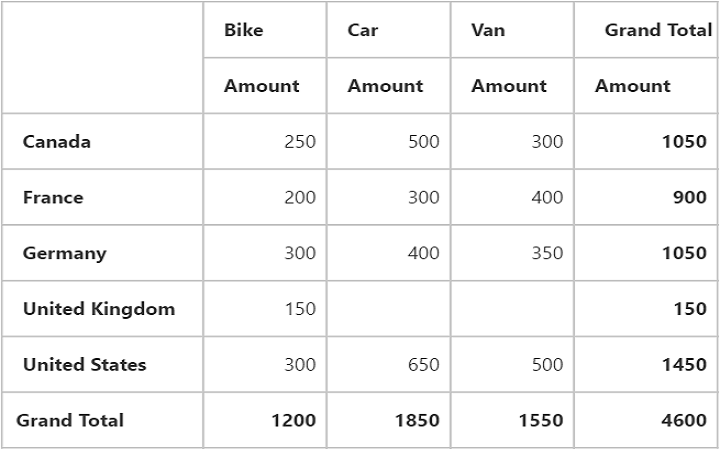
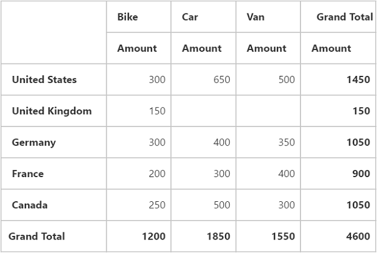
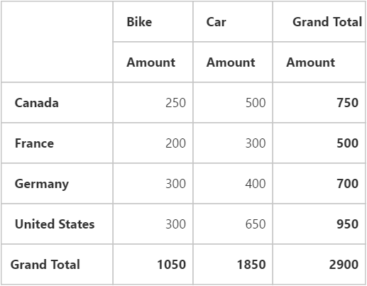

# Getting Started

## Creating a simple application with PivotGrid and OLAP datasource
 
This section covers the information required to create a simple PivotGrid bound to OLAP datasource.

N> ASP.NET MVC Web Application will contain a service that transfers data to server-side, processes and returns back to client-side for control rendering and re-rendering. The service utilized for communication could be either WCF or WebAPI based on user requirement.

###Project Initialization

Create a new **ASP.NET MVC Web Application** using Visual Studio IDE and name the project as **"PivotGridDemo"**. 

Select the View engine as **‘Razor’** and Project template as **‘Internet Application’** and finally click **OK** button to create an application.

Now add the following dependency libraries as references into your MVC Web Application. In order to add them to your application, right-click on **References** in Solution Explorer and select **Add Reference**. Now in the **Reference Manager** dialog, under **Assemblies > Extension**, the following Syncfusion libraries will be found.

* Microsoft.AnalysisServices.AdomdClient
* Syncfusion.Compression.Base
* Syncfusion.Linq.Base
* Syncfusion.Olap.Base
* Syncfusion.PivotAnalysis.Base
* Syncfusion.XlsIO.Base
* Syncfusion.Pdf.Base
* Syncfusion.DocIO.Base
* Syncfusion.EJ
* Syncfusion.EJ.Olap
* Syncfusion.EJ.MVC

N> If any version of SQL Server Analysis Service (SSAS) or Microsoft ADOMD.NET utility is installed, then the location of Microsoft.AnalysisServices.AdomdClient library is [system drive:\Program Files (x86)\Microsoft.NET\ADOMD.NET].

The version of Syncfusion libraries based on .NET framework and MVC version are classified below. For example, 13.3 version is illustrated as,

<table>
<tr>
<th>
MVC Version</th><th>
MVC Version of Syncfusion dlls</th><th>
Base Version of Syncfusion dlls</th><th>
System.Web.Mvc</th><th>
System.Web.WebPages</th>
</tr>
<tr><td>
MVC3</td><td>
{{ site.mvc3releaseversion }}</td><td>    
{{ site.35esreleaseversion }}</td><td>
3.0</td><td>
1.0</td>
</tr>
<tr><td>
MVC4</td><td>
{{ site.mvc4releaseversion }}</td><td>    
{{ site.40esreleaseversion }}</td><td>
4.0</td><td>
2.0</td>
</tr>
<tr><td>
MVC5</td><td>
{{ site.mvc5releaseversion }}</td><td>    
{{ site.45esreleaseversion }}</td><td>
5.0</td><td>
3.0</td>
</tr>
</table>

Register the referenced assemblies in Web.config files available inside Views folder and also at the root of the application.



<compilation debug="true" targetFramework="4.5">
    <assemblies> 
        …… 
        ……
        <add assembly="Syncfusion.EJ, Version= {{ site.40esreleaseversion }}, Culture=neutral, PublicKeyToken=3d67ed1f87d44c89" />
        <add assembly="Syncfusion.EJ.Olap, Version= {{ site.40esreleaseversion }}, Culture=neutral, PublicKeyToken=3d67ed1f87d44c89" />
        <add assembly="Syncfusion.EJ.Mvc, Version= {{ site.40esreleaseversion }}, Culture=neutral, PublicKeyToken=3d67ed1f87d44c89" />
        <add assembly="Syncfusion.Linq.Base, Version= {{ site.40esreleaseversion }}, Culture=neutral, PublicKeyToken=3d67ed1f87d44c89" />
        <add assembly="Syncfusion.Olap.Base, Version= {{ site.40esreleaseversion }}, Culture=neutral, PublicKeyToken=3d67ed1f87d44c89" />
        <add assembly="Syncfusion.Compression.Base, Version= {{ site.40esreleaseversion }}, Culture=neutral, PublicKeyToken=3d67ed1f87d44c89" /> 
        <add assembly="Syncfusion.PivotAnalysis.Base, Version= {{ site.40esreleaseversion }}, Culture=neutral, PublicKeyToken=3d67ed1f87d44c89" /> 
        <add assembly="Syncfusion.Pdf.Base, Version= {{ site.40esreleaseversion }}, Culture=neutral, PublicKeyToken=3d67ed1f87d44c89" />
        <add assembly="Syncfusion.XlsIO.Base, Version= {{ site.40esreleaseversion }}, Culture=neutral, PublicKeyToken=3d67ed1f87d44c89" />
        <add assembly="Syncfusion.DocIO.Base, Version= {{ site.40esreleaseversion }}, Culture=neutral, PublicKeyToken=3d67ed1f87d44c89" /> 
    </assemblies>
</compilation>



Register the required namespaces in Web.config files available inside Views folder and also at the root of the application



<namespaces> 
    ……
    ……
    <add namespace="Syncfusion.MVC.EJ" />
    <add namespace="Syncfusion.JavaScript" /> 
</namespaces>



N> Registering assemblies and namespaces earlier helps to include the control in view page with the help of intellisense.

Set the **UnobtrusiveJavaScriptEnabled** property to false under **appSettings** tag in Web.config file at the root folder.
    


<configuration> 
  	…… 
  	……
    <appSettings> 
      	…… 
      	……
        <add key="UnobtrusiveJavaScriptEnabled" value="false" /> 
   </appSettings>
        
</configuration>



###Scripts and CSS Initialization

The scripts and style sheets that are mandatorily required to render PivotGrid widget in a MVC Web Application are mentioned in an appropriate order below:

1.  ej.widgets.all.min.css
2.	jquery-1.10.2.min.js
3.	jquery.easing.1.3.min.js
4.	ej.web.all.min.js 

[Click here](http://help.syncfusion.com/js/cdn) here to know more about scripts and style sheets available online (CDN Link).

Scripts and style sheets are referred under the **head** tag in **_Layout.cshtml** file which is found inside **Views > Shared folder.**
    


<head>
    <link href="http://cdn.syncfusion.com/{{ site.releaseversion }}/js/web/flat-azure/ej.web.all.min.css" rel="stylesheet" />
    
    
    
</head>



The script manager is initialized immediately after the `RenderBody()` function call in **_Layout.cshtml** file in-order to generate widget related scripts.



<body> 
  …… 
  …… 
  @RenderBody() 
  @(Html.EJ().ScriptManager()) 
  
</body>



### Control Initialization

Before initializing, empty the contents of **Index.cshtml** file under **Views > Home** folder and add the following codes. Register the namespaces at the top of the page and then add the control.


    
@using Syncfusion.JavaScript.Olap;

 
@Html.EJ().Pivot().PivotGrid("PivotGrid1").Url(Url.Content("~/OLAPService")) 



The **“Url”** property in PivotGrid widget points the service endpoint, where data are processed and fetched in the form of JSON. The services used in PivotGrid widget as endpoint are WCF and WebAPI.

N> The above "Index.cshtml" contains WebAPI Url, which is "~/OLAPService". If WCF service is used as endpoint, the Url would look like "~/OLAPService.svc".

###WebAPI

**Adding a WebAPI Controller**

To add a WebAPI controller in an existing Web Application, right-click on the project in Solution Explorer and select **Add > New Item**. In the **Add New Item** window, select **WebAPI Controller Class** and name it as `OLAPServiceController.cs`, click Add.

Now, WebAPI controller is added to the application successfully with the file **"OLAPServiceController.cs"**.

N> While adding WebAPI Controller Class, name it with the suffix 'Controller' that is mandatory. For example, in this demo the controller is named as **"OLAPServiceController"**.

Next, remove all the existing methods such as "Get", "Post", "Put" and "Delete" present inside `OLAPServiceController.cs` file.



namespace PivotGridDemo
{
    public class OLAPServiceController: ApiController
    {
    
    }
}



**Adding the List of Namespaces**

The following are the list of namespaces to be added on top of the main class inside `OLAPServiceController.cs` file.



using System.Web.Script.Serialization;
using Syncfusion.Olap.Manager;
using Syncfusion.Olap.Reports;
using Syncfusion.JavaScript;
using Syncfusion.JavaScript.Olap;

namespace PivotGridDemo
{
    public class OLAPServiceController: ApiController
    {
    
    }
}



**Datasource Initialization**

Now, the connection string to connect OLAP Cube, PivotGrid and JavaScriptSerializer instances are created immediately inside the main class in `OLAPServiceController.cs` file.



namespace PivotGridDemo
{
    public class OLAPServiceController: ApiController
    {
        PivotGridhtmlHelper = new PivotGrid();
        string connectionString = "Data Source=http://bi.syncfusion.com/olap/msmdpump.dll; Initial Catalog=Adventure Works DW 2008 SE;";
        JavaScriptSerializer serializer = new JavaScriptSerializer();
        //Other codes
     }
}



**Service methods in WebAPI Controller**

Define the service methods inside OLAPServiceController class, found inside `OLAPServiceController.cs` file, created while adding WebAPI Controller Class to the Application.



namespace PivotGridDemo {
    public class OLAPServiceController: ApiController {
        PivotGridhtmlHelper = new PivotGrid();
        string connectionString = "Data Source=http://bi.syncfusion.com/olap/msmdpump.dll; Initial Catalog=Adventure Works DW 2008 SE;";
        JavaScriptSerializer serializer = new JavaScriptSerializer();

        [System.Web.Http.ActionName("InitializeGrid")]
        [System.Web.Http.HttpPost]
        public Dictionary < string, object > InitializeGrid(Dictionary < string, object > jsonResult) {
            Dictionary < string, object > customDict = new Dictionary < string, object > ();
            OlapDataManager DataManager = new OlapDataManager(connectionString);
            DataManager.SetCurrentReport(CreateOlapReport());
            customDict = htmlHelper.GetJsonData(jsonResult["action"].ToString(), DataManager, jsonResult["gridLayout"].ToString(), Convert.ToBoolean(jsonResult["enablePivotFieldList"].ToString()));
            return customDict;
        }

        [System.Web.Http.ActionName("DrillGrid")]
        [System.Web.Http.HttpPost]
        public Dictionary < string, object > DrillGrid(Dictionary < string, object > jsonResult) {
            dynamic customData = serializer.Deserialize < dynamic > (jsonResult["customObject"].ToString());
            OlapDataManager DataManager = new OlapDataManager(connectionString);
            DataManager = new OlapDataManager(connectionString);
            if ((customData.ContainsKey("Language"))) {
                DataManager.Culture = new System.Globalization.CultureInfo((customData["Language"]));
                DataManager.OverrideDefaultFormatStrings = true;
            }
            DataManager.SetCurrentReport(Syncfusion.JavaScript.Olap.Utils.DeserializeOlapReport(jsonResult["currentReport"].ToString()));
            return htmlHelper.GetJsonData(jsonResult["action"].ToString(), connectionString, DataManager, jsonResult["cellPosition"].ToString(), jsonResult["headerInfo"].ToString(), jsonResult["layout"].ToString());
        }

        [System.Web.Http.ActionName("NodeDropped")]
        [System.Web.Http.HttpPost]
        public Dictionary < string, object > NodeDropped(Dictionary < string, object > jsonResult) {
            OlapDataManager DataManager = new OlapDataManager(connectionString);
            DataManager.SetCurrentReport(Syncfusion.JavaScript.Olap.Utils.DeserializeOlapReport(jsonResult["currentReport"].ToString()));
            return htmlHelper.GetJsonData(jsonResult["action"].ToString(), DataManager, jsonResult["dropType"].ToString(), jsonResult["nodeInfo"].ToString(), null,
                true);
        }

        [System.Web.Http.ActionName("Filtering")]
        [System.Web.Http.HttpPost]
        public Dictionary < string, object > Filtering(Dictionary < string, object > jsonResult) {
            OlapDataManager DataManager = new OlapDataManager(connectionString);
            DataManager.SetCurrentReport(Syncfusion.JavaScript.Olap.Utils.DeserializeOlapReport(jsonResult["currentReport"].ToString()));
            return htmlHelper.GetJsonData(jsonResult["action"].ToString(), DataManager, null, jsonResult["filterParams"].ToString());
        }

        [System.Web.Http.ActionName("FetchMembers")]
        [System.Web.Http.HttpPost]
        public Dictionary < string, object > FetchMembers(Dictionary < string, object > jsonResult) {
            OlapDataManager DataManager = new OlapDataManager(connectionString);
            DataManager.SetCurrentReport(Syncfusion.JavaScript.Olap.Utils.DeserializeOlapReport(jsonResult["currentReport"].ToString()));
            return htmlHelper.GetJsonData(jsonResult["action"].ToString(), DataManager, null, jsonResult["headerTag"].ToString());
        }

        [System.Web.Http.ActionName("Paging")]
        [System.Web.Http.HttpPost]
        public Dictionary < string, object > Paging(Dictionary < string, object > jsonResult) {
            OlapDataManager DataManager = new OlapDataManager(connectionString);
            DataManager.SetCurrentReport(htmlHelper.SetPaging(jsonResult["currentReport"].ToString(), jsonResult["pagingInfo"].ToString()));
            return htmlHelper.GetJsonData(jsonResult["action"].ToString(), DataManager, jsonResult["gridLayout"].ToString());
        }

        [System.Web.Http.ActionName("RemoveButton")]
        [System.Web.Http.HttpPost]
        public Dictionary < string, object > RemoveButton(Dictionary < string, object > jsonResult) {
            OlapDataManager DataManager = new OlapDataManager(connectionString);
            DataManager.SetCurrentReport(Syncfusion.JavaScript.Olap.Utils.DeserializeOlapReport(jsonResult["currentReport"].ToString()));
            return htmlHelper.GetJsonData(jsonResult["action"].ToString(), DataManager, null, jsonResult["headerInfo"].ToString());
        }

        [System.Web.Http.ActionName("MemberExpanded")]
        [System.Web.Http.HttpPost]
        public Dictionary < string, object > MemberExpanded(Dictionary < string, object > jsonResult) {
            OlapDataManager DataManager = new OlapDataManager(connectionString);
            if (!string.IsNullOrEmpty(jsonResult["currentReport"].ToString()))
                DataManager.SetCurrentReport(Syncfusion.JavaScript.Olap.Utils.DeserializeOlapReport(jsonResult["currentReport"].ToString()));
            return htmlHelper.GetJsonData(jsonResult["actiion"].ToString(), DataManager, jsonResult["checkedStatus"].ToString(), jsonResult["parentNode"].ToString(),
                jsonResult["tag"].ToString(), jsonResult["cubeName"].ToString());
        }

        [System.Web.Http.ActionName("Export")]
        [System.Web.Http.HttpPost]
        public void Export(System.IO.Stream stream) {
            System.IO.StreamReader sReader = new System.IO.StreamReader(stream);
            string args = System.Web.HttpContext.Current.Server.UrlDecode(sReader.ReadToEnd());
            OlapDataManager DataManager = new OlapDataManager(connectionString);
            string fileName = "Sample";
            htmlHelper.ExportPivotGrid(DataManager, args, fileName, System.Web.HttpContext.Current.Response);
        }

        private OlapReport CreateOlapReport() {
            OlapReport olapReport = new OlapReport();
            olapReport.CurrentCubeName = "Adventure Works";

            MeasureElements measureElement = new MeasureElements();
            measureElement.Elements.Add(new MeasureElement {
                UniqueName = "[Measures].[Internet Sales Amount]"
            });

            DimensionElement dimensionElementRow = new DimensionElement();
            dimensionElementRow.Name = "Date";
            dimensionElementRow.AddLevel("Fiscal", "Fiscal Year");

            DimensionElement dimensionElementColumn = new DimensionElement();
            dimensionElementColumn.Name = "Customer";
            dimensionElementColumn.AddLevel("Customer Geography", "Country");

            olapReport.SeriesElements.Add(dimensionElementRow);
            olapReport.CategoricalElements.Add(dimensionElementColumn);
            olapReport.CategoricalElements.Add(measureElement);

            return olapReport;
        }

    }
}



**Configure routing in Global Application Class**

If Global.asax file is not found in your MVC Web Application then add a new one. To add a **Global.asax** in your existing MVC Web Application, right-click on the project in Solution Explorer and select **Add > New Item**. In the **Add New Item** window, select **Global Application Class** and name it as `Global.asax`, click **Add.**
 
Once the Global.asax file is created, remove all the existing code inside the "Application_Start" function. Then routing could be configured as shown in the following code example.



public class Global: System.Web.HttpApplication {
    protected void Application_Start(object sender, EventArgs e) {
        System.Web.Http.GlobalConfiguration.Configuration.Routes.MapHttpRoute(
            name: "DefaultApi",
            routeTemplate: "{controller}/{action}/{id}",
            defaults: new {
                id = RouteParameter.Optional
            });
        AppDomain.CurrentDomain.SetData("SQLServerCompactEditionUnderWebHosting", true);
    }
}



Now, **PivotGrid** is rendered with Customer Count over a period of fiscal years across different customer geographic locations.

 

### WCF

This section demonstrates the utilization of WCF service as endpoint binding OLAP datasource to a simple PivotGrid. For more details on this topic, [click here](http://help.syncfusion.com/aspnetmvc/PivotGrid/olap-connectivity#wcf).

## Creating a simple application with PivotGrid and Relational datasource

This section covers the information required to create a simple PivotGrid bound to Relational datasource. 

N> ASP.NET MVC Web Application will contain a service that transfers data to server-side, processes and returns back to client-side for control rendering and re-rendering. The service utilized for communication could be either WCF or WebAPI based on user requirement.

### Project Initialization

Create a new **ASP.NET MVC Web Application** using Visual Studio IDE and name the project as **“PivotGridDemo”**.

Select the View engine as **‘Razor’** and Project template as **‘Internet Application’** and finally click **OK** button to create an application.

Now add the following dependency libraries as references into your MVC Web Application. In order to add them to your application, right-click on **References** in Solution Explorer and select Add Reference. Now in the **Reference Manager** dialog, under **Assemblies > Extension**, the following Syncfusion libraries will be found.

* Syncfusion.Compression.Base
* Syncfusion.Linq.Base
* Syncfusion.Olap.Base
* Syncfusion.PivotAnalysis.Base
* Syncfusion.XlsIO.Base
* Syncfusion.Pdf.Base
* Syncfusion.DocIO.Base
* Syncfusion.EJ
* Syncfusion.EJ.Olap
* Syncfusion.EJ.MVC

N> If any version of SQL Server Analysis Service (SSAS) or Microsoft ADOMD.NET utility is installed, then the location of Microsoft.AnalysisServices.AdomdClient library is [system drive:\Program Files (x86)\Microsoft.NET\ADOMD.NET].

The version of Syncfusion libraries based on .NET framework and MVC version are classified below. For example, 13.3 version is illustrated as,

<table>
<tr>
<th>
MVC Version</th><th>
MVC Version of Syncfusion dlls</th><th>
Base Version of Syncfusion dlls</th><th>
System.Web.Mvc</th><th>
System.Web.WebPages</th>
</tr>
<tr><td>
MVC3</td><td>
{{ site.mvc3releaseversion }}</td><td>    
{{ site.35esreleaseversion }}</td><td>
3.0</td><td>
1.0</td>
</tr>
<tr><td>
MVC4</td><td>
{{ site.mvc4releaseversion }}</td><td>    
{{ site.40esreleaseversion }}</td><td>
4.0</td><td>
2.0</td>
</tr>
<tr><td>
MVC5</td><td>
{{ site.mvc5releaseversion }}</td><td>    
{{ site.45esreleaseversion }}</td><td>
5.0</td><td>
3.0</td>
</tr>
</table>

Register the referenced assemblies in Web.config files available inside Views folder and also at the root of the application.



<compilation debug="true" targetFramework="4.5">
    <assemblies> 
        …… 
        ……
        <add assembly="Syncfusion.EJ, Version= {{ site.40esreleaseversion }}, Culture=neutral, PublicKeyToken=3d67ed1f87d44c89" />
        <add assembly="Syncfusion.EJ.Olap, Version= {{ site.40esreleaseversion }}, Culture=neutral, PublicKeyToken=3d67ed1f87d44c89" />
        <add assembly="Syncfusion.EJ.Mvc, Version= {{ site.40esreleaseversion }}, Culture=neutral, PublicKeyToken=3d67ed1f87d44c89" />
        <add assembly="Syncfusion.Linq.Base, Version= {{ site.40esreleaseversion }}, Culture=neutral, PublicKeyToken=3d67ed1f87d44c89" />
        <add assembly="Syncfusion.Olap.Base, Version= {{ site.40esreleaseversion }}, Culture=neutral, PublicKeyToken=3d67ed1f87d44c89" />
        <add assembly="Syncfusion.Pdf.Base, Version= {{ site.40esreleaseversion }}, Culture=neutral, PublicKeyToken=3d67ed1f87d44c89" />
        <add assembly="Syncfusion.XlsIO.Base, Version= {{ site.40esreleaseversion }}, Culture=neutral, PublicKeyToken=3d67ed1f87d44c89" />
        <add assembly="Syncfusion.DocIO.Base, Version= {{ site.40esreleaseversion }}, Culture=neutral, PublicKeyToken=3d67ed1f87d44c89" /> 
    </assemblies>
</compilation>



Register the required namespaces in Web.config files available inside Views folder and also at the root of the application



<namespaces> 
  	……
  	……
    <add namespace="Syncfusion.MVC.EJ" />
    <add namespace="Syncfusion.JavaScript" /> 
</namespaces>



N> Registering assemblies and namespaces earlier helps to include the control in view page with the help of intellisense.

Set the **UnobtrusiveJavaScriptEnabled** property to false under **appSettings** tag in Web.config file at the root folder.
    


<configuration> 
  	…… 
  	……
    <appSettings> 
      	…… 
      	……
        <add key="UnobtrusiveJavaScriptEnabled" value="false" /> 
   </appSettings>
        
</configuration>



###Scripts and CSS Initialization

The scripts and style sheets that are mandatorily required to render PivotGrid widget in a MVC Web Application are mentioned in an appropriate order below:

1.  ej.widgets.all.min.css
2.	jquery-1.10.2.min.js
3.	jquery.easing.1.3.min.js
4.	ej.web.all.min.js 

[Click here](http://help.syncfusion.com/js/cdn) here to know more about scripts and style sheets available online (CDN Link).

Scripts and style sheets are referred under the <head> tag in **_Layout.cshtml** file which is found inside **Views > Shared folder.**
    


<head>
    <link href="http://cdn.syncfusion.com/{{ site.releaseversion }}/js/web/flat-azure/ej.web.all.min.css" rel="stylesheet" />
    
    
    
</head>



The script manager is initialized immediately after the `RenderBody()` function call in **_Layout.cshtml** file in-order to generate widget related scripts.



<body> 
  …… 
  …… 
  @RenderBody() 
  @(Html.EJ().ScriptManager()) 
  
</body>



### Control Initialization

Before initializing, empty the contents of **Index.cshtml** file under **Views > Home** folder and add the following codes. Register the namespaces at the top of the page and then add the control.


    
@using Syncfusion.JavaScript.Olap;

 
@Html.EJ().Pivot().PivotGrid("PivotGrid1").Url(Url.Content("~/RelationalService.svc")) 



The **“Url”** property in PivotGrid widget points the service endpoint, where data are processed and fetched in the form of JSON. The services used in PivotGrid widget as endpoint are WCF and WebAPI.

N> The above "Index.cshtml" contains WebAPI Url, which is "~/RelationalService". If WCF service is used as endpoint, the Url would look like "~/RelationalService.svc".

###WebAPI

**Adding a WebAPI Controller**

To add a WebAPI controller in an existing MVC Web Application, right-click on the project in Solution Explorer and select **Add > New Item**. In the **Add New Item** window, select **WebAPI Controller Class** and name it as **“RelationalServiceController.cs”**, click **Add**.

Now, WebAPI controller is added to the application successfully with the file **“RelationalServiceController.cs”**.

N> While adding WebAPI Controller Class, name it with the suffix ‘Controller’ which is mandatory. For example, in this demo the controller is named as “RelationalServiceController”.

Next, remove all the existing methods such as "Get", "Post", "Put" and "Delete" present inside `RelationalServiceController.cs` file.



namespace PivotGridDemo
{
    public class RelationalServiceController: ApiController
    {
        
    }
}



**Adding the List of Namespaces**

The following are the list of namespaces to be added on top of the main class inside `RelationalServiceController.cs` file.



using System.Web.Script.Serialization;
using Syncfusion.JavaScript;
using Syncfusion.PivotAnalysis.Base; 

namespace PivotGridDemo
{
    public class RelationalServiceController : ApiController
    {

    }
}



**Datasource Initialization**

Now, the connection string to connect OLAP Cube, PivotGird and JavaScriptSerializer instances are created immediately inside the main class in **RelationalServiceController.cs** file.



namespace PivotGridDemo {
    …………
    …………
    internal class ProductSales {
        public string Product {
            get;
            set;
        }

        public string Date {
            get;
            set;
        }

        public string Country {
            get;
            set;
        }

        public string State {
            get;
            set;
        }

        public int Quantity {
            get;
            set;
        }

        public double Amount {
            get;
            set;
        }

        public static ProductSalesCollection GetSalesData() {
            /// Geography
            string[] countries = new string[] {
                "Australia",
                "Canada",
                "France",
                "Germany",
                "United Kingdom",
                "United States"
            };
            string[] ausStates = new string[] {
                "New South Wales",
                "Queensland",
                "South Australia",
                "Tasmania",
                "Victoria"
            };
            string[] canadaStates = new string[] {
                "Alberta",
                "British Columbia",
                "Brunswick",
                "Manitoba",
                "Ontario",
                "Quebec"
            };
            string[] franceStates = new string[] {
                "Charente-Maritime",
                "Essonne",
                "Garonne (Haute)",
                "Gers",
            };
            string[] germanyStates = new string[] {
                "Bayern",
                "Brandenburg",
                "Hamburg",
                "Hessen",
                "Nordrhein-Westfalen",
                "Saarland"
            };
            string[] ukStates = new string[] {
                "England"
            };
            string[] ussStates = new string[] {
                "New York",
                "North Carolina",
                "Alabama",
                "California",
                "Colorado",
                "New Mexico",
                "South Carolina"
            };

            /// Time
            string[] dates = new string[] {
                "FY 2005",
                "FY 2006",
                "FY 2007",
                "FY 2008",
                "FY 2009"
            };

            /// Products
            string[] products = new string[] {
                "Bike",
                "Van",
                "Car"
            };
            Random r = new Random(123345345);

            int numberOfRecords = 2000;
            ProductSalesCollection listOfProductSales = new ProductSalesCollection();
            for (int i = 0; i < numberOfRecords; i++) {
                ProductSales sales = new ProductSales();
                sales.Country = countries[r.Next(1, countries.GetLength(0))];
                sales.Quantity = r.Next(1, 12);
                /// 1 percent discount for 1 quantity
                double discount = (30000 * sales.Quantity) * (double.Parse(sales.Quantity.ToString()) / 100);
                sales.Amount = (30000 * sales.Quantity) - discount;
                sales.Date = dates[r.Next(r.Next(dates.GetLength(0) + 1))];
                sales.Product = products[r.Next(r.Next(products.GetLength(0) + 1))];
                switch (sales.Product) {
                    case "Car":
                        {
                            sales.Date = "FY 2005";
                            break;
                        }
                }
                switch (sales.Country) {
                    case "Australia":
                        {
                            sales.State = ausStates[r.Next(ausStates.GetLength(0))];
                            break;
                        }
                    case "Canada":
                        {
                            sales.State = canadaStates[r.Next(canadaStates.GetLength(0))];
                            break;
                        }
                    case "France":
                        {
                            sales.State = franceStates[r.Next(franceStates.GetLength(0))];
                            break;
                        }
                    case "Germany":
                        {
                            sales.State = germanyStates[r.Next(germanyStates.GetLength(0))];
                            break;
                        }
                    case "United Kingdom":
                        {
                            sales.State = ukStates[r.Next(ukStates.GetLength(0))];
                            break;
                        }
                    case "United States":
                        {
                            sales.State = ussStates[r.Next(ussStates.GetLength(0))];
                            break;
                        }
                }
                listOfProductSales.Add(sales);
            }

            return listOfProductSales;
        }

        public override string ToString() {
            return string.Format("{0}-{1}-{2}", this.Country, this.State, this.Product);
        }

        public class ProductSalesCollection: List < ProductSales > {}
    }
}



**Service methods in WebAPI Controller**

Define the service methods inside RelationalServiceController class, found inside `RelationalServiceController.cs` file, created while adding WebAPI Controller Class to the Application.



namespace PivotGridDemo {
    public class RelationalServiceController: ApiController {
        PivotGrid htmlHelper = new PivotGrid();
        JavaScriptSerializer serializer = new JavaScriptSerializer();
        Dictionary < string, object > dict = new Dictionary < string, object > ();

        [System.Web.Http.ActionName("InitializeGrid")]
        [System.Web.Http.HttpPost]
        public Dictionary < string, object > InitializeGrid(Dictionary < string, object > jsonResult) {
            htmlHelper.PivotReport = BindDefaultData();
            dict = htmlHelper.GetJsonData(jsonResult["action"].ToString(), ProductSales.GetSalesData());
            return dict;
        }

        [System.Web.Http.ActionName("FetchMembers")]
        [System.Web.Http.HttpPost]
        public Dictionary < string, object > FetchMembers(Dictionary < string, object > jsonResult) {
            htmlHelper.PopulateData(jsonResult["currentReport"].ToString());
            dict = htmlHelper.GetJsonData(jsonResult["action"].ToString(), ProductSales.GetSalesData(), jsonResult["headerTag"].ToString(), jsonResult["sortedHeaders"].ToString());
            return dict;
        }

        [System.Web.Http.ActionName("Filtering")]
        [System.Web.Http.HttpPost]
        public Dictionary < string, object > Filtering(Dictionary < string, object > jsonResult) {
            htmlHelper.PopulateData(jsonResult["currentReport"].ToString());
            dict = htmlHelper.GetJsonData(jsonResult["action"].ToString(), ProductSales.GetSalesData(), jsonResult["filterParams"].ToString(), jsonResult["sortedHeaders"].ToString());
            return dict;
        }

        [System.Web.Http.ActionName("NodeStateModified")]
        [System.Web.Http.HttpPost]
        public Dictionary < string, object > NodeStateModified(Dictionary < string, object > jsonResult) {
            htmlHelper.PopulateData(jsonResult["currentReport"].ToString());
            dict = htmlHelper.GetJsonData(jsonResult["action"].ToString(), ProductSales.GetSalesData(), jsonResult["headerTag"].ToString(), jsonResult["dropAxis"].ToString(), jsonResult["filterParams"].ToString(), jsonResult["sortedHeaders"].ToString());
            return dict;
        }

        [System.Web.Http.ActionName("NodeDropped")]
        [System.Web.Http.HttpPost]
        public Dictionary < string, object > NodeDropped(Dictionary < string, object > jsonResult) {
            htmlHelper.PopulateData(jsonResult["currentReport"].ToString());
            dict = htmlHelper.GetJsonData(jsonResult["action"].ToString(), ProductSales.GetSalesData(), jsonResult["dropAxis"].ToString(), jsonResult["headerTag"].ToString(), jsonResult["filterParams"].ToString(), jsonResult["sortedHeaders"].ToString());
            return dict;
        }

        [System.Web.Http.ActionName("Sorting")]
        [System.Web.Http.HttpPost]
        public Dictionary < string, object > Sorting(Dictionary < string, object > jsonResult) {
            htmlHelper.PopulateData(jsonResult["currentReport"].ToString());
            dict = htmlHelper.GetJsonData(jsonResult["action"].ToString(), ProductSales.GetSalesData(), jsonResult["sortedHeaders"].ToString());
            return dict;
        }

        private PivotReport BindDefaultData() {
            PivotReport pivotSetting = new PivotReport();
            pivotSetting.PivotRows.Add(new PivotItem {
                FieldMappingName = "Product", FieldHeader = "Product", TotalHeader = "Total", ShowSubTotal = false
            });
            pivotSetting.PivotColumns.Add(new PivotItem {
                FieldMappingName = "Country", FieldHeader = "Country", TotalHeader = "Total", ShowSubTotal = false
            });
            pivotSetting.PivotCalculations.Add(new PivotComputationInfo {
                CalculationName = "Amount", Description = "Amount", FieldHeader = "Amount", FieldName = "Amount", Format = "C", SummaryType = Syncfusion.PivotAnalysis.Base.SummaryType.DoubleTotalSum
            });
            return pivotSetting;
        }
    }
}



**Configure routing in Global Application Class**

If Global.asax file is not found in your MVC Web Application then add a new one. To add a **Global.asax** in your existing MVC Web Application, right-click on the project in Solution Explorer and select **Add > New Item**. In the **Add New Item** window, select **Global Application Class** and name it as `Global.asax`, click **Add.**
 
Once the Global.asax file is created, remove all the existing code inside the "Application_Start" function. Then routing could be configured as shown in the following code example.



public class Global: System.Web.HttpApplication {
    protected void Application_Start(object sender, EventArgs e) {
        System.Web.Http.GlobalConfiguration.Configuration.Routes.MapHttpRoute(
            name: "DefaultApi",
            routeTemplate: "{controller}/{action}/{id}",
            defaults: new {
                id = RouteParameter.Optional
            });
        AppDomain.CurrentDomain.SetData("SQLServerCompactEditionUnderWebHosting", true);
    }
}



Now, **PivotGrid** will be rendered with Sales Amount over a set of products across different customer geographic locations.

 

###WCF

This section demonstrates the utilization of WCF service as endpoint binding Relational datasource to a simple PivotGrid. For more details on this topic, [click here](http://help.syncfusion.com/aspnetmvc/PivotGrid/olap-connectivity#wcf-1).

## Creating a simple application with PivotGrid and Relational datasource (Client-Side)

This section covers the information that you need to know to populate a simple PivotGrid with Relational data completely on the client-side.

### Scripts and CSS References  

The scripts and style sheets that are mandatorily required to render PivotGrid widget in a MVC Web Application are mentioned in an appropriate order below:

1. ej.widgets.all.min.css
2. jquery-1.10.2.min.js
3. jquery.easing.1.3.min.js
4. jquery.linq.js
5. ej.web.all.min.js

Scripts and style sheets are referred under the head tag in _Layout.cshtml file which is found inside Views > Shared folder.

    

<head>
    <link href="http://cdn.syncfusion.com/{{ site.releaseversion }}/js/web/flat-azure/ej.web.all.min.css" rel="stylesheet" type="text/css" />
    
    
    
    
    
</head>    



### Initialize PivotGrid

Before initializing, empty the contents of Index.cshtml file under Views > Home folder and add the following codes.



@using Syncfusion.JavaScript;

    @Html.EJ().Pivot().PivotGrid("PivotGrid1")



### Populate PivotGrid With Data

Let us now see how to populate the PivotGrid control using a sample JSON data as shown below. 



 @Html.EJ().Pivot().PivotGrid("PivotGrid1").ClientSideEvents(clientSideEvents => clientSideEvents.Load("onLoad"))
 
 



The JSON data is set to the **"data"** property present inside the **"dataSource"** object. **"dataSource"** object allows us to set both datasource as well as the fields that needs to be displayed in the row, column, value and filter section of the PivotGrid control.
  

  
 @Html.EJ().Pivot().PivotGrid("PivotGrid1").ClientSideEvents(clientSideEvents => clientSideEvents.Load("onLoad")).DataSource(dataSource => dataSource.Rows(rows => { rows.FieldName("Country").FieldCaption("Country").Add();}).Columns(columns => { columns.FieldName("Product").FieldCaption("Product").Add(); }).Values(values => { values.FieldName("Amount").Add();}))



The above code will generate a simple PivotGrid with "Country" field in Row, "Product" field in Column and "Amount" field in Value section.

 

### Apply Sorting

You can sort a field either to ascending or descending order using the "sortOrder" property. Sorting is applicable only for Row and Column fields. By default, fields are arranged in ascending order.
 


 @Html.EJ().Pivot().PivotGrid("PivotGrid1").ClientSideEvents(clientSideEvents => clientSideEvents.Load("onLoad")).DataSource(dataSource => dataSource.Rows(rows => {rows.FieldName("Country").FieldCaption("Country").SortOrder(SortOrder.Ascending).Add();}).Columns(columns => { columns.FieldName("Product").FieldCaption("Product").Add(); }).Values(values => { values.FieldName("Amount").Add();}))  



 

### Apply Filtering

Filtering option allows you to specify a set of values that either need to be displayed or hided. Also filtering option is applicable only for Row, Column and Filter areas.

**"filterItems"** object allow us to apply filtering to the fields using the following properties:

* filterType -  indicates whether the values should be included or excluded.
* values -  specify an array of values that needs to be included or excluded within the particular field.



 @Html.EJ().Pivot().PivotGrid("PivotGrid1").ClientSideEvents(clientSideEvents => clientSideEvents.Load("onLoad")).DataSource(dataSource => dataSource.Rows(rows => { rows.FieldName("Country").FieldCaption("Country").FilterItems(filter => { filter.FilterType(PivotAnalysisFilterType.Exclude).Values(value => { value.Add("United Kingdom"); }); }).Add(); }).Columns(columns => { columns.FieldName("Product").FieldCaption("Product").Add(); }).Values(values => { values.FieldName("Amount").Add(); }))
  


 

### Apply Summary Types
Allows us to specify the required summary type that PivotGrid should use in its summary cells. **"totalsum"** is the default summary type. Following are the summary types that are supported:

* totalsum
* average
* count
* minimum
* maximum



@Html.EJ().Pivot().PivotGrid("PivotGrid1").ClientSideEvents(clientSideEvents => clientSideEvents.Load("onLoad")).DataSource(dataSource => dataSource.Rows(rows => { rows.FieldName("Country").FieldCaption("Country").Add(); }).Columns(columns => { columns.FieldName("Product").FieldCaption("Product").Add(); }).Values(values => { values.FieldName("Amount").SummaryType(PivotAnalysisSummaryType.Average).Add(); values.FieldName("Quantity").FieldCaption("Quantity").SummaryType(PivotAnalysisSummaryType.TotalSum).Add(); }))  



 
