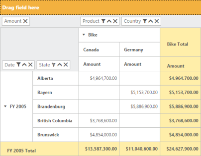

## Grouping Bar

> _Note: This feature is applicable only for Relational datasource._

The PivotGrid control supports Grouping bar that allows you to filter, sort, and remove members of the relational data loaded in the PivotGrid control. The grouped report can also be changed dynamically by using drag and drop operations.

The following code example explains on how to enable the Grouping bar within the PivotGrid control.

@Html.EJ().Pivot().PivotGrid("PivotGrid1").Url(Url.Content("~/wcf/RelationalService.svc")).EnableGroupingBar(true).ClientSideEvents(events => events.AfterServiceInvoke("OnAfterServiceInvoke"))

@Html.EJ().Pivot().PivotSchemaDesigner("PivotSchemaDesigner")

OnAfterServiceInvoke = function (evt) {

    if (evt.action == "initialize") {

        var PivotSchemaDesigner = $("#PivotSchemaDesigner").data('ejPivotSchemaDesigner');

        if (PivotSchemaDesigner.model.pivotControl == null) {

            PivotSchemaDesigner.model.enableWrapper = true;

            PivotSchemaDesigner.model.pivotControl = this;

            PivotSchemaDesigner.model.layout = "excel";

            PivotSchemaDesigner._load();

        }

    }

}

{  | markdownify }
{:.image }

The following operations can be achieved by using the Grouping bar:

Filtering

Filtering option available in the Grouping bar allows you to select a specific set of values that needs to be displayed in the PivotGrid control and hides the rest. By default, the filtering option is applicable only for the Row, Column and Filter areas.

Sorting

Sorting option available in the Grouping bar allows you to sort the values besides the respective PivotItem in the PivotGrid control. This option is applicable for the PivotItems available only in the Row and Column areas. The sort indicator present in the button indicates whether the values are in ascending or descending order. Normally, the up arrow indicates ascending order and the down arrow indicates descending order. By default, the values are sorted in ascending order.

Remove

Remove option available in the Grouping bar allows you to remove a specific PivotItem from the PivotGridcontrol.

