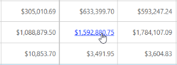

# Hyperlink

The PivotGrid control supports Hyperlink option to link data for any individual cell. Hyperlinks are enabled individually for value, row, column, and summary cells by setting the corresponding property to ‘True’. After enabling the property, the specified cells display Hyperlink on hovering. The name of the event to be triggered is passed to the correspondingevent property. On clicking the cells, the passed event is triggered and the information of the cell is carried through a parameter.

The following code example demonstrates how to create the PivotGrid control using Hyperlink support.



@section ScriptSection{

}


@section ControlsSection{

@Html.EJ().Pivot().PivotGrid("PivotGrid1").Url("../wcf/PivotGridService.svc").ClientSideEvents(events=>
events.ValueCellHyperlinkClick("CellClickEvent").RowHeaderHyperlinkClick("CellClickEvent")
.ColumnHeaderHyperlinkClick("CellClickEvent").SummaryCellHyperlinkClick("CellClickEvent")).HyperlinkSettings(hypLink => 
hypLink.EnableColumnHeaderHyperlink(true).EnableRowHeaderHyperlink(true).EnableValueCellHyperlink(true)
.EnableSummaryCellHyperlink(true))

} 



 The output of the above code creates a PivotGrid with the Hyperlink option as shown in the following screenshot:

