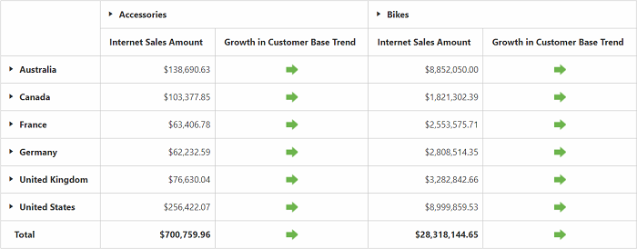
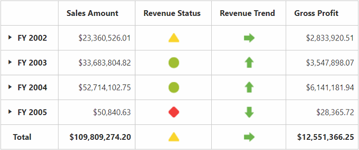

# KPI

Key Performance Indicators (KPI) are business metric that help to figure out the progress of an enterprise in meeting its business goals.

The different indicators available in KPI are:

* KPI Value: A physical measure or a calculated measure.
* KPI Goal: Defines the target for the measure.
* KPI Status: Evaluates the current status of the value compared to the goal.
* KPI Trend: Evaluate the current trend of the value compared to the goal.

The **"KpiElements"** class in OLAP Base library holds the KPI name and when its object is added to an OlapReport, you can view the resultant information in PivotGrid.

## Client Mode



@Html.EJ().Pivot().PivotGrid("PivotGrid1").DataSource(dataSource => dataSource.Rows(rows => { rows.FieldName("[Date].[Fiscal]").Add(); }).Columns(columns => { columns.FieldName("[Product].[Product Categories]").Add(); }).Values(values => { values.Measures(measures => { measures.FieldName("[Measures].[Internet Sales Amount]").Add(); measures.FieldName("[Measures].[Growth in Customer Base Trend]").Add(); }).Axis(AxisName.Column).Add(); }).Data("http://bi.syncfusion.com/olap/msmdpump.dll").Catalog("Adventure Works DW 2008 SE").Cube("Adventure Works"))



## Server Mode



OlapReport olapReport = new OlapReport();
olapReport.Name = "Sample Report";
olapReport.CurrentCubeName = "Adventure Works";

MeasureElements measureElementColumn = new MeasureElements();
measureElementColumn.Elements.Add(new MeasureElement { Name = "Gross Profit" });

DimensionElement dimensionElementRow = new DimensionElement();
dimensionElementRow.Name = "Date";
dimensionElementRow.AddLevel("Fiscal", "Fiscal Year");

KpiElements kpiElement = new KpiElements();
kpiElement.Elements.Add(new KpiElement { Name = "Revenue", ShowKPIStatus = true, ShowKPIGoal = false, ShowKPITrend = true, ShowKPIValue = true });

olapReport.CategoricalElements.Add(kpiElement);
olapReport.CategoricalElements.Add(measureElementColumn);
olapReport.SeriesElements.Add(dimensionElementRow);



