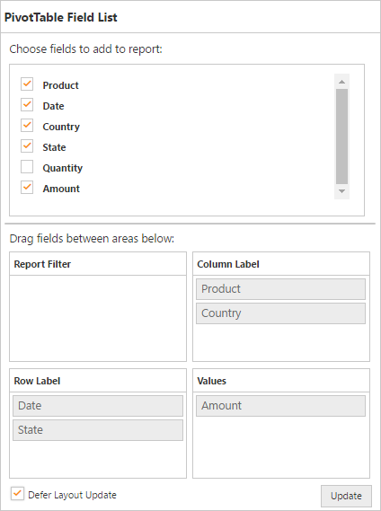

# Defer Update

I> This feature is applicable for Relational datasource only at Server Mode.

Defer Update support allows you to refresh the control only on-demand and not during every UI interaction.



@Html.EJ().Pivot().PivotGrid("PivotGrid1").Url(Url.Content("/RelationalService")).ClientSideEvents(events => events.AfterServiceInvoke("OnAfterServiceInvoke"))

@Html.EJ().Pivot().PivotSchemaDesigner("PivotSchemaDesigner").Layout(PivotSchemaDesignerLayout.Excel)



