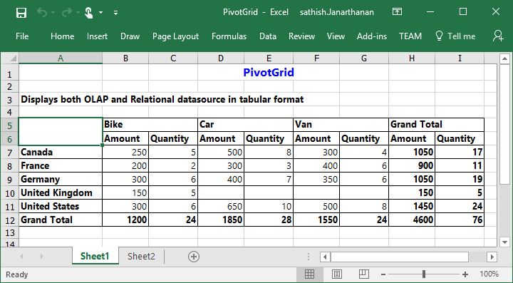

# Exporting

The PivotGrid control can be exported to the following file formats.

* Excel
* Word
* PDF
* CSV

The PivotGrid control can be exported by invoking **“exportPivotGrid”** method, with an appropriate export option as parameter.

## JSON Export

I> By default JSON export mode will be applied for server and client mode.



//If you want to render PivotGrid in Client Mode.
    @Html.EJ().Pivot().PivotGrid("PivotGrid1").ClientSideEvents(clientSideEvents => clientSideEvents.Load("onLoad")).DataSource(dataSource => dataSource.Rows(rows => { rows.FieldName("Country").FieldCaption("Country").Add(); }).Columns(columns => { columns.FieldName("Product").FieldCaption("Product").Add(); }).Values(values => { values.FieldName("Amount").Add(); })) 
                  
//If you want to render PivotGrid in Server Mode.
  @Html.EJ().Pivot().PivotGrid("PivotGrid1").Url(Url.Content("../RelationalService"))

  @Html.EJ().Button("Button1").ClientSideEvents(clientSideEvents => { clientSideEvents.Click("exportBtnClick"); }).Text("Export")
  
    


To achieve exporting, we need to add **"Syncfusion.EJ.Export"** dependency library into the application.

When PivotGrid is rendered, a method needs to be added in MVC controller file of the application and we need to import **"Syncfusion.EJ.Export"** namespace in the controller file. 



//...
using Syncfusion.EJ.Export;

public void ExcelExport()
{
     PivotGridExcelExport pGrid = new PivotGridExcelExport();
     string args = System.Web.HttpContext.Current.Request.Form.GetValues(0)[0];
     string fileName = "Sample";
     pGrid.ExportToExcel(fileName, args, System.Web.HttpContext.Current.Response);
}
        


### Excel Export

User can export the contents of PivotGrid to an Excel document for future archival, references and analysis purposes.

To achieve Excel export, the controller method name **"ExcelExport"** and file name is sent as the parameter.



   
    
  

Following method needs to be added in MVC controller file of the application.



//...
using Syncfusion.EJ.Export;

public void ExcelExport()
{
     PivotGridExcelExport pGrid = new PivotGridExcelExport();
     string args = System.Web.HttpContext.Current.Request.Form.GetValues(0)[0];
     string fileName = "Sample";
     pGrid.ExportToExcel(fileName, args, System.Web.HttpContext.Current.Response);
}



### Word Export

User can export the contents of PivotGrid to a Word document for future archival, references and analysis purposes.

To achieve Word export, controller method name **"WordExport"** and file name is sent as the parameter.



   
    
  

Following method needs to be added in MVC controller file of the application.



//...
using Syncfusion.EJ.Export;

public void WordExport()
{
     PivotGridWordExport pGrid = new PivotGridWordExport();
     string args = System.Web.HttpContext.Current.Request.Form.GetValues(0)[0];
     string fileName = "Sample";
     pGrid.ExportToWord(fileName, args, System.Web.HttpContext.Current.Response);
}



### PDF Export

User can export the contents of PivotGrid to a PDF document for future archival, references and analysis purposes.

To achieve Word export, controller method name **"PDFExport"** and file name is sent as the parameter.



   
    
  

Following method needs to be added in MVC controller file of the application.



//...
using Syncfusion.EJ.Export;

public void PDFExport()
{
     PivotGridPDFExport pGrid = new PivotGridPDFExport();
     string args = System.Web.HttpContext.Current.Request.Form.GetValues(0)[0];
     string fileName = "Sample";
     pGrid.ExportToPDF(fileName, args, System.Web.HttpContext.Current.Response);
}        



### CSV Export

User can export the contents of PivotGrid to a CSV document for future archival, references and analysis purposes.

To achieve CSV export, controller method name **"CSVExport"** and file name is sent as the parameter.



   
    
  

Following method needs to be added in MVC controller file of the application.



//...
using Syncfusion.EJ.Export;

public void CSVExport()
{
     PivotGridCSVExport pGrid = new PivotGridCSVExport();
     string args = System.Web.HttpContext.Current.Request.Form.GetValues(0)[0];
     string fileName = "Sample";
     pGrid.ExportToCSV(fileName, args, System.Web.HttpContext.Current.Response);
}        



### Customize the export document name

For customizing file name, we need to send file name as parameter to the **“exportPivotGrid”**  method along with method name.



function exportBtnClick(args)
{
    var pGridObj = $('#PivotGrid1').data("ejPivotGrid");
    pGridObj.exportPivotGrid("ExcelExport","fileName");
}



## PivotEngine Export

I> This feature is applicable only at server mode operation.

In order to perform exporting with the use of PivotEngine available in server-side, the 'exportMode' property obtained in the “BeforeExport” event is set to the value "ej.PivotGrid.ExportMode.PivotEngine" as shown below.



  @Html.EJ().Pivot().PivotGrid("PivotGrid1").Url(Url.Content("../RelationalService")).ClientSideEvents(clientSideEvents => clientSideEvents.BeforeExport("Export"))

  @Html.EJ().Button("Button1").ClientSideEvents(clientSideEvents => { clientSideEvents.Click("exportBtnClick"); }).Text("Export")
  
    


When PivotGrid is rendered in server mode, a service method needs to be added in WCF/WebAPI for server side operations.

For WebAPI controller, the below method needs to be added.



//...
using Syncfusion.Compression.Base;
using Syncfusion.XlsIO;
using Syncfusion.DocIO.Base;
using Syncfusion.Pdf.Base;

[System.Web.Http.ActionName("Export")]
[System.Web.Http.HttpPost]
public void Export()
{
    string args = HttpContext.Current.Request.Form.GetValues(0)[0];
    Dictionary<string, string> gridParams = serializer.Deserialize<Dictionary<string, string>>(args);
    htmlHelper.PopulateData(gridParams["currentReport"]);
    string fileName = "Sample";
    htmlHelper.ExportPivotGrid(ProductSales.GetSalesData(), args, fileName, HttpContext.Current.Response);
}



For WCF service, the below method needs to be added.



//...
using Syncfusion.Compression.Base;
using Syncfusion.XlsIO;
using Syncfusion.DocIO.Base;
using Syncfusion.Pdf.Base;

public void Export(System.IO.Stream stream)
{
    System.IO.StreamReader sReader = new System.IO.StreamReader(stream);
    string args = System.Web.HttpContext.Current.Server.UrlDecode(sReader.ReadToEnd()).Remove(0, 5);
    Dictionary<string, string> gridParams = serializer.Deserialize<Dictionary<string, string>>(args);
    htmlHelper.PopulateData(gridParams["currentReport"]);
    string fileName = "Sample";
    htmlHelper.ExportPivotGrid(ProductSales.GetSalesData(), args, fileName, System.Web.HttpContext.Current.Response);
}



### Excel Export

User can export the contents of PivotGrid to an Excel document for future archival, references and analysis purposes.

To achieve Excel export, we need to add the following dependency libraries into the application.

* Syncfusion.Compression.Base
* Syncfusion.XlsIO.Base

For Excel export, **“ej.PivotGrid.ExportOptions.Excel”** enumeration value is sent as the parameter.



function exportBtnClick(args)
{
    var pGridObj = $('#PivotGrid1').data("ejPivotGrid");
    //Setting export option as Excel in the exportPivotGrid method for ServerMode
    pGridObj.exportPivotGrid(ej.PivotGrid.ExportOptions.Excel);
}

  

### Word Export

User can export the contents of PivotGrid to a Word document for future archival, references and analysis purposes.

 To achieve Word export, we need to add the following dependency libraries into the application.

* Syncfusion.Compression.Base
* Syncfusion.DocIO.Base

For Word export, **“ej.PivotGrid.ExportOptions.Word”** enumeration value is sent as the parameter.



function exportBtnClick(args)
{
    var pGridObj = $('#PivotGrid1').data("ejPivotGrid");
    //Setting export option as Word in the exportPivotGrid method
    pGridObj.exportPivotGrid(ej.PivotGrid.ExportOptions.Word);
}



### PDF Export

User can export the contents of PivotGrid to a PDF document for future archival, references and analysis purposes.

To achieve PDF export, we need to add the following dependency libraries into the application.

* Syncfusion.Compression.Base
* Syncfusion.Pdf.Base

For PDF export, **“ej.PivotGrid.ExportOptions.PDF”** enumeration value is sent as the parameter.



function exportBtnClick(args)
{
    var pGridObj = $('#PivotGrid1').data("ejPivotGrid");
    //Setting export option as PDF in the exportPivotGrid method
    pGridObj.exportPivotGrid(ej.PivotGrid.ExportOptions.PDF);
}

 

### CSV Export

User can export contents of PivotGrid to a CSV document for future archival, references and analysis purposes.

For CSV export, **“ej.PivotGrid.ExportOptions.CSV”** enumeration value is sent as the parameter.



function exportBtnClick(args)
{
    var pGridObj = $('#PivotGrid1').data("ejPivotGrid");
    //Setting export option as CSV in the exportPivotGrid method
    pGridObj.exportPivotGrid(ej.PivotGrid.ExportOptions.CSV);
}

 

### Customize the export document name

For customizing name in WebAPI controller, below code snippet is used.



//...
using Syncfusion.Compression.Base;
using Syncfusion.XlsIO;
using Syncfusion.DocIO.Base;
using Syncfusion.Pdf.Base;

[System.Web.Http.ActionName("Export")]
[System.Web.Http.HttpPost]
public void Export()
{
    string args = HttpContext.Current.Request.Form.GetValues(0)[0];
    Dictionary<string, string> gridParams = serializer.Deserialize<Dictionary<string, string>>(args);
    htmlHelper.PopulateData(gridParams["currentReport"]);
    string fileName = " File name is customized here ";
    htmlHelper.ExportPivotGrid(ProductSales.GetSalesData(), args, fileName, HttpContext.Current.Response);
}



For customizing name in WCF Service, below code snippet is used.



//...
using Syncfusion.Compression.Base;
using Syncfusion.XlsIO;
using Syncfusion.DocIO.Base;
using Syncfusion.Pdf.Base;

public void Export(System.IO.Stream stream)
{
    System.IO.StreamReader sReader = new System.IO.StreamReader(stream);
    string args = System.Web.HttpContext.Current.Server.UrlDecode(sReader.ReadToEnd()).Remove(0, 5);
    Dictionary<string, string> gridParams = serializer.Deserialize<Dictionary<string, string>>(args);
    htmlHelper.PopulateData(gridParams["currentReport"]);
    string fileName = " File name is customized here ";
    htmlHelper.ExportPivotGrid(ProductSales.GetSalesData(), args, fileName, System.Web.HttpContext.Current.Response);
}



## Exporting Customization

You can add title and description to the exporting document by using title and description property obtained in the "beforeExport" event.



 @Html.EJ().Pivot().PivotGrid("PivotGrid1").ClientSideEvents(clientSideEvents => clientSideEvents.BeforeExport("Exporting"))

  @Html.EJ().Button("Button1").ClientSideEvents(clientSideEvents => { clientSideEvents.Click("exportBtnClick"); }).Text("Export")
  
    


You can also edit the exporting document with the use of a server side event for required exporting option.



//...
using Syncfusion.EJ.Export;
using Syncfusion.Compression.Base;
using Syncfusion.XlsIO;
using Syncfusion.DocIO.Base;
using Syncfusion.Pdf.Base;

//Following methods needs to be added in MVC controller file of the application for JSON export
public void ExcelExport()
{
    PivotGridExcelExport pGrid = new PivotGridExcelExport();
    string args = System.Web.HttpContext.Current.Request.Form.GetValues(0)[0];
    string fileName = "Sample";
    pGrid.ExcelExport += pGrid_ExcelExport;
    pGrid.ExportToExcel(fileName, args, System.Web.HttpContext.Current.Response);
}

void pGrid_ExcelExport(object sender, Syncfusion.XlsIO.IWorkbook workBook)
{
    //You can customize exporting document here.
}
public void PDFExport()
{
    PivotGridPDFExport pGrid = new PivotGridPDFExport();
    string args = System.Web.HttpContext.Current.Request.Form.GetValues(0)[0];
    string fileName = "Sample";
    pGrid.AddPDFHeaderFooter += pGrid_AddPDFHeaderFooter;
    pGrid.PDFExport += pGrid_PDFExport;
    pGrid.ExportToPDF(fileName, args, System.Web.HttpContext.Current.Response);
}

void pGrid_PDFExport(object sender, Syncfusion.Pdf.PdfDocument pdfDoc)
{
    //You can customize exporting document here.
}

void pGrid_AddPDFHeaderFooter(object sender, Syncfusion.Pdf.PdfDocument pdfDoc)
{
    //You can add header/footer information to the PDF document.
}

public void CSVExport()
{
    PivotGridCSVExport pGrid = new PivotGridCSVExport();
    string args = System.Web.HttpContext.Current.Request.Form.GetValues(0)[0];
    string fileName = "Sample";
    pGrid.CSVExport += pGrid_CSVExport;
    pGrid.ExportToCSV(fileName, args, System.Web.HttpContext.Current.Response);
}

void pGrid_CSVExport(object sender, string csvString)
{
    //You can customize exporting document here.
}

public void WordExport()
{
    PivotGridWordExport pGrid = new PivotGridWordExport();
    string args = System.Web.HttpContext.Current.Request.Form.GetValues(0)[0];
    string fileName = "Sample";
    pGrid.WordExport += pGrid_WordExport;
    pGrid.ExportToWord(fileName, args, System.Web.HttpContext.Current.Response);
}

void pGrid_WordExport(object sender, Syncfusion.DocIO.DLS.WordDocument document)
{
    //You can customize exporting document here.
}

//Following service methods needs to be added in WEBAPI controller file for PivotEngine export

[System.Web.Http.ActionName("Export")]
[System.Web.Http.HttpPost]
public void Export()
{
    string args = HttpContext.Current.Request.Form.GetValues(0)[0];
    Dictionary<string, string> gridParams = serializer.Deserialize<Dictionary<string, string>>(args);
    htmlHelper.PopulateData(gridParams["currentReport"]);
    htmlHelper.ExcelExport += htmlHelper_ExcelExport;
    htmlHelper.WordExport += htmlHelper_WordExport;
    htmlHelper.AddPDFHeaderFooter += htmlHelper_AddPDFHeaderFooter;
    htmlHelper.PDFExport += htmlHelper_PDFExport;
    htmlHelper.CSVExport += htmlHelper_CSVExport;
    string fileName = "Sample";
    htmlHelper.ExportPivotGrid(ProductSales.GetSalesData(), args, fileName, System.Web.HttpContext.Current.Response);
}

void htmlHelper_ExcelExport(object sender, Syncfusion.XlsIO.IWorkbook workBook)
{
    //You can customize exporting document here.
}
void htmlHelper_WordExport(object sender, Syncfusion.DocIO.DLS.WordDocument document)
{
    //You can customize exporting document here.
}
void htmlHelper_AddPDFHeaderFooter(object sender, Syncfusion.Pdf.PdfDocument pdfDoc)
{
    //You can add header/footer information to the PDF document.
}
void htmlHelper_PDFExport(object sender, Syncfusion.Pdf.PdfDocument pdfDoc)
{
    //You can customize exporting document here.
}
void htmlHelper_CSVExport(object sender, string csvString)
{
    //You can customize exporting document here.
}


The below screenshot shows the PivotGrid control exported to Excel document.

The below screenshot shows the PivotGrid control exported to Word document.

The below screenshot shows the PivotGrid control exported to PDF document.

The below screenshot shows the PivotGrid control exported to CSV document.

