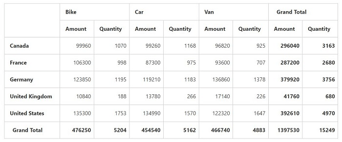
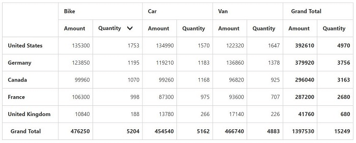

# Value Sorting

I> This feature is applicable for Relational datasource.

Value Sorting allows to sort columns and rows based on value fields.

The headers of the column to be sorted is given in the 'HeaderText' property under 'ValueSortSettings' in field wise order separated by a string.  The string which is used to separate the headers is given in the property 'HeaderDelimiters'.
Also you can sort column by clicking the column header. On clicking the same header once again will reverse the sorting direction.



@Html.EJ().Pivot().PivotGrid("PivotGrid1").DataSource(dataSource => dataSource.Rows(rows => { rows.FieldName("Country").FieldCaption("Country").Add(); }).Columns(columns => { columns.FieldName("Product").FieldCaption("Product").Add(); }).Values(values => { values.FieldName("Amount").Add(); values.FieldName("Quantity").Add(); })).ValueSortSettings(valuesortsettings=>valuesortsettings.HeaderText("Bike##Quantity").HeaderDelimiters("##").SortOrder(SortOrder.Descending))



