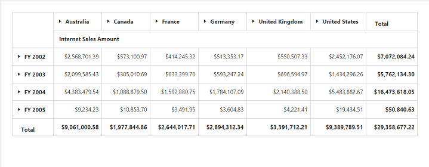
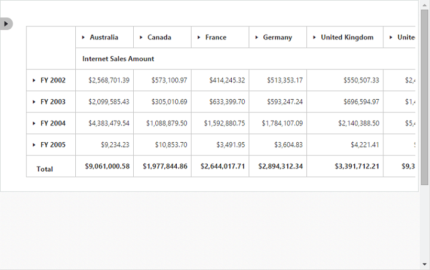

# Responsive

PivotGrid and PivotTable Field list control supports responsive rendering based on the target device (desktop and tablet) resolution. It supports resolution upto 1024x600. You can enable responsiveness in PivotGrid by setting `IsResponsive` property to true.

On resizing the browser, the PivotTable Field list will get collapse and an icon will appear on the left-hand side of the browser. User can toggle its view and perform UI interaction.



@Html.EJ().Pivot().PivotGrid("PivotGrid1").Url(Url.Content("/OLAPService")).IsResponsive(true)



_Normal PivotGrid_

_Responsive PivotGrid_

_Responsive PivotTable Field List - Collapsed_

_Responsive PivotTable Field List - Expanded_

