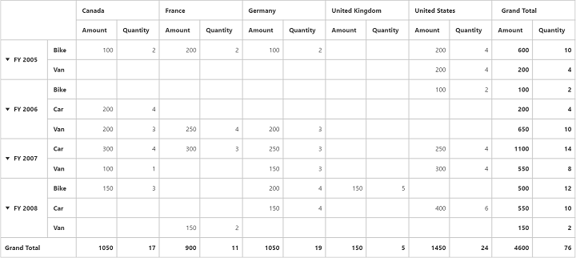

# Sub Total Hiding

N> This feature is applicable only for Relational data source.

You can hide the **Sub Total** for respective fields in rows and columns by setting the property `ShowSubTotal` to `false`.

## Client Mode



@Html.EJ().Pivot().PivotGrid("PivotGrid1").DataSource(dataSource => dataSource.Rows(rows => { rows.FieldName("Date").FieldCaption("Date").ShowSubTotal(false).Add(); rows.FieldName("Product").FieldCaption("Product").Add(); }).Columns(columns => { columns.FieldName("Country").FieldCaption("Country").Add(); columns.FieldName("State").FieldCaption("State").Add(); }).Values(values => { values.FieldName("Amount").Add(); values.FieldName("Quantity").Add(); }))



## Server Mode



private PivotReport BindDefaultData()
{
    PivotReport pivotSetting = new PivotReport();
    pivotSetting.PivotRows.Add(new PivotItem { FieldMappingName = "Date", FieldHeader = "Date", TotalHeader = "Total", ShowSubTotal = false });
    pivotSetting.PivotRows.Add(new PivotItem { FieldMappingName = "Product", FieldHeader = "Product", TotalHeader = "Total", ShowSubTotal = true });
    pivotSetting.PivotColumns.Add(new PivotItem { FieldMappingName = "Country", FieldHeader = "Country", TotalHeader = "Total", ShowSubTotal = false });
    pivotSetting.PivotCalculations.Add(new PivotComputationInfo { CalculationName = "Amount", Description = "Amount", FieldHeader = "Amount", FieldName = "Amount", Format = "C", SummaryType = Syncfusion.PivotAnalysis.Base.SummaryType.DoubleTotalSum });
    return pivotSetting;
}



