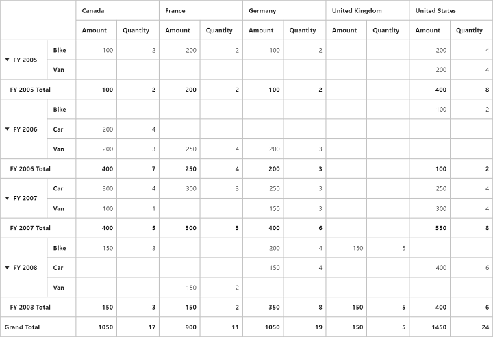

# Summary Customization

Allows you to show or hide the PivotGrid totals in column and row sections. Summary customization can been classified into two different categories.

* Sub Total Customization
* Grand Total Customization

## Sub Total Customization

You can hide the **Sub Total** for respective fields in rows and columns by setting the property `ShowSubTotal` to `false`.

## Client Mode



@Html.EJ().Pivot().PivotGrid("PivotGrid1").DataSource(dataSource => dataSource.Columns(columns => { columns.FieldName("[Date].[Fiscal]").Add(); columns.ShowSubTotal(false); }))



## Server Mode



private PivotReport BindDefaultData()
{
    PivotReport pivotSetting = new PivotReport();
    pivotSetting.PivotRows.Add(new PivotItem { FieldMappingName = "Date", FieldHeader = "Date", TotalHeader = "Total", ShowSubTotal = false });
    pivotSetting.PivotRows.Add(new PivotItem { FieldMappingName = "Product", FieldHeader = "Product", TotalHeader = "Total", ShowSubTotal = true });
    pivotSetting.PivotColumns.Add(new PivotItem { FieldMappingName = "Country", FieldHeader = "Country", TotalHeader = "Total", ShowSubTotal = false });
    pivotSetting.PivotCalculations.Add(new PivotComputationInfo { CalculationName = "Amount", Description = "Amount", FieldHeader = "Amount", FieldName = "Amount", Format = "C", SummaryType = Syncfusion.PivotAnalysis.Base.SummaryType.DoubleTotalSum });
    return pivotSetting;
}



## Grand Total Customization

Grand Total Customization can be classified into three categories.

* Row Grand Total Customization
* Column Grand Total Customization
* Both

## Row Grand Total Customization

You can hide the **Grand Total** in row alone by setting the property `EnableRowGrandTotal` to `false`.



@Html.EJ().Pivot().PivotGrid("PivotGrid1").EnableRowGrandTotal(false).DataSource(.....)



## Column Grand Total Customization

You can hide the **Grand Total** in column alone by setting the property `EnableColumnGrandTotal` to `false`.



@Html.EJ().Pivot().PivotGrid("PivotGrid1").EnableColumnGrandTotal(false).DataSource(.....)



## Both

You can hide the **Grand Total** in both row and column by setting the property `EnableGrandTotal` to `false`.



@Html.EJ().Pivot().PivotGrid("PivotGrid1").EnableGrandTotal(false).DataSource(.....)



