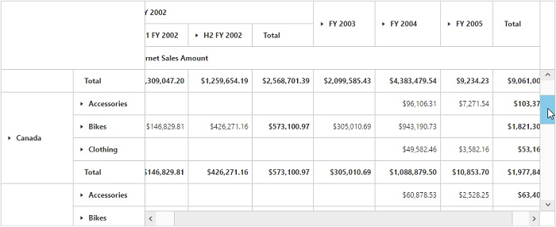

# Frozen Header

Allows you to freeze the header of the Grid so that it will be always visible when scrolling the content with a large number of rows or columns providing a precise view.



@Html.EJ().Pivot().PivotGrid("PivotGrid1").DataSource(.....).FrozenHeaderSettings(frohead => frohead.EnableFrozenHeaders(true))



We can also freeze the row/column headers individually by setting the below properties.



@Html.EJ().Pivot().PivotGrid("PivotGrid1").DataSource(.....).FrozenHeaderSettings(frohead => frohead.EnableFrozenRowHeaders(true))  //To Freeze the Row headers





@Html.EJ().Pivot().PivotGrid("PivotGrid1").DataSource(.....).FrozenHeaderSettings(frohead => frohead.EnableFrozenColumnHeaders(true))  //To Freeze the Column headers



We can also set the size of the scroller (horizontal and vertical) in PivotGrid by using below property.



@Html.EJ().Pivot().PivotGrid("PivotGrid1").DataSource(.....).FrozenHeaderSettings(frohead => frohead.ScrollerSize(18))



