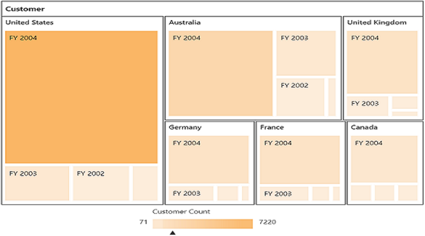

# Getting Started

## Creating a simple application with PivotTreeMap and OLAP datasource (Client Mode)

This section covers the information that you need to know to populate a simple PivotTreeMap with OLAP data completely on the client-side.

### Project Initialization
Create a new **ASP.NET MVC Empty Web Application** by using Visual Studio IDE and name the project as **“PivotTreeMapDemo”**.

Select the View engine as **‘Razor’** and Project template as **‘Internet Application’** and finally click **OK** button to create an application.

Now add the following dependency libraries as references into your MVC Web Application. In order to add them to your application, right-click on **References** in Solution Explorer and select Add Reference. Now in the **Reference Manager** dialog, under **Assemblies > Extension**, the following Syncfusion libraries will be found.

* Syncfusion.EJ
* Syncfusion.EJ.Pivot
* Syncfusion.EJ.MVC

The version of Syncfusion libraries based on .NET Framework and MVC version are classified below. For example, version is illustrated as,

<table>
<tr>
<th>MVC Version</th>
<th>MVC Version of Syncfusion assembly</th>
<th>Base Version of Syncfusion assembly</th>
<th>System.Web.Mvc</th>
<th>System.Web.WebPages</th>
</tr>
<tr>
<td>MVC3</td>
<td>{{ site.mvc3releaseversion }}</td>
<td>{{ site.35esreleaseversion }}</td>
<td>3.0</td>
<td>1.0</td>
</tr>
<tr>
<td>MVC4</td>
<td>{{ site.mvc4releaseversion }}</td>
<td>{{ site.40esreleaseversion }}</td>
<td>4.0</td>
<td>2.0</td>
</tr>
<tr>
<td>MVC5</td>
<td>{{ site.mvc5releaseversion }}</td>
<td>{{ site.45esreleaseversion }}</td>
<td>5.0</td>
<td>3.0</td>
</tr>
</table>

Register the referred assemblies in Web.config files available inside Views folder and also at the root of the application.



<compilation debug="true" targetFramework="4.0">
    <assemblies> 
        ……
        ……
        <add assembly="Syncfusion.EJ, Version= {{ site.40esreleaseversion }}, Culture=neutral, PublicKeyToken=3d67ed1f87d44c89" />
        <add assembly="Syncfusion.EJ.Pivot, Version= {{ site.40esreleaseversion }}, Culture=neutral, PublicKeyToken=3d67ed1f87d44c89" />
        <add assembly="Syncfusion.EJ.Mvc, Version= {{ site.40esreleaseversion }}, Culture=neutral, PublicKeyToken=3d67ed1f87d44c89" />
    </assemblies>
</compilation>


Register the required namespaces in Web.config files available inside Views folder and also at the root of the application



<namespaces> 
    ……
    ……
    <add namespace="Syncfusion.MVC.EJ" />
    <add namespace="Syncfusion.JavaScript" /> 
</namespaces>


N> Registering assemblies and namespaces earlier helps to include the control in view page with the help of intellisense.

Set the **UnobtrusiveJavaScriptEnabled** property to false under **appSettings** tag in Web.config file at the root folder.
    


<configuration> 
    …… 
    ……
    <appSettings>
        …… 
        ……
        <add key="UnobtrusiveJavaScriptEnabled" value="false" /> 
    </appSettings>        
</configuration>


### Scripts and CSS References

The scripts and style sheets that are mandatorily required to render PivotTreeMap control in a MVC Web Application which are highlighted below in an appropriate order.

1. ej.web.all.min.css
2. jQuery-3.0.0.min.js
3. ej.web.all.min.js
4. jsrender.min.js

Scripts and style sheets are referred under the <head> tag in _Layout.cshtml file which is found inside Views > Shared folder.



<head>
    <link href="http://cdn.syncfusion.com/{{ site.releaseversion }}/js/web/flat-azure/ej.web.all.min.css" rel="stylesheet" type="text/css" />
    
    
    
</head> 



The script manager is initialized immediately after the `RenderBody()` function call in **_Layout.cshtml** file in-order to generate control related scripts.



<body> 
…… 
…… 
@RenderBody() 
@(Html.EJ().ScriptManager()) 

</body>



### Initialize PivotTreeMap

Before initializing, empty the contents of Index.cshtml file under Views > Home folder and add the following codes.



@using Syncfusion.JavaScript;

@Html.EJ().Pivot().PivotTreeMap("PivotTreeMap1")



### Populate PivotTreeMap with DataSource

Initializes the OLAP datasource for PivotTreeMap control as shown below.



@Html.EJ().Pivot().PivotTreeMap("PivotTreeMap1").IsResponsive(true).DataSource(dataSource => dataSource.Rows(rows=>{rows.FieldName("[Date].[Fiscal]").Add();}).Columns(columns=>{columns.FieldName("[Customer].[Customer Geography]").Add();}).Values(values => { values.Measures(measures => { measures.FieldName("[Measures].[Internet Sales Amount]").Add(); }).Axis(AxisName.Column).Add();})
.Data("http://bi.syncfusion.com/olap/msmdpump.dll").Catalog("Adventure Works DW 2008 SE").Cube("Adventure Works"))



The above code will generate a simple PivotTreeMap with internet sales amount over a period of fiscal years across different customer geographic locations.

 

## Creating a simple application with PivotTreeMap and OLAP datasource (Server Mode)

This section covers the information required to create a simple PivotTreeMap bound to OLAP datasource.  

N> We will be illustrating this section by creating a simple Web Application through Visual Studio IDE since PivotTreeMap can also act as a server-side control with .NET dependency. ASP.NET MVC Web Application will contain a service that transfers data to server-side, processes and returns back to client-side for control rendering and re-rendering. The service utilized for communication could be either WCF or WebAPI based on user requirement.

### Project Initialization
Create a new **ASP.NET MVC Empty Web Application** by using Visual Studio IDE and name the project as **“PivotTreeMapDemo”**.

Select the View engine as **‘Razor’** and Project template as **‘Internet Application’** and finally click **OK** button to create an application.

Now add the following dependency libraries as references into your Web Application. In order to add them to your application, right-click on **References** in Solution Explorer and select **Add Reference**. Now in the **Reference Manager** dialog, under **Assemblies > Extension**, the following Syncfusion libraries will be found.

* Microsoft.AnalysisServices.AdomdClient
* Syncfusion.Compression.Base
* Syncfusion.Linq.Base
* Syncfusion.Olap.Base
* Syncfusion.PivotAnalysis.Base
* Syncfusion.XlsIO.Base
* Syncfusion.Pdf.Base
* Syncfusion.DocIO.Base
* Syncfusion.EJ
* Syncfusion.EJ.MVC
* Syncfusion.EJ.Pivot

N> If any version of SQL Server Analysis Service (SSAS) or Microsoft ADOMD.NET utility is installed, then the location of Microsoft.AnalysisServices.AdomdClient library is [system drive:\Program Files (x86)\Microsoft.NET\ADOMD.NET].

The version of Syncfusion libraries based on .NET Framework and MVC version are classified below. For example, 14.2 version is illustrated as,

<table>
<tr>
<th>
MVC Version</th><th>
MVC Version of Syncfusion assembly</th><th>
Base Version of Syncfusion assembly</th><th>
System.Web.Mvc</th><th>
System.Web.WebPages</th>
</tr>
<tr><td>
MVC3</td><td>
{{ site.mvc3releaseversion }}</td><td>    
{{ site.35esreleaseversion }}</td><td>
3.0</td><td>
1.0</td>
</tr>
<tr><td>
MVC4</td><td>
{{ site.mvc4releaseversion }}</td><td>    
{{ site.40esreleaseversion }}</td><td>
4.0</td><td>
2.0</td>
</tr>
<tr><td>
MVC5</td><td>
{{ site.mvc5releaseversion }}</td><td>    
{{ site.45esreleaseversion }}</td><td>
5.0</td><td>
3.0</td>
</tr>
</table>

Register the referenced assemblies in Web.config files available inside Views folder and also at the root of the application.



<compilation debug="true" targetFramework="4.0">
    <assemblies> 
        …… 
        ……
        <add assembly="Syncfusion.EJ, Version= {{ site.40esreleaseversion }}, Culture=neutral, PublicKeyToken=3d67ed1f87d44c89" />
        <add assembly="Syncfusion.EJ.Pivot, Version= {{ site.40esreleaseversion }}, Culture=neutral, PublicKeyToken=3d67ed1f87d44c89" />
        <add assembly="Syncfusion.EJ.Mvc, Version= {{ site.40esreleaseversion }}, Culture=neutral, PublicKeyToken=3d67ed1f87d44c89" />
        <add assembly="Syncfusion.Linq.Base, Version= {{ site.40esreleaseversion }}, Culture=neutral, PublicKeyToken=3d67ed1f87d44c89" />
        <add assembly="Syncfusion.Olap.Base, Version= {{ site.40esreleaseversion }}, Culture=neutral, PublicKeyToken=3d67ed1f87d44c89" />
        <add assembly="Syncfusion.Compression.Base, Version= {{ site.40esreleaseversion }}, Culture=neutral, PublicKeyToken=3d67ed1f87d44c89" /> 
        <add assembly="Syncfusion.PivotAnalysis.Base, Version= {{ site.40esreleaseversion }}, Culture=neutral, PublicKeyToken=3d67ed1f87d44c89" /> 
        <add assembly="Syncfusion.Pdf.Base, Version= {{ site.40esreleaseversion }}, Culture=neutral, PublicKeyToken=3d67ed1f87d44c89" />
        <add assembly="Syncfusion.XlsIO.Base, Version= {{ site.40esreleaseversion }}, Culture=neutral, PublicKeyToken=3d67ed1f87d44c89" />
        <add assembly="Syncfusion.DocIO.Base, Version= {{ site.40esreleaseversion }}, Culture=neutral, PublicKeyToken=3d67ed1f87d44c89" /> 
    </assemblies>
</compilation>



Register the required namespaces in Web.config files available inside Views folder and also at the root of the application



<namespaces> 
    ……
    ……
    <add namespace="Syncfusion.MVC.EJ" />
    <add namespace="Syncfusion.JavaScript" /> 
</namespaces>



N> Registering assemblies and namespaces earlier helps to include the control in view page with the help of intellisense.

Set the **UnobtrusiveJavaScriptEnabled** property to false under **appSettings** tag in Web.config file at the root folder.
    


<configuration> 
    …… 
    ……
    <appSettings> 
        …… 
        ……
        <add key="UnobtrusiveJavaScriptEnabled" value="false" /> 
</appSettings>
        
</configuration>



### Scripts and CSS Initialization
The scripts and style sheets that are mandatorily required to render a PivotTreeMap control in a Web Application are mentioned in an appropriate order.

1. ej.web.all.min.css
2. jQuery-3.0.0.min.js
3. ej.web.all.min.js
4. jsrender.min.js

[Click here](http://helpjs.syncfusion.com/js/cdn) to know more about script and style sheets available online (CDN Link).

Scripts and style sheets are referred under the **head** tag in **_Layout.cshtml** file which is found inside **Views > Shared folder.** 



<head>
    <link href="http://cdn.syncfusion.com/{{ site.releaseversion }}/js/web/flat-azure/ej.web.all.min.css" rel="stylesheet" type="text/css" />
    
    
    
</head> 



The script manager is initialized immediately after the `RenderBody()` function call in **_Layout.cshtml** file in-order to generate control related scripts.



<body> 
    …… 
    …… 
    @RenderBody() 
    @(Html.EJ().ScriptManager()) 

</body>



### Control Initialization

Before initializing, empty the contents of **Index.cshtml** file under **Views > Home** folder and add the following codes. Register the namespaces at the top of the page and then add the control.



@using Syncfusion.JavaScript; 

 
    @Html.EJ().Pivot().PivotGrid("PivotGrid1").Url(Url.Content("/Olap")) 

<!--Tooltip labels can be localized here-->



The **“Url”** property in PivotTreeMap control points the service endpoint, where data are processed and fetched in the form of JSON. The services used in PivotTreeMap control as endpoint are WCF and WebAPI.

N> The above "Index.cshtml" contains WebAPI URL, which is “/Olap”. If WCF service is used as endpoint, the URL would look like "/OlapService.svc".

### WebAPI

**Adding a WebAPI Controller**

To add a WebAPI controller in your existing Web Application, right-click on the project in Solution Explorer and select **Add > New Item.** In the **Add New Item** window, select **WebAPI Controller Class** and name it as “OlapController.cs”, click **Add.**

Now WebAPI controller is added into your application successfully which in-turn comprise of the following file. The utilization of this file will be explained in the following sections.
 
* OlapController.cs

N> While adding WebAPI Controller Class, name it with the suffix “Controller” that is mandatory. For example, in demo the controller is named as “OlapController”.

Next, remove all the existing methods such as “Get”, “Post”, “Put” and “Delete” present inside `OlapController.cs` file. 



namespace PivotTreeMapDemo 
{ 
    public class OlapController : ApiController 
    { 
    } 
}



**Adding the List of Namespaces**

Following are the list of namespaces to be added on top of the main class inside `OlapController.cs` file.



using System.Web;
using System.Collections.Generic;
using System.Configuration;
using System.Linq;
using System.Net;
using System.Net.Http;
using System.Web.Http;
using System.Web.Script.Serialization;
using Syncfusion.Olap.Manager;
using Syncfusion.Olap.Reports;
using Syncfusion.JavaScript;
using OLAPUTILS = Syncfusion.JavaScript.Olap;

namespace PivotTreeMapDemo
{
    public class OlapController : ApiController
    {

    }
}



**Datasource Initialization**

Now, the connection string to connect OLAP Cube and PivotTreeMap instances are created immediately inside the main class in `OlapController.cs` file.



namespace PivotTreeMapDemo
{
    public class OlapController : ApiController
    {
        PivotTreeMap htmlHelper = new PivotTreeMap();
        string connectionString = "Data Source=http://bi.syncfusion.com/olap/msmdpump.dll; Initial Catalog=Adventure Works DW 2008 SE;";
        //Other codes

    }
}



**Service methods in WebAPI Controller**

Now you need to define the service methods inside OlapController class, found inside `OlapController.cs` file, created while adding WebAPI Controller Class to your Web Application.
 


namespace PivotTreeMapDemo 
{ 
    public class OlapController : ApiController
    {
        PivotTreeMap htmlHelper = new PivotTreeMap(); 
        string connectionString = "Data Source=http://bi.syncfusion.com/olap/msmdpump.dll; Initial Catalog=Adventure Works DW 2008 SE;"; 
        [System.Web.Http.ActionName("InitializeTreeMap")]
        [System.Web.Http.HttpPost]
        public Dictionary< string, object > InitializeTreeMap(Dictionary<string, object> jsonResult)
        {
            OlapDataManager DataManager = null;
            DataManager = new OlapDataManager(connectionString);
            DataManager.SetCurrentReport(CreateOlapReport());
            return htmlHelper.GetJsonData(jsonResult["action"].ToString(), DataManager);
        }
        [System.Web.Http.ActionName("DrillTreeMap")]
        [System.Web.Http.HttpPost]
        public Dictionary<string, object> DrillTreeMap(Dictionary<string, object> jsonResult)
        {
            OlapDataManager DataManager = new OlapDataManager(connectionString);
            DataManager = new OlapDataManager(connectionString);
            DataManager.SetCurrentReport(OLAPUTILS.Utils.DeserializeOlapReport(jsonResult["olapReport"].ToString()));
            return htmlHelper.GetJsonData(jsonResult["action"].ToString(), DataManager, jsonResult["drillInfo"].ToString());
        }

        private OlapReport CreateOlapReport()
        {
            OlapReport olapReport = new OlapReport();
            olapReport.Name = "Default Report";
            olapReport.CurrentCubeName = "Adventure Works";

            DimensionElement dimensionElementColumn = new DimensionElement();
            //Specifying the Name for the Dimension Element
            dimensionElementColumn.Name = "Date";
            dimensionElementColumn.AddLevel("Fiscal", "Fiscal Year");

            MeasureElements measureElementColumn = new MeasureElements();
            //Specifying the Name for the Measure Element
            measureElementColumn.Elements.Add(new MeasureElement { Name = "Customer Count" });

            DimensionElement dimensionElementRow = new DimensionElement();
            //Specifying the Dimension Name
            dimensionElementRow.Name = "Customer";
            dimensionElementRow.AddLevel("Customer Geography", "Country");
            DimensionElement dimensionElementRow1 = new DimensionElement();

            ///Adding Row Members
            olapReport.SeriesElements.Add(dimensionElementRow);
            ///Adding Column Members
            olapReport.CategoricalElements.Add(dimensionElementColumn);
            ///Adding Measure Element
            olapReport.CategoricalElements.Add(measureElementColumn);
            return olapReport;
        }
    }
}



**Configure routing in Global Application Class**

If Global.asax file is not found in your MVC Web Application then add a new one. To add a **Global.asax** in your existing MVC Web Application, right-click on the project in Solution Explorer and select **Add > New Item**. In the **Add New Item** window, select **Global Application Class** and name it as `Global.asax`, click **Add.**
 
Once the Global.asax file is created, remove all the existing code inside the "Application_Start" function. Then routing could be configured as shown in the following code example.



public class Global : System.Web.HttpApplication
    {
        protected void Application_Start(object sender, EventArgs e)
        {
            System.Web.Http.GlobalConfiguration.Configuration.Routes.MapHttpRoute(
                name: "DefaultApi",
                routeTemplate: "{controller}/{action}/{id}",
                defaults: new { id = RouteParameter.Optional });
            AppDomain.CurrentDomain.SetData("SQLServerCompactEditionUnderWebHosting", true);
        }
}



Now, PivotTreeMap is rendered with customer count over different customer geographic locations across a period of fiscal years.

 

### WCF
This section demonstrates the utilization of WCF service as endpoint binding OLAP datasource to a simple PivotTreeMap. For more details on this topic, [click here](http://help.syncfusion.com/js/pivottreemap/olap-connectivity#wcf).

