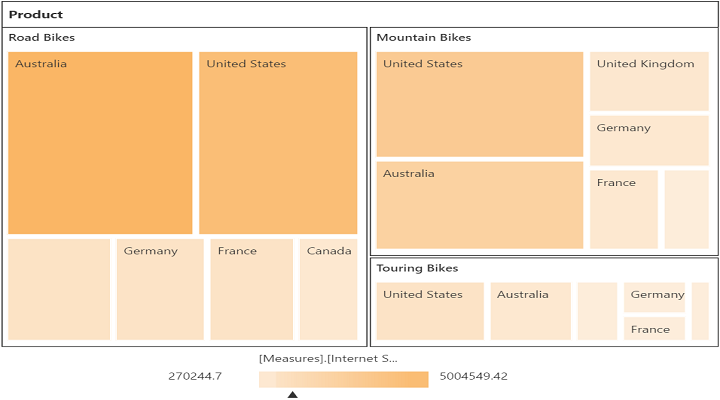

# Named Sets

Named Sets is a multidimensional expression (MDX) that returns a set of dimension members, which can be created by combining cube data, arithmetic operators, numbers and functions.

## Client Mode

You can bind the Named Sets in PivotTreeMap by setting it's unique name in the `fieldName` property either in row or column axis and `isNamedSets` boolean property to "true".



<!--Create a tag which acts as a container for PivotTreeMap--> 
@Html.EJ().Pivot().PivotTreeMap("PivotTreeMap1").DataSource(dataSource => dataSource.Rows(rows => { rows.FieldName("[Core Product Group]").IsNamedSets(true).Add(); }).Columns(columns => { columns.FieldName("[Customer].[Customer Geography]").Add(); }).Values(values => { values.Measures(measures => { measures.FieldName("[Measures].[Internet Sales Amount]").Add(); }).Axis(AxisName.Column).Add(); })
.Data("http://bi.syncfusion.com/olap/msmdpump.dll").Catalog("Adventure Works DW 2008 SE").Cube("Adventure Works"))

<! --Tooltip labels can be localized here-->
  



## Server Mode

You can add Named Sets in the PivotTreeMap by using `NamedSetElement` class in the OlapReport.



OlapReport olapReport = new OlapReport(); 
olapReport.Name = "Customer Report"; 
olapReport.CurrentCubeName = "Adventure Works"; 

DimensionElement dimensionElementColumn = new DimensionElement(); 
dimensionElementColumn.Name = "Customer"; 
dimensionElementColumn.AddLevel("Customer Geography", "Country ");
 
MeasureElements measureElementColumn = new MeasureElements(); 
measureElementColumn.Elements.Add(new MeasureElement { 
Name = "Internet Sales Amount" 
}); 

NamedSetElement dimensionElementRow = new NamedSetElement(); 
dimensionElementRow.Name = "Core Product Group"; 

olapReport.CategoricalElements.Add(dimensionElementColumn); 
olapReport.CategoricalElements.Add(measureElementColumn); 
olapReport.SeriesElements.Add(dimensionElementRow);



