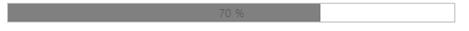

## Appearance and Styling

Adjusting ProgressBar size

ProgressBar widget provides the ability to change or adjust the ProgressBar size. The ‘Height’ and ‘Width’ properties in the ProgressBar widget allows you to set the maximum height and maximum width for the ProgressBar. The value set to this property is string or Number type.

The following steps explain you on how to adjust the ProgressBar size.

1. In the VIEW page, add a helper element to render the ProgressBar widget

<table>
<tr>
<td>
 [CSHTML]// Add the following code example to the corresponding CSHTML page to render the ProgressBar control with customized size.@Html.EJ().ProgressBar("progressbar").Value(40).Height("40").Width("400")</td></tr>
<tr>
<td>
[JavaScript]</td></tr>
</table>

The following screenshot displays the output.

{{ '' | markdownify }}
{:.image }

Custom text

Custom text is displayed when the ProgressBar shows different levels of progress in the ProgressBar. Support for Custom Text to mention the percentage or any other message inside the ProgressBar is possible.

The following steps explain the configuration of the Custom Text for the ProgressBar widget.

1.   In the VIEW page, add a helper element to render the ProgressBar widget.

[CSHTML]

// Add the following code example to the corresponding CSHTML page to render the ProgressBar control with customized text.

@Html.EJ().ProgressBar("progressbar").Text("loading").Value(40).Height("20").Width("500")

The following screenshot displays the output.       {{ '' | markdownify }}
{:.image }

Theme

The ProgressBar widget style and appearance are controlled based on CSS classes. In order to apply Theme to the ProgressBar widget, you can refer two files, namely, ej.widgets.core.min.css and ej.theme.min.css. When the file ej.widgets.all.min.css is referred, then it is not necessary to include the files ej.widgets.core.min.css and ej.theme.min.css in your project, as ej.widgets.all.min.css is the combination of these both. 

By default, there are 12 themes’ support available for the ProgressBar widget namely,

* Default-theme
* Flat-azure-dark
* Fat-lime
* Flat-lime-dark
* Flat-saffron
* Flat-saffron-dark
* Gradient-azure
* Gradient-azure-dark
* Gradient-lime
* Gradient-lime-dark
* Gradient-saffron
* Gradient-saffron-dark

CSS class

To apply custom styles to the ProgressBar widget, you can specify the CssClass property. The specified CSS name is added in the root of the ProgressBar widget.

The following code example is used to render the ProgressBar widget with customized style.

1. In the VIEW page, add a helper element to render the ProgressBar widget.

<table>
<tr>
<td>
[CSHTML]// Add the following code example to the corresponding CSHTML page to render the ProgressBar control with customized style.@Html.EJ().ProgressBar("progressbar").Value(70).Height("20").Width("500").CssClass("custom")</td></tr>
<tr>
<td>
[JavaScript]   </td></tr>
</table>

2. Add the following styles to render the ProgressBar with customized style.

[CSS]

The following screenshot displays the output.

{{ '' | markdownify }}
{:.image }

