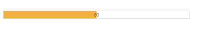
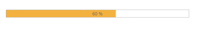

# Define value

## Value

The Value for the ProgressBar is set by using ‘Value’ property. The Value should be between the minimum (min) and the maximum (max) values (number) of the ProgressBar. By default, the MinValue is 0 and the MaxValue is 100 in ProgressBar, and the ‘Value’ is set to 0(number).

The following steps explain you on how to set the Value for the ProgressBar widget.

1. In the VIEW page, add a helper element to render the ProgressBar widget.


// Add the following code example to the corresponding CSHTML page to render the ProgressBar control with customized value.
@Html.EJ().ProgressBar("progressbar").MinValue(40).MaxValue(80).Value(60).Height("20").Width("500")



The following screenshot displays the output for the above code.

## Percentage

The ProgressBar value is set in Percentage by using the ‘Percentage’ property. The value should be between the min and max values (number) of the ProgressBar. By default, the MinValue is 0 and the MaxValue is 100 in ProgressBar, and percentage is set to 0 (number).

The following steps explain you on how to set the value in Percentage for the ProgressBar widget. 

1. In the VIEW page, add a helper element to render the ProgressBar widget.


// Add the following code example to the corresponding CSHTML page to render the ProgressBar control with customized percentage.
@Html.EJ().ProgressBar("progressbar").MinValue(40).MaxValue(80).Percentage(60).Height("20").Width("500")



The following screenshot displays the output.

Percentage in Progress Bar
{:.caption}
