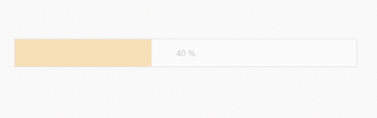

## Enabling the ProgressBar

The ProgressBar is enabled by using the ‘Enabled’ Property. When this property is set to ‘false’, it disables the ProgressBar widget. By default, ‘Enabled’ property is set to ‘true’ in the ProgressBar widget.

The following steps explain how to disable the ProgressBar widget when ‘Enabled’ property is set to ‘false’.

1. In the VIEW page, add a helper element to render the ProgressBar widget.


// Add the following code example to the corresponding CSHTML page to disable the ProgressBar control.
@Html.EJ().ProgressBar("progressbar").Value(70).Height("20").Width("500").Enabled(false)

  



The following screenshot displays the output for the above code.

_Figure_ _12_: Disabled Progress Bar

