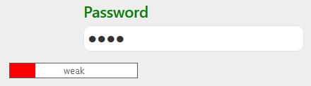
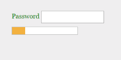
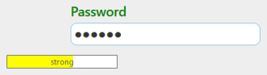
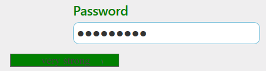

# Getting Started

This section briefly describes how to create a Progress Bar control using ASP.NET MVC and learn its features.

## 1.2.1 create your first Progress Bar in MVC

ASP.NET MVCProgress Bar control provides support to display a Progress Bar that allows you to change the process of the ProgressBar animations and flexible APIs. Using the following guidelines, you can create the ProgressBar to validate the Password strength.

The following screenshot illustrates the functionality of a Progress Bar and displays the final result of the Password Strength Validation for your password using Progress Bar.

{  | markdownify }
{:.image }
{  | markdownify }
{:.image }
{  | markdownify }
{:.image }

{  | markdownify }
{:.image }

Figure 1: Progress Bar

Create a Textbox and Progress Bar

ASP.NET MVC Progress Bar control indicates the current progress of an operation like uploading a document through a simple interface. You can easily create the Progress bar control using simple HTML helpers as follows.

1. Create an MVC Project and add necessary assemblies, scripts and styles to it. 
Refer [MVC-Getting Started.](http://help.syncfusion.com/ug/js/Documents/gettingstartedwithmv.htm)

2. Add the following code to the corresponding view page to render Progress Bar.

&lt;div class="start" &gt;

         <label for="start">Password</label>

               &lt;input type="password" id="password"/&gt;

  @Html.EJ().ProgressBar("progressBar").Value(20).Height("20px").Width("180px") 

 &lt;/div&gt;

3. Add the following styles to show the Progress Bar and Textbox.

 &lt;style&gt;

 .start {

            margin-left: 105px;

            color: green;

            font-size: 18px;

        }

.control {

            margin-bottom: 5px;

             margin-left: 230px;

        }

 #progressBar

   {

    margin-top: 10px;

   }

&lt;/style&gt;

4. Execute the above code to render the following output. 

{  | markdownify }
{:.image }

Find the Strength of the Password

In this scenario, the advancement of the Progress Bar is changed according to the length and special characters present in the text of the password field. This is achieved by binding the change in the properties of your control and by checking the length of the password field.

       &lt;script&gt; 

            var progresObj, k = 10, i = 0;

            $(document).keydown(function() {

                i = $("#password").val().length;

                if (i < 4) {

                    progress2();

                    $('.e-progress').css({ background: 'red' });

                } else if (i > 4 && i < 7) {

                    progress1();

                    $('.e-progress').css({ background: 'yellow' });

                } else if (i > 7) {

                    var pwd = $("#password").val();

                    if (/^[a-zA-Z0-9- ]*$/.test(pwd) == false) {

                        progress();

                        $('.e-progress').css({ background: 'green' });

                    }

                }

            });

            $(function () {

                progresObj = $("#progressBar").data("ejProgressBar");       

            });

            function progress() {

                progresObj.option("text", " verystrong");

                progresObj.option("percentage", k + 90);

            }

            function progress1() {

                progresObj.option("text", "strong");

                progresObj.option("percentage", k + 50);

            }

            function progress2() {

                progresObj.option("percentage", k + 10);

                progresObj.option("text", "weak");  

            }

        &lt;/script&gt;

* The progress() function changes the text inside the Progress Bar to Very Strong and percentage to 100, and it is invoked when the length of the text is more than 7 and the text contains a symbol in it. Then it shows the Progress Bar in violet color.
* The progress1() function changes the text inside the Progress Bar to Strong and percentage to 60, and it is invoked when the length of the text is more than 4. Then it shows the Progress Bar in green color
* The progress 2() function changes the text inside the Progress Bar to Weak and percentage to 30, and it is invoked when the length of the text is less than 4. Then it shows the ProgressBar in red color.

The following screenshot displays a Progress Bar control for the above scenario.

{  | markdownify }
{:.image }

{  | markdownify }
{:.image }

{  | markdownify }
{:.image }

