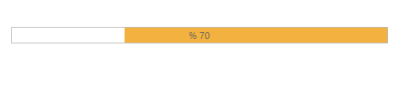

## RTL Support

Right-to-left starts from the right of the page and continues to the left. By default, this option is set to ‘false’ in the ProgressBar control. The EnableRTL option allows the ProgressBar control to display it in the right to left direction.

The following steps explain how to enable the RTL property of the ProgressBar control.

1. In the VIEW page, add a helper element to render the ProgressBar widget.


// Add the following code example to the corresponding CSHTML page to render ProgressBar control to display it in the right-to-left direction.
@Html.EJ().ProgressBar("progressbar").Value(70).Height("20").Width("500").EnableRTL(true)


       



 The following screenshot displays the output.

