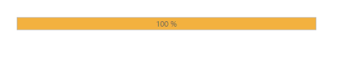

## Setting Range

The range of the ProgressBar is set by using minimum and maximum values. The Minimum value specifies the value where the ProgressBar shows the process to have started. The Maximum value specifies the value where the process is completed. You can set the range by using the ‘MinValue’ and ‘MaxValue’ property.

1. In the VIEW page, add a helper element to render the ProgressBar widget.

<table>
<tr>
<td>
 [CSHTML]// Add the following code example to the corresponding CSHTML page to render the ProgressBar control with customized range.@Html.EJ().ProgressBar("progressbar").MinValue(40).MaxValue(80).Value(80).Height("20").Width("500")</td></tr>
<tr>
<td>
[JavaScript]        </td></tr>
</table>

 The following screenshot displays the output.

{{ '' | markdownify }}
{:.image }

