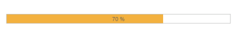

## State Maintenance

Save current model value to cookies for State Maintenance. While refreshing the ProgressBar widget, page retains the model value applied from browser cookies. By default, the ‘EnablePersistence’ property is set to ‘false’ in the ProgressBar.

The following steps explain the State Maintenance in the ProgressBar control.

1. In the VIEW page, add a helper element to render the ProgressBar widget.

<table>
<tr>
<td>
[CSHTML]// Add the following code example to the corresponding CSHTML page to enable the state maintenance in the ProgressBar control.@Html.EJ().ProgressBar("progressbar").Value(70).Height("20").Width("500").EnablePersistence(true)</td></tr>
<tr>
<td>
[JavaScript]     &lt;script&gt;            var progress;            $(document).ready(function () {                progress = $("#progressbar").data("ejProgressBar");                progress.setModel({ text: progress.getValue() + " %"});          });     &lt;/script&gt;        </td></tr>
</table>

The following screenshot displays the output.

{  | markdownify }
{:.image }

