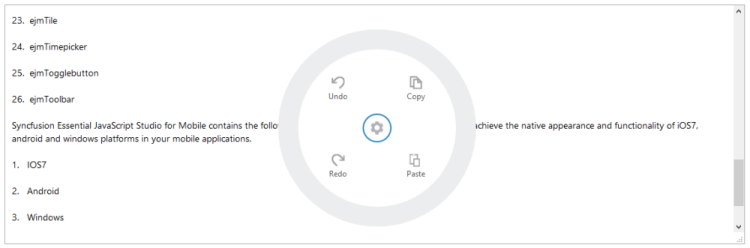
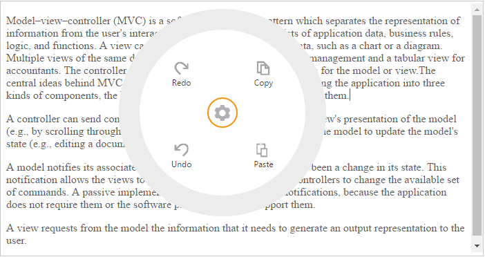

# Getting Started

## Create your first Radial Menu control in MVC

In this section, you can learn how to create a simple Radial Menu in the MVC application.

## Create a simple Radial Menu

The following steps guide you to add a Radial Menu control.

You can create an MVC Project and add the necessary assemblies, styles, and scripts to it. Refer to the [MVC-Getting Started.](http://docs.syncfusion.com/aspnetmvc/radialmenu/getting-started)

Add the following code example to the corresponding view page to render the Radial Menu.



@Html.EJ().RadialMenu("radialmenu").Items(items =>

{

items.Add().ImageURL("http://js.syncfusion.com/ug/web/content/radial/copy.png").Text("Copy");

    items.Add().ImageURL("http://js.syncfusion.com/ug/web/content/radial/paste.png").Text("Paste");

    items.Add().ImageURL("http://js.syncfusion.com/ug/web/content/radial/Redo.png").Text("Redo");

    items.Add().ImageURL("http://js.syncfusion.com/ug/web/content/radial/Undo.png").Text("Undo"); })



Refer to the following code example to add target content to the Radial Menu.



  

  <textarea id="textarea">

Syncfusion Essential JavaScript Studio for Mobile contains the following built-in theme support with that you can achieve the native appearance and functionality of iOS7, android and windows platforms in your mobile applications.

1.   iOS7

2.   Android

3.   Windows

4.   Flat

By default, the respective render modes are chosen based on the device where the application runs. You can also force and use a particular theme to a control or the whole application that is discussed in later sections. All of the above widgets are highly customizable and also designed with high performance in mind.

	</textarea>

 

<!--Adds Style for Content-->

  



You can set the ID of target content to the Radial Menu as illustrated in the following code example. 



@Html.EJ().RadialMenu("radialmenu").TargetElementId("radialtarget").Items(items =>

{

items.Add().ImageURL("http://js.syncfusion.com/ug/web/content/radial/copy.png").Text("Copy");

    items.Add().ImageURL("http://js.syncfusion.com/ug/web/content/radial/paste.png").Text("Paste");

    items.Add().ImageURL("http://js.syncfusion.com/ug/web/content/radial/Redo.png").Text("Redo");

    items.Add().ImageURL("http://js.syncfusion.com/ug/web/content/radial/Undo.png").Text("Undo"); })



You can display the Radial Menu by performing the desired action on the target while selecting the text inside the target. Therefore, call the show method in the select action of the content. Refer to the following code example and add it to the script section.





Run the above code and select any text inside the target. The settings icon is displayed. Click that icon to render the following output.

