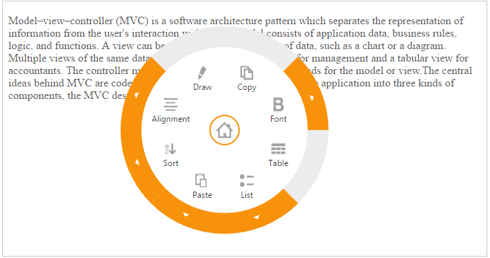
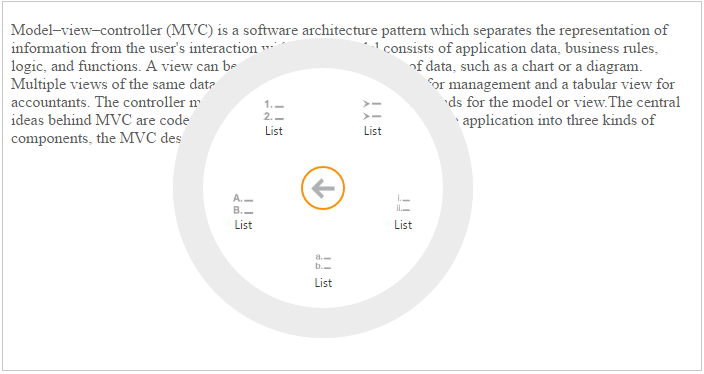

## Image Customization

You can simply customize the Radial Menu’s center and back images by using the Imageclass and Backimageclass properties. By using this imageclass property, you can customize the Radial Menu center image. 

The Radial Menu control is essentially a context menu presenting its items in a circular arrangement around a center button. Sub-Items are also supported in the Radial Menu. To navigate Sub-Items, click the arrows in the outer ring and it displays the corresponding sub-items group. Clicking the center button when a sub-items group is shown, displays the items on the previous level. Nested Radial Menu has the second level back button. In this case, you can use the Backimageclass property to change your second level back button. BackImageClass is used to customize the nestedRadialmenu back image. Refer to the following code example.

You can add the page content with text-area by referring to this section.



@{

    Html.EJ().RadialMenu("nestedradialmenu").ImageClass("imageclass").BackImageClass("backimageclass").Items(items =>

{

    items.Add().Text("Copy").ImageURL("http://js.syncfusion.com/UG/web/Content/radial/copy.png").Children(children =>

    {

        children.Add().ImageURL("http://js.syncfusion.com/UG/web/Content/radial/c1.png").Text("Copy");

        children.Add().ImageURL("http://js.syncfusion.com/UG/web/Content/radial/c2.png").Text("Copy");

    });

    items.Add().Text("Font").ImageURL("http://js.syncfusion.com/UG/web/Content/radial/font.png").Children(children =>

    {

        children.Add().ImageURL("http://js.syncfusion.com/UG/web/Content/radial/f1.png").Text("Italic");

        children.Add().ImageURL("http://js.syncfusion.com/UG/web/Content/radial/f2.png").Text("Bold");

    });

    items.Add().Text("Table").ImageURL("http://js.syncfusion.com/UG/web/Content/radial/table.png");

    items.Add().Text("List").ImageURL("http://js.syncfusion.com/UG/web/Content/radial/list.png").Children(children =>

    {

        children.Add().ImageURL("http://js.syncfusion.com/UG/web/Content/radial/l1.png").Text("List");

        children.Add().ImageURL("http://js.syncfusion.com/UG/web/Content/radial/l2.png").Text("List");

        children.Add().ImageURL("http://js.syncfusion.com/UG/web/Content/radial/l3.png").Text("List");

        children.Add().ImageURL("http://js.syncfusion.com/UG/web/Content/radial/l4.png").Text("List");

        children.Add().ImageURL("http://js.syncfusion.com/UG/web/Content/radial/l5.png").Text("List");

    });

    items.Add().Text("Paste").ImageURL("http://js.syncfusion.com/UG/web/Content/radial/paste.png");

    items.Add().Text("Sort").ImageURL("http://js.syncfusion.com/UG/web/Content/radial/sort.png").Children(children =>

    {

        children.Add().Text("Sort").ImageURL("http://js.syncfusion.com/UG/web/Content/radial/s1.png");

        children.Add().Text("Sort").ImageURL("http://js.syncfusion.com/UG/web/Content/radial/s2.png");

    });

    items.Add().Text("Alignment").ImageURL("http://js.syncfusion.com/UG/web/Content/radial/align.png").Children(children =>

    {

        children.Add().Text("Left").ImageURL("http://js.syncfusion.com/UG/web/Content/radial/a1.png");

        children.Add().Text("Right").ImageURL("http://js.syncfusion.com/UG/web/Content/radial/a2.png");

    });

    items.Add().Text("Paste").ImageURL("http://js.syncfusion.com/UG/web/Content/radial/draw.png");

}).Render();

}



Add the following common style codes for both JS and MVC samples.



    



The following screenshot illustrates the output.

{{ '' | markdownify }}
{:.image }

When you click the arrow, it navigates to the child item as illustrated in the following screenshot.

{{ '' | markdownify }}
{:.image }

