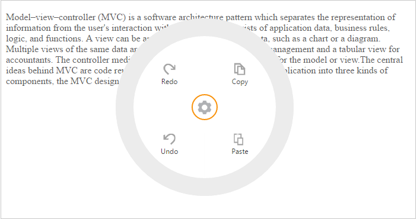

## Item Customization

You can customize the Radial Menu items by using the ImageURL and Text properties. The ImageURL property specifies the URL of the image for the items. Text property is used to specify the item text. Refer to the following code example.

You can add the page content with text-area by referring to this section.



@Html.EJ().RadialMenu("defaultradialmenu").Width(250).Items(items =>

{

    items.Add().ImageURL("http://js.syncfusion.com/UG/web/Content/radial/c1.png").Text("Copy");

    items.Add().ImageURL("http://js.syncfusion.com/UG/web/Content/radial/paste.png").Text("Paste");

    items.Add().ImageURL("http://js.syncfusion.com/UG/web/Content/radial/redo.png").Text("Redo");

    items.Add().ImageURL("http://js.syncfusion.com/UG/web/Content/radial/undo.png").Text("Undo");

})



The following screenshot illustrates the output.

{{ '' | markdownify }}
{:.image }

