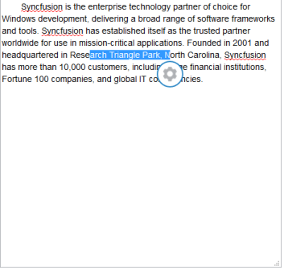
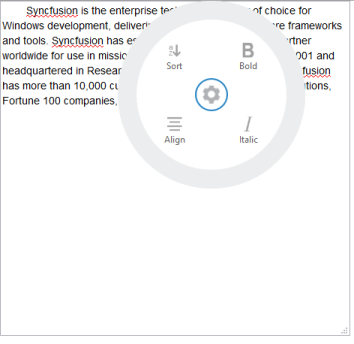

# Width

You can customize the Radial Menu width or radius by using the width property. By default, the Radial Menu width is set as 300px. Refer to the following code example.

You can add the page content with text-area by referring to this section.



@Html.EJ().RadialMenu("defaultradialmenu").Width(250).Items(items =>

{

    items.Add().ImageURL("http://js.syncfusion.com/UG/web/Content/radial/font.png ").Text("Bold");

    items.Add().ImageURL("http://js.syncfusion.com/UG/web/Content/radial/f1.png ").Text("Italic");

    items.Add().ImageURL("http://js.syncfusion.com/UG/web/Content/radial/align.png ").Text("Align");

    items.Add().ImageURL("http://js.syncfusion.com/UG/web/Content/radial/sort.png ").Text("Sort");

})



The following screenshot illustrates the output while selecting the text in the page.

The following screenshot illustrates the Radial Menu while clicking on the settings icon.

