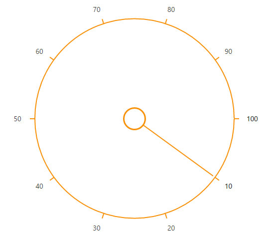

# Getting Started

## Creating your first RadialSlider in MVC application

1. Create an MVC Project and add necessary assemblies, scripts and CSS files given in [MVC-Getting Started](http://help.syncfusion.com/aspnetmvc/getting-started#manual-integration-of-syncfusion-mvc-components-into-newexisting-mvc-applications) Documentation.

2. Add RadialSlider control using the helper from EJ namespace. 

        

            @Html.EJ().RadialSlider("RadialSlider1")
                
        

3. Execute the code and get a Default RadialSlider control as below

