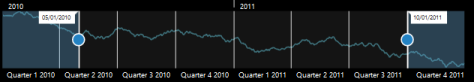

# Appearance and Styling

RangeNavigator is enriched with lots of customization options for labels, gridlines and slider to develop high quality graphic rich control.

## Customize labels

The labels are found along the range, displaying the value of the data it correspond, both on (higher level label) and below (lower level label) the RangeNavigator. RangeNavigator labels are further customized using “Font” property in label Settings. 

 [MVC]

@(Html.EJ().RangeNavigator("rangecontainer")

       // ...

       .LabelSettings(ls=>ls

           // customizing higher level labels.

                        .HigherLevel(hl =>hl                                     

                           .Style(lst => lst

                                      .Font(f =>f

                                           .Color("#ff0000") 

                                           .Opacity(1)

                                           .Size("12px")                                                                     

                                           .Style(RangeNavigatorFontStyle.Normal)

                                         .Weight(RangeNavigatorFontWeight.Regular)

                                                )

                                             )

                                       )

                    // customizing lower level labels.

                       .LowerLevel(ll => ll

                           . Style(lst => lst

                                  .Font(f => f

                                           .Color("#ff0000")

                                           .Opacity(1)

                                           .Size("12px")                                              

                                           .Style(RangeNavigatorFontStyle.Normal)                                                              

                                         .Weight(RangeNavigatorFontWeight.Regular)

                                         )

                                    )

                                )                                                                                                                                                                                                                                                                                                                                   

                           )      

       //...

        .Render())



_Figure 27: Customize labels_

## Label Placement:

Labels in RangeNavigator are placed inside or outside of the control. You can customize both the higher and lower level labels using LabelPlacement property in label setting of RangeNavigator. By default LabelPlacement is “outside” for the both higher and lower level labels.

The following screen shot illustrates both the lower and higher level labels that are placed outside the control with LabelPlacement specified as outside. 

[MVC]

@(Html.EJ().RangeNavigator("rangecontainer")

       // ...

            .LabelSettings(ls=>ls

                            .HigherLevel(hl =>hl.LabelPlacement("inside"))                                                                          

                            .LowerLevel(ll => ll.LabelPlacement("inside"))                                                                                                                                                                                                                                                                                                                                                              

                           )    

       //...

        .Render())


The following screenshot illustrates a RangeNavigator with labels inside the control after specifying the LabelPlacement as inside.

## Customize RangeNavigator

RangeNavigator is customized using NavigatorStyleSettings properties. You can customize the selected and unselected region color using SelectedRegionColor, UnselectedRegionColor in NavigatorStyleSettings and the thumb of the slider using ThumbColor, ThumbRadius and ThumbStorke in NavigatorStyleSettings.  MajorGridLineStyle and MinorGridLineStyle are used to customize the grid line color and visibility. 

 [MVC]

@(Html.EJ().RangeNavigator("rangecontainer")

       // ...

                   //  To customize the navigator element     

       .NavigatorStyleSettings (ns=>ns

                  .Border(br=>br.Color("black").Width(3))

                  .Background("transparent")

                  .UnselectedRegionColor("white")

                  .SelectedRegionColor("#5EABDE")

                  .ThumbRadius(10)

                  .ThumbColor("white")

                  .MajorGridLineStyle(mr=>mr.Color("transparent").Visible(true))

                  .MinorGridLineStyle(mi=>mi.Color("transparent").Visible(true))

                  )

               //  To customize the labels

       .LabelSettings(ls=>ls

                          .HigherLevel(hl =>hl

                                 .LabelPlacement("inside")

                                 .IntervalType(NavigatorIntervalType.Years)                                      

                                 .Style(lst => lst                                                       

                                        .HorizontalAlignment(HorizontalAlignment.Left)

                                        .Font(f =>f

                                                  .Color("black") 

                                                  .Opacity(1)

                                                  .Size("13px")

                                                 )

                                           )

                                      )

                           .LowerLevel(ll => ll

                                 .LabelPlacement("inside")                                              

                                 .IntervalType(NavigatorIntervalType.Quarters)

                                 .Style(lst => lst                                               

                                      .HorizontalAlignment(HorizontalAlignment.Center)

                                      .Font(f => f

                                                 .Color("black")

                                                 .Opacity(1)

                                                 .Size("12px")

                                             )

                                        )

                                   )                                                                                                                                                                                                                                                                                                                                   

                           )

       //...

        .Render())



## Themes

RangeNavigator theme is a set of pre-defined options that are applied to the control before each RangeNavigator is instantiated. Following predefined themes are available in ASP.NET MVC RangeNavigator.

1. flatlight                  
2. flatdark                  
3. gradientlight           
4. gradientdark           
5. azure                      
6. azuredark               
7. lime 
8. limedark
9. saffron
10. saffrondark
11. gradientazure
12. gradientazuredark
13. gradientlime
14. gradientlimedark
15. gradientsaffron

### gradientsaffrondark


 [MVC]

@(Html.EJ().RangeNavigator("rangecontainer")

       // ...

        .Theme("azuredark")

       //...

        .Render())



