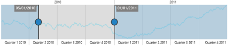
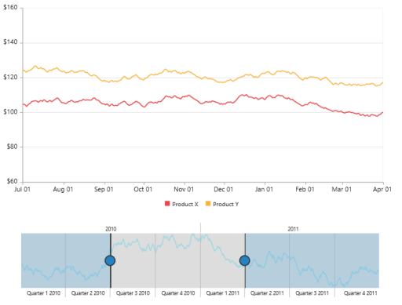
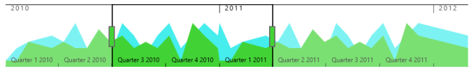

# Behavior Customization

RangeNavigator allows you to customize the control using events. You can change the range for selected data of the RangeNavigator using events.

## Deferred update

If you set EnableDeferredUpdate to true, the RangeChanged event gets fired after dragging and dropping the slider. By default the EnableDeferredUpdate is true. If EnableDeferredUpdate is false then the RangeChanged event gets fired while dragging the slider.


 [
@(Html.EJ().RangeNavigator("rangecontainer")

. EnableDeferredUpdate (true)

.Render())


Deferred update
{:.caption}

## Handle Events

### Loaded: function

This event is handled when the RangeNavigator gets loaded. A parameter sender is passed to the handler. Using sender.model, you can access the RangeNavigator properties. 


 
@(Html.EJ().RangeNavigator("rangecontainer")

.Loaded("loadingdata")

   
.Render())

         



### RangeChanged: function

This event gets fired whenever the selected range changes in RangeNavigator. A parameter sender is passed to the handler. Using sender.selectedRangeSettings, you can access the start and end value of range for the selected region. 


@(Html.EJ().RangeNavigator("rangecontainer")

    
.RangeChanged("loadingdata")

.Render())

         


## Use of ZoomCoordinates

RangeNavigator is used along with the controls like chart and grid to view the selected data. To update chart/grid, whenever the selected range changes in RangeNavigator, you can use RangeChanged event of RangeNavigator and then update the chart/grid with the selected data in this event. 

You can easily update the data for chart by assigning the ZoomFactor and ZoomPosition of the RangeNavigator to the chart axis. 

 

@(Html.EJ().RangeNavigator("rangecontainer")

.RangeChanged("loadingdata")

.Render())

         


## Thumb Template

You can customize Thumb template by using LeftThumbTemplate and RightThumbTemplate property. You can add the required template as a “div” element with an “id” to the web page and assign the id or assign the html string to this property under NavigatorStyleSettings. 


@(Html.EJ().RangeNavigator("container")

	            // ...              

      .NavigatorStyleSettings(ns=>ns.LeftThumbTemplate("left")

                 .RightThumbTemplate("right"))

                 // ... 

)



The following screenshot displays the RangeNavigator using thumb template.

