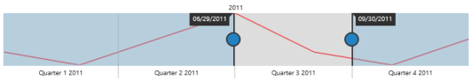
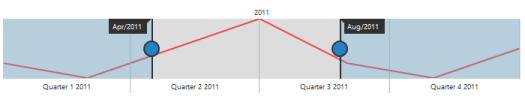

# Getting Started

This section explains briefly about how to create a RangeNavigator in your ASP.NET MVC application.

## Create your first RangeNavigator in MVC

This section encompasses the details on how to configure the RangeNavigator and update the chart control for RangeNavigator’s selected range. It also helps you to learn how to pass the required data to RangeNavigator and customize the scale and selected range for your requirements. In this example, you will learn how to configure the RangeNavigator to analyse sales of a product for a particular quarter in a year.

### Create a simple MVC Application for RangeNavigator

 You can create a new ASP.NET MVC project Razor Application.

1. On the File menu, click New Project. The New Project dialog box opens.

2. On the upper-right corner, select .NET Framework 4.0.
3. In the Installed Templates pane, expand either Visual Basic or Visual C# and then click Web.
4. In the Visual Studio Installed Templates pane, select ASP.NET MVC 4 Web Application.
5. In the Name box, enter MvcSample
6. In the Location box, enter a name for the project folder.
7. If you want the name of the solution to differ from the project name, then enter a name in the Solution name box.
8. Select the Create directory for solution checkbox.
9. Click OK.
10. The New ASP.NET MVC4Project dialog box opens.

11. In the Project Template group, select the Internet Application template for MVC4 project.
12. Check the Create a unit test project checkbox, if you want to create a unit test project.
13.  Click OK. The new MVC application project is generated.

The following screenshot shows the folder structure of the newly created MVC project.

14. Adding Reference Assemblies
* On the Solution Explorer, right-click the References folder and then click Add Reference. The Add Reference dialog box appears.

_Figure 5: Adding Reference Assemblies_

* Add the following Syncfusion assemblies : 
1. Syncfusion.Core
2. Syncfusion.EJ
3. Syncfusion.EJ.MVC

15.  You can add required Scripts and ScriptManger in _Layout page
* Add the script references of the required libraries in the _Layout page as shown in the following code sample


[HTML]

<!DOCTYPE html>

<html xmlns="http://www.w3.org/1999/xhtml">

<head>

 

</head>



* Add the ScriptManager() at the end of <body> tag in _Layout page.

[HTML]

<!DOCTYPE html>

<html xmlns="http://www.w3.org/1999/xhtml">

<head>

</head>

<body>

    @(Html.EJ().ScriptManager())

</body>

</html>


16. Configure web.config files for assemblies
* The following assemblies references are added properly in web.config file (There will be two web.config files. Refer to the one in the root folder.).  

[Web.config]

  <compilation debug="true" targetFramework="4.0" >

  <assemblies>       

<add assembly="Syncfusion.Core, Version=XX.XXXX.X.X, Culture=neutral, PublicKeyToken=632609B4D040F6B4" />

<add assembly="Syncfusion.EJ, Version= XX.XXXX.X.X, Culture=neutral, PublicKeyToken=3d67ed1f87d44c89" />

<add assembly="Syncfusion.EJ.Mvc, Version= XX.XXXX.X.X, Culture=neutral, PublicKeyToken=3d67ed1f87d44c89" />

</assemblies>

  </assemblies>


> Note: Add the following namespaces in web.config file within the Views folder.



[Web.config] – Views folder

<namespaces>

        <add namespace="System.Web.Mvc" />

        <add namespace="System.Web.Mvc.Ajax" />

         …….

         …….

        <add namespace="Syncfusion.JavaScript" />

        <add namespace="Syncfusion.JavaScript.DataVisualization" />

        <add namespace="Syncfusion.MVC.EJ" />

        <add namespace="Syncfusion.EJ" />

</namespaces>



The above steps are done automatically, if you create your project with the help of MVC Project creation template, which is available once the MVC Extension is installed on your machine.

## Configure RangeNavigator

Getting started with your MVC RangeNavigator is simple; all you need to do is initialize the RangeNavigator by setting range values.

1. Create a simple 
 tag.


  



2. Add the following code in the SimpleRangeNavigator.cshtml file, to create the RangeNavigator control in the View page. 

The following code example renders a RangeNavigator with a range from 2010 January 1st to December 31st.

    
 

           @(Html.EJ().RangeNavigator("scrollcontent")

           .RangeSettings(range=>range.Start("2010/1/1").End("2010/12/31"))

           .Render()) 

    
  



     3.   Open ~/Controllers/HomeController.cs.

     4.   Add the SimpleRangeNavigator() action as illustrated in the following code example.


[Controller]

 public ActionResult SimpleRangeNavigator()

{

return View();

}


The following Screen shot displays the RangeNavigator with a range from 2010 January 1st to December 31st.

### Add series

To add a series to RangeNavigator, you need to set DataSource property, as given in the following code example. 

You can add JSON data to the RangeNavigator using the Datasource property.

In Controllers/HomeController.cs specify the data for data source.

[cs]

public ArrayList GetData()

        {

            ArrayList dataTable = new ArrayList();

            dataTable.Add(new NavigatorData (new DateTime(2011, 01, 01), 10));

            dataTable.Add(new NavigatorData (new DateTime(2011, 02, 01), 5));

            dataTable.Add(new NavigatorData (new DateTime(2011, 04, 01), 15));

            dataTable.Add(new NavigatorData (new DateTime(2011, 06, 01), 25));

            dataTable.Add(new NavigatorData (new DateTime(2011, 08, 01), 10));

            dataTable.Add(new NavigatorData (new DateTime(2011, 10, 01), 5));

            dataTable.Add(new NavigatorData (new DateTime(2011, 12, 31), 15));   

            return dataTable;

        }

        class NavigatorData

        {

            private DateTime xdate;

            public DateTime xDate

            {

                get { return xdate; }

                set { xdate = value; }

            }

            private double yvalue;

            public double yValue

            {

                get { return yvalue; }

                set { yvalue = value; }

            }

            public NavigatorData(DateTime xdate, double yvalue)

            {

                this.xdate = xdate;

                this.yvalue = yvalue;

            }

        }

        public ActionResult SimpleRangeNavigator()

        {

            var DataSource = GetData();

            ViewBag.datasource = DataSource;

            return View();

        }



In SimpleRangeNavigator.cshtml specify the type of series you want to render using “Type” property. And specify the Datasource to the Series of RangeNavigator.


[cshtml]

@(Html.EJ().RangeNavigator("scrollcontent")

           .DataSource((System.Collections.IEnumerable)ViewBag.datasource)

           .XName("xDate")

           .YName("yValue")

.      .Render())


The following screenshot displays the RangeNavigator with the type series as “line”. 

### Enable tooltip

Tooltip can be customized for RangeNavigator using tooltip option. You can also use ToolipDisplayMode option in tooltip to display the tooltip “always” or “ondemand” (displays tooltip only while dragging the sliders). You can also specify label format for tooltip using LabelFormat.

[cshtml]

@(Html.EJ().RangeNavigator("scrollcontent")

   .TooltipSettings(tooltip=>tooltip.Visible(true).LabelFormat("MMM/yyyy").TooltipDisplayMode("always"))

.Render())


The following screen shot displays the label format Tooltip in RangeNavigator:

### Update Chart

RangeNavigator is used along with the controls like chart and grid to view the range of data selected in RangeNavigator. 

In order to update chart, whenever the selected range changes in RangeNavigator, you need to use RangeChanged event of RangeNavigator and then update the chart with the selected data in this event. 

Now, add the DataSource to the series and provide the field name to get the values from the DataSource in XName and YName options and also trigger the RangeChanged event for updating the chart.

 [cshtml]

@(Html.EJ().Chart("chartcontainer")

          .Title(title => title.Text("Sales Analysis"))

          .Legend(legend => legend.Visible(true).Position(LegendPosition.Top))

          .PrimaryYAxis(axis => axis.Title(axisTitle => axisTitle.Text("Sales(Million)")))

          .Series(series =>

              {

                  series.Name("Product A").Type(SeriesType.Line)

           .DataSource((System.Collections.IEnumerable)ViewBag.datasource)

           .XName("xDate")

           .YName("yValue")

.Add();

              })

          .Render())

@(Html.EJ().RangeNavigator("scrollcontent")

           .DataSource((System.Collections.IEnumerable)ViewBag.datasource)

           .XName("xDate")

           .YName("yValue")

.RangeChanged("onrangechanged")

      .Render())


The following code example illustrates how to use the RangeChanged event of RangeNavigator for updating the chart with the selected data.

[JavaScript]



The following screenshot displays how the RangeNavigator is updated when the selected range is changed.

### Set value type

RangeNavigator can also be used with numerical values. You can specify the data type using ValueType option. 

First let’s create a DataSource for Chart Series with integer Values. 

In Controllers/HomeController.cs specify the data for data source.

[cs] 

 public ArrayList GetData()

        {

            ArrayList dataTable = new ArrayList();

dataTable.Add(new NavigatorData (0, 10));

            dataTable.Add(new NavigatorData (50, 5));

            dataTable.Add(new NavigatorData (100, 15));

            dataTable.Add(new NavigatorData (150, 25));

            dataTable.Add(new NavigatorData (200, 10));

            dataTable.Add(new NavigatorData (250, 5));

            dataTable.Add(new NavigatorData (300, 15));            

            return dataTable;

        }

        class NavigatorData

        {

            private double xvalue;

            public double xValue

            {

                get { return xvalue; }

                set { xvalue = value; }

            }

            private double yvalue;

            public double yValue

            {

                get { return yvalue; }

                set { yvalue = value; }

            }

            public NavigatorData(double xvalue, double yvalue)

            {

                this.xvalue = xvalue;

                this.yvalue = yvalue;

            }

        }

        public ActionResult SimpleRangeNavigator()

        {

            var DataSource = GetData();

            ViewBag.datasource = DataSource;

            return View();

        }



In SimpleRangeNavigator.cshtml, specify the DataSource to the Series and provide the field name to get the values from the DataSource in XName and YName options series and also set the ValueType property to “numeric” as given in the following code example. 

[cshtml]

  @(Html.EJ().RangeNavigator ("scrollcontent")

        .Series(sr =>

            {

              sr.Type(SeriesType.Line)

            .DataSource((System.Collections.IEnumerable)ViewBag.datasource)

            .XName("xDate")

            .YName("yValue")

                .Add();

            })

         .ValueType("numeric")

         .Render())


The following screenshot displays the RangeNavigator with numerical values:

