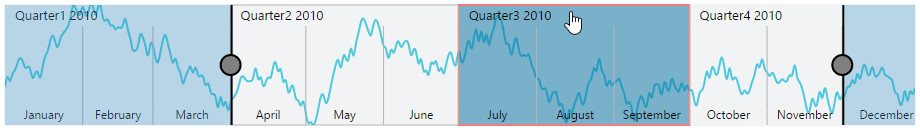

# User Interactions

## Highlight

EjRangeNavigator provides highlighting supports to the intervals on mouse hover. To enable the highlighting option, set the *Enable* property to true in the *HighlightSettings* of NavigatorStyleSettings.



   @(Html.EJ().RangeNavigator("rangeContainer")
          //...

        .NavigatorStyleSettings(nvs=>
               nvs.HighlightSettings(hls=>
                   // enable the highlight settings
                   hls.Enable(true))
                )
     )



 

[Click](http://mvc.syncfusion.com/demos/web/rangenavigator/rangehighlight) here to view the highlight and selections online demo sample.

### Customize the highlight style

To customize the highlighted intervals, use color, border and opacity options in the HighlightSettings.



    @(Html.EJ().RangeNavigator("rangeContainer")
           //...

          .NavigatorStyleSettings(nvs=>
               nvs.HighlightSettings(hls=>
                   // enable the highlight settings
                   hls.Enable(true)
                    // customizing style
                   .Color("#006fa0")
                   .Border(br=>br.Color("red").Width(2))
                   )
                )
     )



## Selection

EjRangeNavigator provides selection supports to the intervals by, clicking and dragging the highlighted intervals. To enable the selection option, set the Enable property to true in the SelectionSettings.



   @(Html.EJ().RangeNavigator("rangeContainer")
          //...

        .NavigatorStyleSettings(nvs=>
               nvs.SelectionSettings(shls=>
                   // enable the selectio settings
                   shls.Enable(true)
                   )
                )
     )



 

[Click](http://mvc.syncfusion.com/demos/web/rangenavigator/rangehighlight) here to view the highlight and selections online demo sample.

### Customize the selection style

To customize the selected intervals, use color, border and opacity options in the SelectionSettings.



 @(Html.EJ().RangeNavigator("rangeContainer")
          //...

        .NavigatorStyleSettings(nvs=>
               nvs.SelectionSettings(shls=>
                   // enable the selectio settings
                   shls.Enable(true)
                    // customizing style
                   .Color("#27e8e5’")
                   .Border(br=>br.Color("red").Width(2))
                   )
                )
     )



## Scrollbar

* To render the Scrollbar in rangenaviagtor, you need to enable **EnableScrollbar** option.
 
* **ScrollRangeSettings** of  rangenavigator *Start* and *End* value is used to set the minimum and maximum datasource value to be added in the rangenavigator.
 
* Based on the ScrollRangeSettings *Start, End* value and dataSource *Start, End* value scrollbar will be adjust.

* When you change the scrollbar position, **ScrollEnd** event returns the current position of start and end range value.



 @(Html.EJ().RangeNavigator("rangeContainer")
          //...
           //Enable scrollbar option in the rangenavigator
           .EnableScrollbar(true)
           
           //Maximum data to be displayed in the rangenavigator control
           .ScrollRangeSettings(scrl=>
               scrl.Start("2010, 1, 1").End("2011, 11, 31")
               )
               
           //Subscribe the event on scrollbar position changed 
           .ScrollEnd("onScrollbarChange")
     )
     

    
 

      function onScrollbarChange(sender) {
            var start  = sender.data.newRange.start;
            var end  = sender.data.newRange.end;
      }
      


[Click](http://mvc.syncfusion.com/demos/web/rangenavigator/rangescrollbar) here to view scrollbar online demo sample.