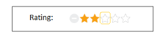
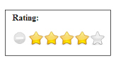
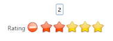

## Appearance and Styling

Show ToolTip

Rating control provides support for Tooltip values. This is achieved by enabling the ShowTooltip property to True. When you move the mouse over the Rating control, it displays the Tooltip value as ratingvalue. By default, this property value is set to True.

The following code example is used to render the Rating control without tooltip.

1. Add the following code in your view page to render Rating with Tooltip.

[CSHTML]

// Add the following code example to the corresponding CSHTML page to render Rating without Tooltip

&lt;div id="container" style="width: 300px; padding: 2px"&gt;

    &lt;table&gt;

        &lt;tr&gt;

            <td valign="top">Rating:

            &lt;/td&gt;

            &lt;td&gt;

                @Html.EJ().Rating("Rating").ShowTooltip(false)

            &lt;/td&gt;

        &lt;/tr&gt;           

    &lt;/table&gt;

&lt;/div&gt;

The following screenshot illustrates Rating without Tooltip.

{  | markdownify }
{:.image }

### Adjusting Rating Size

Adjust Shape Width and Shape Height

You can customize the width and height of the Rating by ShapeWidth and ShapeHeight properties. These properties completely depend on rating image’s size. The ShapeWidth and ShapeHeight are adjusted within the rating image size.

The following code example is used to render the Rating control with customized ShapeWidth and ShapeHeight.

In this sample, the default rating star is replaced by crystal-stars.png local imgae by overriding the Rating control css.

Add the following code in your view page to render the Rating with customized ShapeWidth and ShapeHeight.

 [CSHTML]

// Add the following code example to the corresponding CSHTML page to render Rating with customized ShapeWidth and ShapeHeight.

&lt;div id="container" style="border: 1px solid black; width: 300px; padding: 2px"&gt;

    &lt;table&gt;

        &lt;tr&gt;

            <td valign="top">Rating:

            &lt;/td&gt;

            &lt;td&gt;

                @Html.EJ().Rating("Rating").Value(4).ShapeWidth(29).ShapeHeight(29)

            &lt;/td&gt;

        &lt;/tr&gt;

    &lt;/table&gt;

&lt;/div&gt;

Add the following styles.

[CSS]

&lt;style type="text/css"&gt;

        .e-rating

{

    margin-top: -7px;

}

.e-rating.e-horizontal .e-shape-list, .e-rating.e-vertical .e-shape-list,

.e-rating.e-horizontal .e-shape, .e-rating.e-vertical .e-shape, .e-rating.e-horizontal .e-ul,.e-rating.e-vertical .e-ul,.e-rating.e-horizontal .e-reset, .e-rating.e-vertical .e-reset 

{

height:28px;width:28px;

background:url(images/crystal-stars.png) no-repeat;

}

   .e-rating.e-horizontal .e-reset, .e-rating.e-vertical .e-reset {

background-position: 0 42px;

margin-left: 2px;

}

   .e-rating.e-horizontal .e-shape-list

{

    background-position: 0 -56px;

}

       .e-rating .e-shape.inactive {

        background-position: 0 -56px;

    }

    .e-rating .e-shape.active {

        background-position: 0 -112px;

    }

    .e-rating .e-shape.selected {

        background-position: 0 -84px;

    }

&lt;/style&gt;

The following screenshot illustrates Rating with customized ShapeWidth and ShapeHeight.

{  | markdownify }
{:.image }

Theme

Rating control’s style and appearance are controlled based on CSS classes. In order to apply styles to the Rating control, refer to 2 files namely, ej.widgets.core.min.css and ej.theme.min.css. When the file ej.widgets.all.min.css is referred, then it is not necessary to include the files ej.widgets.core.min.css and ej.theme.min.css in your project, as ej.widgets.all.min.css is the combination of these both. 

By default, there are 12 themes support available for Rating control namely:

* default-theme
* flat-azure-dark
* fat-lime
* flat-lime-dark
* flat-saffron
* flat-saffron-dark
* gradient-azure
* gradient-azure-dark
* gradient-lime
* gradient-lime-dark
* gradient-saffron
* gradient-saffron-dark

Custom styles

The style of the Rating control is customized by CssClass property. 

The following code example is used to render the Rating control with customizedstyle.

Add the following HTML to render the Rating with customized style. In this, hovering behaviors, tooltip position and display have been customized by using custom css class.

[CSHTML]

// Add the following code example to the corresponding CSHTML page to render Rating with customized styles.

&lt;div id="container" style="border: 1px solid black; width: 300px; padding: 2px"&gt;

    &lt;table&gt;

        &lt;tr&gt;

            <td valign="top">Rating:

            &lt;/td&gt;

            &lt;td&gt;

                @Html.EJ().Rating("Rating").CssClass("custom")

            &lt;/td&gt;

        &lt;/tr&gt;             

    &lt;/table&gt;

&lt;/div&gt;

Add the following styles.

[CSS]

&lt;style type="text/css"&gt;

    .customCss {

        margin-top: -7px;

    }

        .customCss.e-horizontal .e-shape-list, .e-rating.e-vertical .e-shape-list,

        .customCss.e-horizontal .e-shape, .e-rating.e-vertical .e-shape, .e-rating.e-horizontal .e-ul, .customCss.e-vertical .e-ul, .e-rating.e-horizontal .e-reset, .e-rating.e-vertical .e-reset {

            height: 28px;

            width: 28px;

            background: url(../../Content/ej/default-theme/images/crystal-stars.png) no-repeat repeat;

        }

        .customCss.e-horizontal .e-reset, .customCss.e-vertical .e-reset {

            background-position: -2px 113px;

            margin-left: 2px;

        }

        .customCss.e-horizontal .e-shape-list {

            background-position: 0 -56px;

        }

        .customCss.e-horizontal .e-reset:hover {

            background-position: 0 42px;

        }

        .customCss .e-shape.inactive {

            background-position: 0 -84px;

        }

        .customCss .e-shape.active {

            background-position: 0 -112px;

        }

        .customCss .e-shape.selected {

            background-position: 0 -84px;

        }

    .customCss.e-tooltip {

        background-color: white;

        border: 2px solid #b0c4de;

        color: black;

    }

&lt;/style&gt;

The following screenshot illustrates the Rating with customized style.

{  | markdownify }
{:.image }

