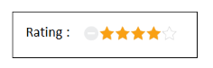
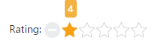
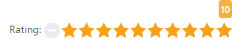
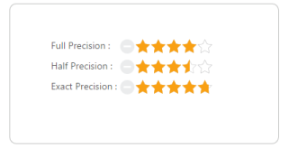
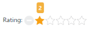
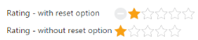

# Rating Customization

## Setting Value

The Value property sets the display value of the Rating. For example, when the Value property is set to 4, the Rating control renders 4 ratings. By default, Value property’s value is one.

The following code example is used to render the Rating control with the customized value.

Add the following code in your view page to render the Rating with the customized value.



// Add the following code example to the corresponding CSHTML page to render Rating with customized value.

    <table>

        <tr>

            <td valign="top">Rating:

            </td>

            <td>

                @Html.EJ().Rating("Rating").Value(4)

            </td>

        </tr>

    </table>



The following screenshot illustrates the Rating with custom defined value.

' 

## Min Value

Rating control provides support for setting the MinimumValue. This is achieved by adding the MinValue property. When the MinValue property is set, the Rating value starts with MinValue+1.

The following code example is used to render the Rating control with minimumrating value specfied.

Add the following code in your view page to render the Rating with Minimumvalue.



// Add the following code example to the corresponding CSHTML page to render Rating with customized minimum value.

    <table>

        <tr>

            <td valign="top">Rating:

            </td>

            <td>

                @Html.EJ().Rating("Rating").MinValue(3)

            </td>

        </tr>

    </table>



The following screenshot Rating value starts with 4 since MinValuevalue is set as 3.

Rating with minimum value as 4
{:.caption}

## Max Value

Rating controlprovides support for setting Maximumvalue. This is achieved by adding the MaxValue property. By default, MaxValue is five.

The following code example is used to render the Rating control with maximumrating value spefied

Add the following code in your view pageto render the Rating with maximumvalue.



// Add the following code example to the corresponding CSHTML page to render Rating with customized maximum value.

    <table>

        <tr>

            <td valign="top">Rating:

            </td>

            <td>

                @Html.EJ().Rating("Rating").MaxValue(10)

            </td>

        </tr>

    </table>



The following screenshot illustrates the Rating with maximumvalue.

## Set Precision

You can set Precision in Rating value between two whole numbers such as 2.5 or 3.7 and it is done by using the property Precision by changing the value to Precision.Half or Precision.Exact. By default, value of Precision is Full.

The following code example is used to render the Rating control with Precision.

Add the following code in your view page to render the Rating with Precision.



// Add the following code example to the corresponding CSHTML page to render Rating with Precison.

    <table>

        <tr>

            <td valign="top">Rating:

            </td>

            <td>

                @Html.EJ().Rating("FullRating").Precision(Precision.Full).Value(4)

            </td>

        </tr>

        <tr>

            <td valign="top">Rating:

            </td>

            <td>

                @Html.EJ().Rating("HalfRating").Precision(Precision.Half).Value(3.5)

            </td>

        </tr>

        <tr>

            <td valign="top">Rating:

            </td>

            <td>

                @Html.EJ().Rating("ExactRating").Precision(Precision.Exact).Value(4.7)

            </td>

        </tr>

    </table>



The following screenshot illustrates the Rating with Precision.

## Increment Step

Rating control supports customized increment value for Rating. This is achieved by adding the IncrementStep property.

The following code example is used to render the Rating control with customized increment.

Add the followingcode in your view page to render the Rating with customized increment.



// Add the following code example to the corresponding CSHTML page to render Rating with customized increment.

	<table>

		<tr>

			<td valign="top">Rating:

			</td>

			<td>

				@Html.EJ().Rating("Rating").IncrementStep(2).MaxValue(10)

			</td>

		</tr>      

	</table>



The following screenshot illustrates the Rating with customized increment.

## Resetting values

Rating control provides support for value reset at runtime. This is achieved by enabling the AllowReset property to True. By default, the property value is set to True.

The following code example is used to render the Rating control with AllowReset.

Add the following code in your view page to render the Rating with AllowReset.



// Add the following code example to the corresponding CSHTML page to render Rating with allowReset.

    <table>

        <tr>

            <td valign="top">Rating:

            </td>

            <td>

                @Html.EJ().Rating("ResetRating").AllowReset(true)

            </td>

        </tr>  

        <tr>

            <td valign="top">Rating:

            </td>

            <td>

                @Html.EJ().Rating("Rating").AllowReset(false)

            </td>

        </tr>    

    </table>

 



The following illustrates the Rating with allowReset.

## Read only

Rating control provides support for changeable or unchangeable values for Rating control. This is achieved by the ReadOnly property. When this property is set to True, the Rating value becomes unchangeable. By default, this property value is set to False.

The following code example is used to render the Rating control with ReadOnly.

Add the following code in your view page to render Rating with readOnly.



// Add the following code example to the corresponding CSHTML page to render Rating with readOnly.

    <table>

        <tr>

            <td valign="top">Rating:

            </td>

            <td>

                @Html.EJ().Rating("Rating").ReadOnly(true).Value(2).MaxValue(10) 

            </td>

        </tr>  

    </table>



The following screenshot illustrates the Rating with ReadOnly.

## Enable or Disable

Rating control provides support to Enable or Disable the control. This is achieved by the Enabled property. By default the property value is True.

The following code example is used to render the Rating control with Enable or Disable support.

Add the following code in your view page to render the Rating with enable or disable support.



// Add the following code example to the corresponding CSHTML page to render Rating with Enable/Disable support.

    <table>

        <tr>

            <td valign="top">Rating:

            </td>

            <td>

                @Html.EJ().Rating("Rating").Enabled(false)

            </td>

        </tr>

    </table>



The following screenshot illustrates the Rating in a disabled form.

