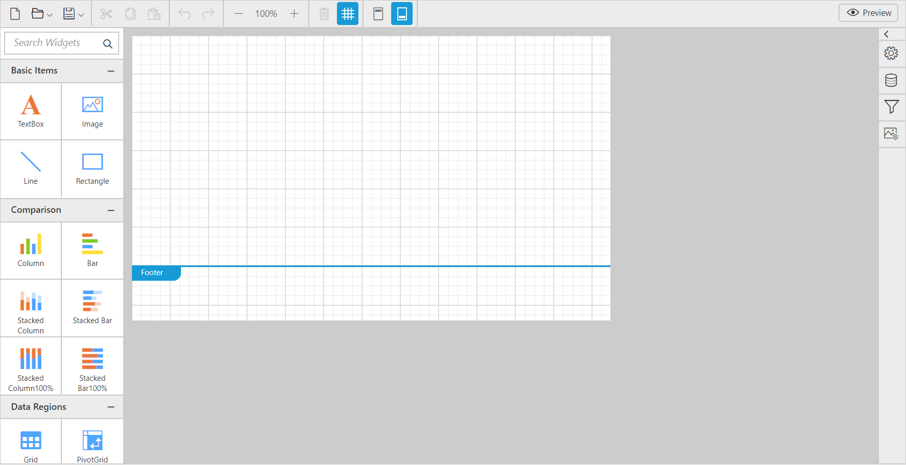

# Getting Started

This section explains briefly about how to create a ReportDesigner in your web application with MVC.

## Project Creation

The following screenshots displays the Project Creation Wizard in Visual Studio 2013

Create a new ASP.NET MVC4 Web Application project by selecting the **WEB** category from the listed project template in Microsoft Visual Studio IDE.

Project Creation Wizard
{:.caption}

The following screenshot displays how to select the project template with razor view engine:

### Add References, Scripts, Styles and Control in CSHTML Page

#### Add References

1. In the Solution Explorer, right-click the `References` folder and then click `Add Reference`.

   
	
   Adding Reference
   {:.caption}

2. Add the following assemblies
	
   * System.Web.Routing
   * System.Web.Http
   * System.Web.WebHost
   * System.Net.Http
   * System.Net.Http.WebRequest
   * System.Net.Http.Formatting
   * Syncfusion.Compression.Base 
   * Syncfusion.EJ
   * Syncfusion.EJ.MVC  
   * Syncfusion.EJ.ReportViewer
   * Syncfusion.EJ.ReportDesigner
   * Syncfusion.Pdf.Base
   * Syncfusion.XlsIO.Base
   * Syncfusion.Presentation.Base
   * Syncfusion.DocIO.Base
   * Syncfusion.Shared.Wpf
   * Syncfusion.Chart.Wpf
   * Syncfusion.Gauge.Wpf
   * Syncfusion.SfMaps.Wpf
   
   > Refer the above assemblies from the installed location, C:\Program Files (x86)\Syncfusion\Essential Studio\ASP.NET MVC\{{ site.releaseversion }}\Assemblies

   > Refer System.Web.Http, System.Web.WebHost, System.Net.Http.WebRequest and System.Net.Http.Formatting assemblies from ASP.NET WebApi NuGet package.

#### Add Scripts and Styles

Add the script files and CSS files in the &lt;head&gt; tag of the _Layout.cshtml page.

Use the following code example while adding scripts and styles.



<link rel="stylesheet" href="http://cdn.syncfusion.com/{{ site.releaseversion }}/js/web/flat-azure/ej.web.all.min.css" />
<link href="http://cdn.syncfusion.com/{{ site.releaseversion }}/js/web/flat-azure/ej.reportdesigner.min.css" rel="stylesheet" />
<link href="https://cdnjs.cloudflare.com/ajax/libs/codemirror/5.37.0/codemirror.min.css" rel="stylesheet" />
<link href="https://cdnjs.cloudflare.com/ajax/libs/codemirror/5.37.0/addon/hint/show-hint.min.css" rel="stylesheet" />



#### Add Control in View page

Add the following code example in the Index.cshtml page that is already created. Set the desired `ServiceUrl` to ReportDesigner.



@using Syncfusion.JavaScript
@using Syncfusion.MVC.EJ

@{
    ViewBag.Title = "Index";
}

    @{Html.EJ().ReportDesigner("designer").ServiceUrl("/api/ReportDesigner").Render();}



### Add WebAPI controller for ReportDesigner

The MVC ReportDesigner uses WebApi services to process the report file and process the request from control.

Adding WebApi Controller
{:.caption}

### Inherit IReportController

The ApiController should inherit the `IReportDesignerController` and to process the report file, please add the following code example to its method definition. The interface `IReportDesignerController` contains the required actions and helper methods declaration to process the report. The `ReportDesignerHelper` and `ReportHelper` class contains helper methods that helps to process Post/Get request from control and return the response to control.



using System;
using Syncfusion.EJ.ReportViewer;
using System.Collections.Generic;
using System.Linq;
using System.Net;
using System.Net.Http;
using System.Web.Http;
using Syncfusion.Reports.EJ;
using System.Collections;
using System.Web;
using Syncfusion.EJ.ReportDesigner;
using System.IO;
using Reporting.ExternalServer;

namespace ReportDesignerSample
{
    public class ReportDesignerController : ApiController, Syncfusion.EJ.ReportDesigner.IReportDesignerController
    {
        string CachePath = "App_Data\\ReportServer\\Cache\\";

        internal ExternalServer Server
        {
            get;
            set;
        }

        internal string ServerURL
        {
            get;
            set;
        }

        internal string AuthorizationHeaderValue
        {
            get;
            set;
        }

        public ReportDesignerController()
        {
            ExternalServer externalServer = new ExternalServer();
            this.Server = externalServer;
            this.ServerURL = "Sample";
            externalServer.ReportServerUrl = this.ServerURL;
            ReportDesignerHelper.ReportingServer = externalServer;
        }

        [HttpPost]
        public void UploadReportAction()
        {
            ReportDesignerHelper.ProcessDesigner(null, this, HttpContext.Current.Request.Files[0]);
        }

        [HttpGet]
        public object GetImage(string key, string image)
        {
            return ReportDesignerHelper.GetImage(key, image, this);
        }

        [HttpPost]
        public object PostDesignerAction(Dictionary<string, object> jsonResult)
        {
            return ReportDesignerHelper.ProcessDesigner(jsonResult, this, null);
        }

        public object PostReportAction(Dictionary<string, object> jsonResult)
        {
            return ReportHelper.ProcessReport(jsonResult, this as IReportController);
        }

        public void OnInitReportOptions(Syncfusion.EJ.ReportViewer.ReportViewerOptions reportOption)
        {
            reportOption.ReportModel.ReportingServer = this.Server;
            reportOption.ReportModel.ReportServerUrl = this.ServerURL;
            reportOption.ReportModel.ReportServerCredential = new NetworkCredential("Sample", "Password");
        }

        public void OnReportLoaded(Syncfusion.EJ.ReportViewer.ReportViewerOptions reportOption)
        {
        }

        public object GetResource(string key, string resourcetype, bool isPrint)
        {
            return ReportHelper.GetResource(key, resourcetype, isPrint);
        }

        public bool UploadFile(HttpPostedFile httpPostedFile)
        {
            string targetFolder = HttpContext.Current.Server.MapPath("~/");
            string fileName = !string.IsNullOrEmpty(ReportDesignerHelper.SaveFileName) ? ReportDesignerHelper.SaveFileName : Path.GetFileName(httpPostedFile.FileName);
            targetFolder += CachePath;

            if (!Directory.Exists(targetFolder))
            {
                Directory.CreateDirectory(targetFolder);
            }

            if (!Directory.Exists(targetFolder + "\\" + ReportDesignerHelper.EJReportDesignerToken))
            {
                Directory.CreateDirectory(targetFolder + "\\" + ReportDesignerHelper.EJReportDesignerToken);
            }

            httpPostedFile.SaveAs(targetFolder + "\\" + ReportDesignerHelper.EJReportDesignerToken + "\\" + fileName);
            return true;
        }

        public List<Syncfusion.EJ.ReportDesigner.FileModel> GetFiles(Syncfusion.EJ.ReportDesigner.FileType fileType)
        {
            List<FileModel> databases = new List<FileModel>();
            var folderPath = HttpContext.Current.Server.MapPath("~/") + CachePath + ReportDesignerHelper.EJReportDesignerToken + "\\";

            if (Directory.Exists(folderPath))
            {
                DirectoryInfo directoryInfo = new DirectoryInfo(folderPath);
                FileInfo[] Files = directoryInfo.GetFiles(this.GetFileExtension(fileType));

                foreach (FileInfo file in Files)
                {
                    databases.Add(new FileModel() { Name = file.Name, Path = "../" + CachePath + ReportDesignerHelper.EJReportDesignerToken + "/" + file.Name });
                }
            }

            return databases;
        }

        private string GetFileExtension(Syncfusion.EJ.ReportDesigner.FileType fileType)
        {
            if (fileType == FileType.Sdf)
            {
                return "*.sdf";
            }
            else if (fileType == FileType.Xml)
            {
                return "*.xml";
            }

            return "*.rdl";
        }

        public string GetFilePath(string fileName)
        {
            string targetFolder = HttpContext.Current.Server.MapPath("~/");
            targetFolder += CachePath;

            if (!Directory.Exists(targetFolder))
            {
                Directory.CreateDirectory(targetFolder);
            }

            if (!Directory.Exists(targetFolder + "\\" + ReportDesignerHelper.EJReportDesignerToken))
            {
                Directory.CreateDirectory(targetFolder + "\\" + ReportDesignerHelper.EJReportDesignerToken);
            }

            var folderPath = HttpContext.Current.Server.MapPath("~/") + CachePath + ReportDesignerHelper.EJReportDesignerToken + "\\";
            return folderPath + fileName;
        }

        public FileModel GetFile(string filename, bool isOverride)
        {
            throw new NotImplementedException();
        }
    }
}



### WebAPI Routing

1. Right-click the project and select Add and select `Global Application Class` from the listed templates.

    

2. Route the WebAPI in Application_Start event into Global.asax file as follows.



using System;
using System.Collections.Generic;
using System.Linq;
using System.Web;
using System.Web.Security;
using System.Web.SessionState;
using System.Web.Http;

namespace ReportDesignerDemo
{
    public class Global : System.Web.HttpApplication
    {
        protected void Application_Start(object sender, EventArgs e)
        {
            System.Web.Http.GlobalConfiguration.Configuration.Routes.MapHttpRoute(
            name: "DefaultApi",
            routeTemplate: "api/{controller}/{action}/{id}",
            defaults: new { id = RouteParameter.Optional });
            AppDomain.CurrentDomain.SetData("SQLServerCompactEditionUnderWebHosting", true);
        }
    }
}



>NOTE: 
You can refer the External Server sample and service from the installed location :
API Service: %public%\Documents\Syncfusion\ASP.NET MVC\{{ site.releaseversion }}\Samples\web\WebAPI\ReportDesignerController.cs .
External Server: %public%\Documents\Syncfusion\ASP.NET MVC\{{ site.releaseversion }}\Samples\web\WebAPI\ExternalReportServer.cs

### Run the Application

On running the application, Report Designer will be rendered like below.

